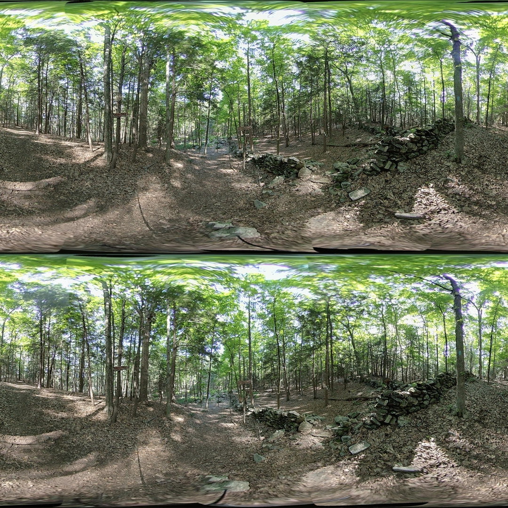
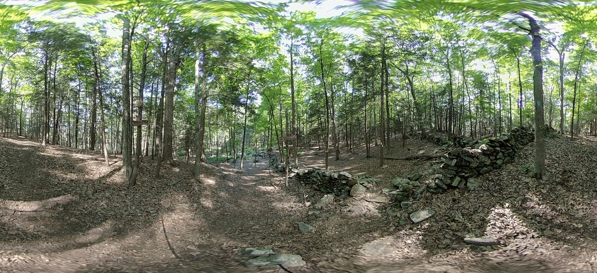
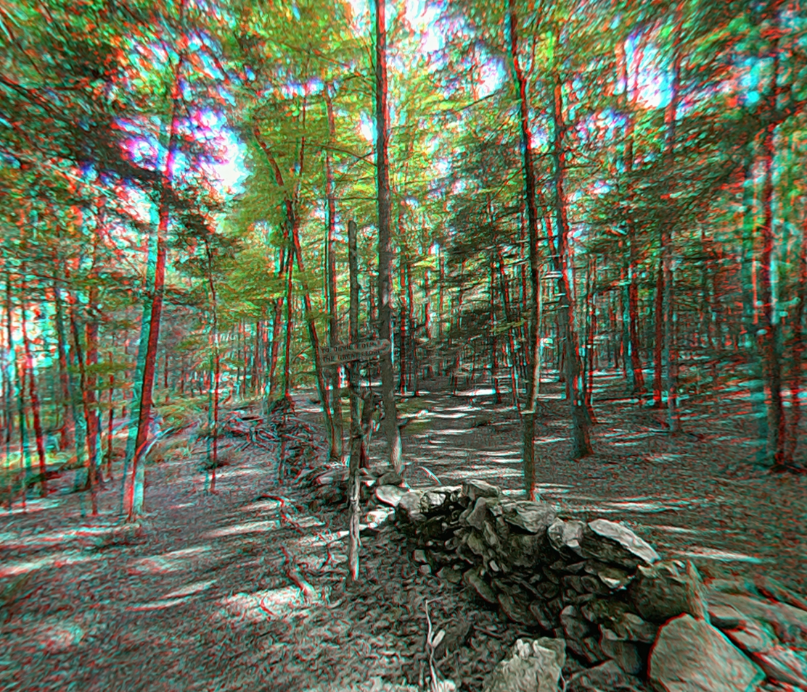

# vuze-3d-stitcher
A python based script for combining 8 separate photos taken by the Vuze 4K 3D 360 camera into a stereo 360 image. The goal is to provide a unix based alternative to the Vuze VR Studio which is only available on Windows and MAC. In the process, it may be possible to improve upon the overall stitch and output image quality. A set of sample images with their merged output is provided below.

<table>
  <tr>
    <td></td>
    <td></td>
    <td></td>
    <td></td>
  </tr>
  <tr>
    <td></td>
    <td></td>
    <td></td>
    <td></td>
  </tr>
</table>

The following image uses a resolution of 4320x4320 (resized for display here) along with the exposure merge of HET_0011, HET_0012, HET_0014, and HET_0015. The image is also suitable for lens position and size determination. A series of sample depth images (indepent of this one) were used to determine the optimal positioning of the left and right eye images. Using the merged image additional outputs are produced for use in Google Photos and for use with Red-Cyan Anaglyph glasses. Note: the Google Photos image stores the right eye in special EXIF metadata fields which only display with Google Cardboard image viewer or Google Photos.

| Generated Images |
| :----: |
| Over-Under 3D Image |
|  |
| |
| |
| Google Photos 3D Image (When Viewed in Google Cardboard) |
|  |
| |
| |
| Red-Cyan Anaglyph |
|  |


## Requirements
The following python models will need to be installed. The installation requires pip.
```
pip install numpy
pip install opencv-python
pip install -U scikit-learn
python -m pip install -U scikit-image
python -m pip install -U pyexiftool
```

## Installation and Usage

Clone this repository and ensure all of the requirements above are met. Assuming your Vuze Camera is similar to the one used for this project, copy a series of 8 images (`_1.JPG` -> `_8.JPG`) and their CSV from the camera to the parent directory of this repo. Also copy the VUZ*.yml file from the root of the memory card. The following commands are run from the parent directory of the repo.

Update the position of the sensors within the lens using your cameras configuration. Note: the images to merge in this command are `HET_0014_1.JPG` -> `HET_0014_8.JPG`.

```
vuze-3d-stitcher/src/vuze_merge.py -a vuze-3d-stitcher/coeffs_v5.dat -i HET_0014 --yaml-config VUZ*.yml
```

Merge the images into an over-under 3d equirectangular image.

```
vuze-3d-stitcher/src/vuze_merge.py -a vuze-3d-stitcher/coeffs_v5.dat -i HET_0014
```

To further configure the merge process examine the additional options provided by `vuze_merge.py` by running the script without any arguments.

```
vuze-3d-stitcher/src/vuze_merge.py
```

## Contribute

There is currently no formal contribution process. And there are no unit tests or regression tests. So good luck! Having said that code contributions of features and fixes are welcome.

If you wish to support this project please buy me a coffee.

<a href="https://www.buymeacoffee.com/eregular" target="_blank"></a>

## Website
[E-Regular Games](https://www.e-regular-games.com)

## Development Log
This directory contains documentation on useful processes and tests. It also documents attempts which failed, to avoid repeating them in the future. This is an on-going development log.

[Depth Calibration](./notes/depth_calibration/depth_calibration.md) (January 8th, 2023)

[Sensor Rotation and Feature Depth](./notes/depth_feature.md) (December 27, 2022)

[Camera Constants](./notes/camera_constants.md) (December 23, 2022)

[Lens Alignment](./notes/lens_alignment.md) (November 16, 2022)

[Horizon Leveling](./notes/horizon_leveling.md) (October 31, 2022)

[Super Resolution](./notes/super_resolution.md) (October 21, 2022)

[Color Matching Seams](./notes/color_matching_seams.md) (October 14, 2022)

[Seam Blending](./notes/seam_blending.md) (August 12, 2022)

[Color Matching with Regression](./notes/color_regression.md) (August 11, 2022)

[Handling Outliers & Better Seam Lines](./notes/handling_outliers.md) (August 7, 2022)

[All at Once Alignment](./notes/alignment_all.md) (August 4, 2022)

[Code Modules](./notes/code_modules.md) (August 2, 2022)

[Alignment in 3 Steps](./notes/alignment_3_steps.md) (July 30, 2022)

[Alignment with a Cubic](./notes/alignment_cubic.md) (July 27, 2022)

[Color Histogram Matching](./notes/color_hist_match.md) (July 24, 2022)

[Seam Alignment](./notes/seam_alignment.md) (July 24, 2022)

[Using Feature Detection](./notes/feature_detection.md) (July 23, 2022)

[Python Splice](./notes/python_splice.md) (July 21, 2022)

[Exposure Fusion](./notes/exposure_fusion.md) (July 19, 2022)

[Bash Splice](./notes/bash_splice.md) (July 15, 2022)

[Make VR](./notes/make_vr.md) (July 10, 2022)


## Source Code
The working source code. The current implementation is in python and requires several added libraries such as Numpy, OpenCV and MatPlotLib.

[Main Function](./src/vuze_merge.py)

## Tests
A collection of test images, configuration files, and result images.

[Test Images](./test/README.md)
