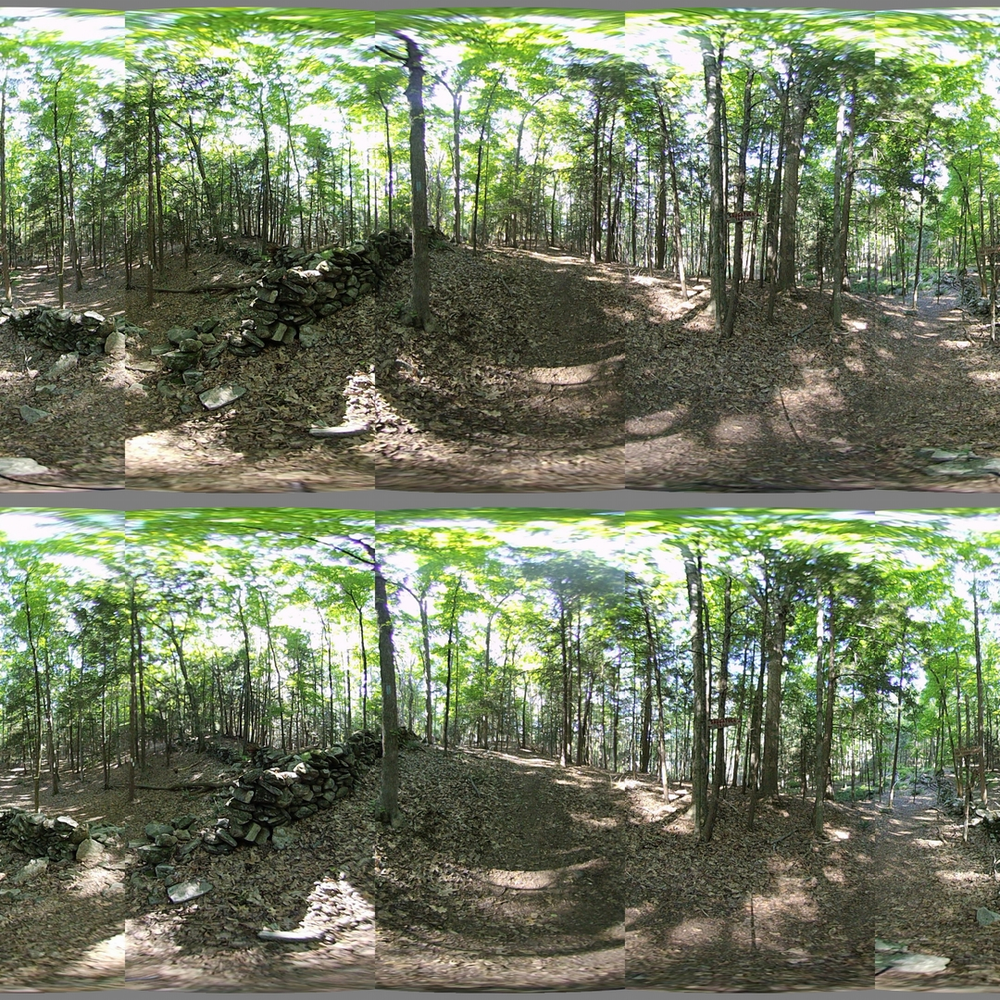

## Developer Log
*Entries at the top are more recent.*

### Using Feature Detection

Script: [features.py](../src/features.py)

Usage:
```
../notes/splice_360.sh -d -c config_bash_splice_360.dat
../src/features.py -c config_features.dat

```

The features script uses image features as determined by the SIFT algoritm and brute force macthing between images to determine the constants used for image transformations. All image transforms are within the spherical coordinate system. The most beneficial is the scaling of theta. A second transform was added to linearly shift phi with respect to theta.

<!-- \theta_f = k \theta_i -->


<!-- \phi_f = \phi_i + k \theta_i -->


These transforms were used because the operations are easy to perform both forward and reverse. The reverse transform is needed to determine the pixel location within the lens when given a pixel location in the final image. The table below shows the resulting constants and the error between the expected value and the calculated value using the constant.

<!-- \overline{\theta_f - \theta_i} -->
<!-- \sigma_{\theta_f-\theta_i} -->
<!-- \overline{\phi_f - \phi_i} -->
<!-- \sigma_{\phi_f-\phi_i} -->

<table>
  <tr>
    <th>Lens</th>
    <th>Theta Scale</th>
    <th></th>
    <th></th>
    <th>Phi Rate</th>
    <th></th>
    <th></th>
  </tr>
  <tr>
    <td>1</td>
    <td>0.8974</td>
    <td>0.0099</td>
    <td>0.0193</td>
    <td>0.0015</td>
    <td>-0.2655</td>
    <td>0.5106</td>
  </tr>
  <tr>
    <td>2</td>
    <td>0.9007</td>
    <td>-0.0242</td>
    <td>0.0237</td>
    <td>0.0027</td>
    <td>-0.1943</td>
    <td>0.5920</td>
  </tr>
  <tr>
    <td>3</td>
    <td>0.8760</td>
    <td>-0.0223</td>
    <td>0.0268</td>
    <td>-0.0100</td>
    <td>-0.3039</td>
    <td>0.4947</td>
  </tr>
  <tr>
    <td>4</td>
    <td>0.8970</td>
    <td>-0.0098</td>
    <td>0.0218</td>
    <td>0.0015</td>
    <td>-0.2582</td>
    <td>0.5568</td>
  </tr>
  <tr>
    <td>5</td>
    <td>0.8897</td>
    <td>0.0308</td>
    <td>0.0248</td>
    <td>0.0079</td>
    <td>-0.2470</td>
    <td>0.5288</td>
  </tr>
  <tr>
    <td>6</td>
    <td>0.9084</td>
    <td>-0.0193</td>
    <td>0.0235</td>
    <td>0.0033</td>
    <td>-0.3314</td>
    <td>0.5195</td>
  </tr>
  <tr>
    <td>7</td>
    <td>0.9048</td>
    <td>-0.0123</td>
    <td>0.0173</td>
    <td>0.0053</td>
    <td>-0.2227</td>
    <td>0.5425</td>
  </tr>
  <tr>
    <td>8</td>
    <td>0.9054</td>
    <td>-0.0044</td>
    <td>0.0192</td>
    <td>0.0109</td>
    <td>-0.2575</td>
    <td>0.5707</td>
  </tr>
</table>

Once the images were adjusted to get the feature points as close as possible, the stitch seams were computed. Instead of choosing a single constant theta for the seam a line of points starting from phi = 0, to phi = math.pi was used. All points within one standard deviation of the median theta were used for the seam. The seam is sorted by phi with duplicate values of phi removed. Points within the seam are assumed to be connected by a straight line. As you can see the stitch lines have issues when theta changes greatly with very little change in phi. The significant changes causes a zig-zag pattern in the final image.


#### References

[OpenCV Feature Matching](https://docs.opencv.org/4.x/dc/dc3/tutorial_py_matcher.html)


### Exposure Fusion

Script: [merge_exposure.sh](./merge_exposure.sh)

Usage (Luminance): `../notes/merge_exposure.sh -c config_exposure_merge_luminance.dat`

Usage (Enfuse): `../notes/merge_exposure.sh -c config_exposure_merge_enfuse.dat`

Expanding the feature set of the Vuze VR Studio to include exposure bracketing and HDR image creation would be helpful. The exposure fusion script attempts to take multiple images from a single lens and fuse the exposures into a new single image for that lens. This new image can be used in Vuze VR Studio or provided to a yet to be created splice script.

The first attempt at exposure fusion relied on Luminance HDR. The application has a batch interface which allows for creating HDR images and saving them as HDR images. The application also allows for creating a LDR image from the HDR image. There are over-exposed areas within the test images causing Luminance HDR and the LDR conversion alogirthms to create images with grey blotches in those areas. To mitigate this, the bash script for exposure fusion added support for negating the image and then fusing exposures. A clampping feature was also added. Finally a reasonable result was obtained. This result was given to the python splice script to produce the output below. While reasonable the result did show color distoritions.


Given the complexity of Luminance HDR stitching and its inability to provide a reasonable image given real world input a simpler solution is needed. The `enfuse` application was incorporated into the script as an option. Enfuse does not require the HDR configuration or LDR conversion. It does not require the exposure value for each image either. The result from enfuse was much closer to the original source images.


Cleary the winner here is Enfuse. The simple configuration and color accurate result speak for themselves.

#### References

[Luminance HDR](https://luminancehdr.readthedocs.io/en/latest/)

[pfsclamp](https://resources.mpi-inf.mpg.de/pfstools/man1/pfsclamp.1.html)

[Enfuse](http://enblend.sourceforge.net/index.htm)

[Mertens-Kautz-Van Reeth](https://web.stanford.edu/class/cs231m/project-1/exposure-fusion.pdf)

### Python Splice

Script: [splice_360.py](./splice_360.py)

Usage (from ./test):
```
../notes/splice_360.sh -d -c config_bash_splice_360.dat
../notes/splice_360.py -c config_python_splice_360.dat
```

This script allows for scaling, rotating, and shifting each lens individually. It attempts to correct the issue of missing pieces which was found in the Bash script. The python script requires the equirectangular 180 degree images created by the previous Bash script. OpenCV and Numpy were used for loading images and manipulating image data in an efficient manner. To ensure efficiency and reduce the number of intermediate images, the coordinates are computed without resolving to pixel colors until the final step.

The equirectangular image coordinates for each pixel in the final image are created. These coordinates are translated to polar, and then filtered to the respective lens the polar coordinate should reference. The polar coordinate is then converted to an equirectangular coordinate relative to that lens. The final step is to determine the color of that coordinate using a linear interpolation of the 4 surrounding pixels.

The results were reasonable, but required complete manual configuration of the transformation parameters. This is infeasible as there are 8 lenses and each lens could have different parameters. Adjust parameters for one lens could impact the parameters for other lenses. It is a problem which will need a more automated solution.

The example configuration file [config_python_splice_360.dat](../test/config_python_splice_360.dat) and output is provided in the [/test](../test) directory.



#### References
[OpenCV Getting Started](https://docs.opencv.org/4.x/db/deb/tutorial_display_image.html)

### Bash Splice

Script: [splice_360.sh](./splice_360.sh)

Usage (from ./test): `../notes/splice_360.sh -c config_bash_splice_360.dat`

The goal is to join 4 left eye images into a single 360 panorama, and the 4 right eye images into a second 360 panorama. The first step was determining the center of the fisheye and the radius for each lens. The images were then cropped and padded such that the center of the fisheye was the center of the iamge. Ffmpeg was used to convert from fisheye to cubemap with faces ordered consistently such that the front of the camera was always the same side of the cubemap. The cubemap for each image was split apart and re-assembled such that a single cubemap including pieces of the original 4 was created. This was done for each eye and then the cubemaps were converted to equirectangular images.

The result was very poorly stitched 360 panorama for each eye. The seam locations being at the same angle from center in each image causes 8 seams to appear when viewing in stereo mode. Parts of the image were missing as horizontal scaling causes each image to occupy more than 90 degrees of the view. Ideally, there should be 4 seams and no missing parts of the image.

The example configuration file [config_bash_splice_360.dat](../test/config_bash_splice_360.dat) and output is provided in the [/test](../test/) directory.


#### References

[FFMPEG v360 Filter](https://ffmpeg.org/ffmpeg-filters.html#v360)

[ImageMagick Convert](https://imagemagick.org/script/convert.php)

### Make VR
Google Photos can render 360 images. It shows them in flat vr or as a single eye 2d moveable frame. It also appears to have the ability to render 360 3d images, but does not use the standard side-by-side or over under stereo format.

It turns out Google Photos uses image metadata to embed the right eye image in the left eye file. It uses XMP tags for dimensions, initial position, the image type, and the actual right eye image. While the standard appears straightforward there are some caveats to actually inserting the image. Allow exiftool to insert the XMP tags as it pleases leads to a file which Google Photos does not understand. Special care must be taken to preserve a format compatible with Google Photos.

To preserve the proper format a template xmp file is used. This template is modified with the current photo data and the exiftool inserts the template into the left eye image. The result is a single image which can be displayed both as a normal image and as 3d 360 VR.

#### References

[Google VR Metadata Tags](https://developers.google.com/vr/reference/cardboard-camera-vr-photo-format)

[Jumping Jack Flash - Foto 3d a 180° o 360° (VR180 o VR360)](https://jumpjack.wordpress.com/2021/07/03/foto-3d-a-180-o-360-vr180-o-vr360/) - A thorough explanation of how to create an image compatible with Google Photos that will render in 360° Stereoscopic.

[JPEG ExifTool](https://exiftool.org/)