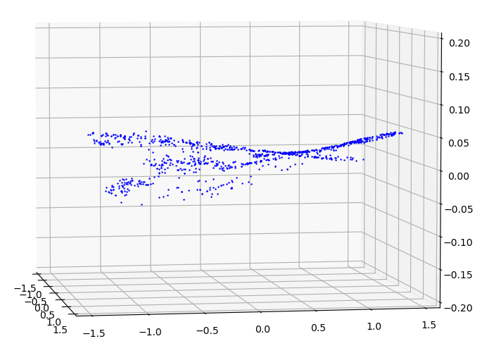
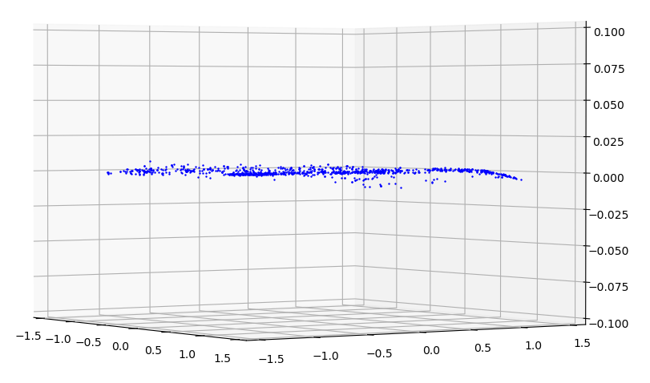
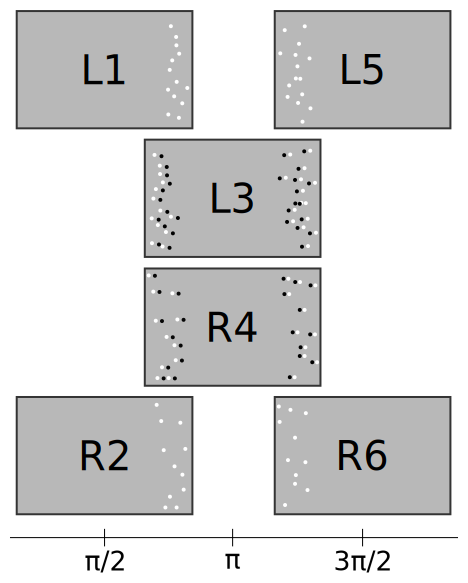
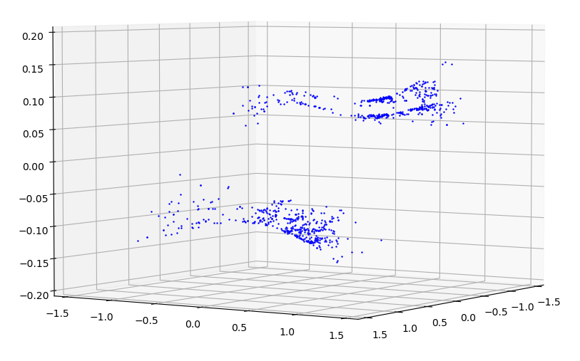
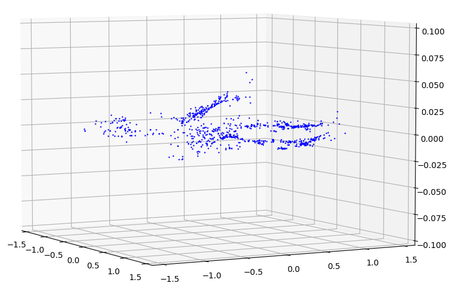
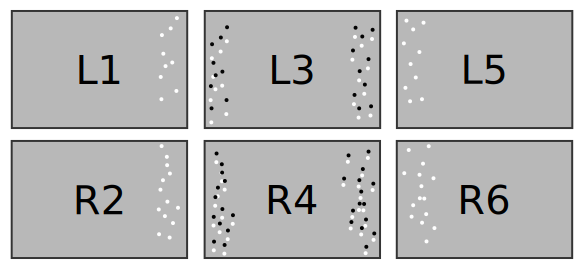
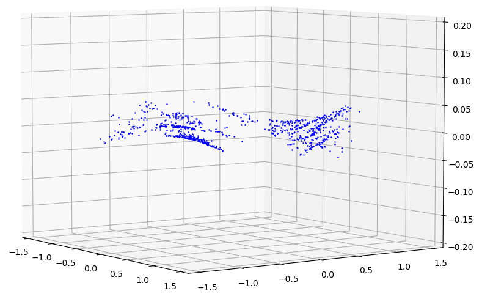
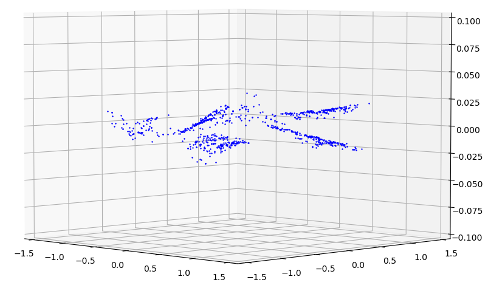
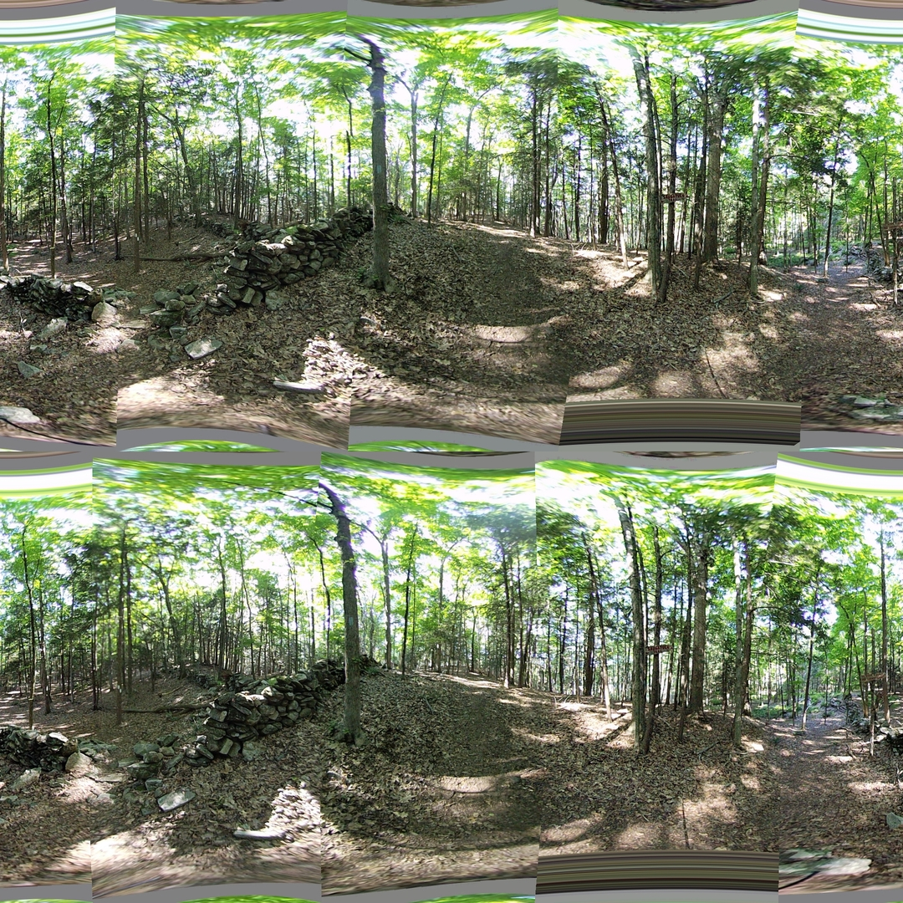

## Alignment in 3 Steps

*Date: July 30, 2022*

Script: [features.py](../src/features.py)

Usage:
```
../notes/splice_360.sh -d -c config_bash_splice_360.dat
../src/features.py -c config_features.dat
```

Seams of the final image still appear to show some misalignment. The 3 steps of alignment were each analyzed in greater depth. In order to attempt to keep visual discrepancies between the eyes to a minimal for stitching adjustments (steps 2 and 3) regression constants were shared between the eyes.

### Step 1
The first step is verticle alignment, or ensuring the matching feature points of the left-eye image and the right-eye image have the same value of $\phi$. The median $\phi$ between the left-eye and right-eye was used as the desired value, $\phi_f$. The regression was done assuming a quadratic function with respect to $\theta$ and $\phi$. Using the calculated constants, the output of the function will be called $\phi_a$.

| $\Delta\phi$ with respect to $\theta$ and $\phi$ |
| :----: |
|  |

$$\phi_a = (c_0\theta^2 + c_1\theta + c_2)(c_3\phi^2 + c_4\phi + c_5)$$

$$
\begin{split}
\phi_a &= c_0\theta^2\phi^2 + c_1\theta^2\phi + c_2\theta^2 \\
&+ c_3\theta\phi^2 + c_4\theta\phi + c_5\theta \\
&+ c_6\phi^2 + c_7\phi + c_8
\end{split}
$$

The linear regression is computed using QR factorization and the following setup for $x$.

$$x = \begin{bmatrix} \theta^2\phi^2 & \theta^2\phi & \theta^2 & \theta\phi^2 & \theta\phi & \theta & \phi^2 & \phi & 1 \end{bmatrix}$$

$$\phi_f = \sum_{i=0}^{9}{c_ix_i}$$

The error between the actual value of $\phi_f$ and the approximation $\phi_a$ is plotted below.

| $\phi_f - \phi_a$ with respect to $\theta$ and $\phi$ |
| :----: |
|  |

### Step 2
The next step is to align the edges of each lens with the edges of the lenses adjacent to it. This alignment is done independent of the other eye lenses. This desired \theta coordinate for each feature point is the average value between matching feature points of adjacent images, when the images are positioned $\pi/2^c$ apart in spherical space. The diagram below illustrates the positioning as well as the desired value. Each image will have a set of desired values, black dots, on the left side and a set of desired values on the right side. To maintain the best alignment between left-eye and right-eye images only one set of constants will be used for both.

| Alignment showing Desired values of $\theta$ for Lens 3 and 4. |
| :----: |
|  |

The difference between the feature point and the average value determined above needs to be approximated in order to transform the image. This difference is visualized below. The similarly shaped, but offset collections are each from a single eye.

| $\Delta\theta$ with respect to $\theta$ and $\phi$ |
| :----: |
|  |

Again a cubic function is used, but it is generalized to be cubic with respect to $\theta$ and $\phi.

$$\theta_a = (c_0\theta^3 + c_1\theta^2 + c_2\theta + c_3)(c_4\phi^3 + c_5\phi^2 + c_6\phi + c_7)$$

$$
\begin{split}
\theta_a &= c_0\theta^3\phi^3 + c_1\theta^3\phi^2 + c_2\theta^3\phi + c_3\theta^3 \\
&+ c_4\theta^2\phi^3 + c_5\theta^2\phi^2 + c_6\theta^2\phi + c_7\theta^2 \\
&+ c_8\theta\phi^3 + c_9\theta\phi^2 + c_{10}\theta\phi + c_{11}\theta \\
&+ c_{12}\phi^3 + c_{13}\phi^2 + c_{14}\phi + c_{15}
\end{split}
$$

The regression to compute the constants for $c$ is as follows.

$$x = \begin{bmatrix} \theta^3\phi^3 & \theta^3\phi^2 & \theta^3\phi & \theta^3 & ... & \phi^3 & \phi^2 & \phi & 1 \end{bmatrix}$$

$$\theta_f = \sum_{i=0}^{16}{c_ix_i}$$

Using these constants a much closer value of $\theta$ can be obtained.

| $\theta_f - \theta_a$ with respect to $\theta$ and $\phi$ |
| :----: |
|  |

### Step 3
The final step is to adjust $\phi$ one last time. The adjustment is done to more accurately align the seams veritcally. There is clear pattern, but it does not appear to fit well with a linear, quadratic, or cubic. The closest appears to be quadratic. Only the points along the seams will be used during the regression. The $\theta$ used during these calculations is $\theta_f$ from the previous step.

| Alignment showing Desired values of $\phi$ for Lens 3 and 4. |
| :----: |
|  |

The observed difference is visualized below. The similarly shaped, but offset collections are each from a single eye.

| $\Delta\phi$ with respect to $\theta$ and $\phi$ |
| :----: |
|  |

A similar regression to step 1 is performed. The reuslting error in $\phi_a$ is graphed below.

| $\phi_f - \phi_a$ with respect to $\theta$ and $\phi$ |
| :----: |
|  |

### Results

The regression performed well respect to to the mean error. For all regressions the mean error was 0.0. The table below shows only the standard deviation of the error. Each lens has a unique regression for vertical $\phi$, but combined left-eye and right-eye pairs were used for $\theta$ and $\phi$.

| Lens | Vertical $\sigma_{\phi_f-\phi_a}$ | $\sigma_{\theta_f-\theta_a}$ | $\sigma_{\phi_f-\phi_a}$ |
| ---- | ---- | ---- | ---- |
| 1 | 0.0016 | 0.0117 | 0.0119 |
| 2 | 0.0012 | 0.0117 | 0.0119 |
| 3 | 0.0047 | 0.0104 | 0.0125 |
| 4 | 0.0015 | 0.0104 | 0.0125 |
| 5 | 0.0016 | 0.0164 | 0.0108 |
| 6 | 0.0095 | 0.0164 | 0.0108 |
| 7 | 0.0014 | 0.0178 | 0.0108 |
| 8 | 0.0013 | 0.0178 | 0.0108 |

The resulting stitch looks significantly improved near the top and bottom of the seam lines. There is still a visible seam line. Now there are also sections of the image which do not render. These missing sections are likely caused by the cubic regression having more than one real solution, an implementation limitation.


