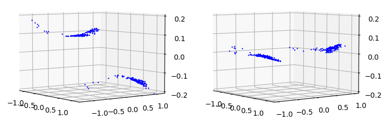
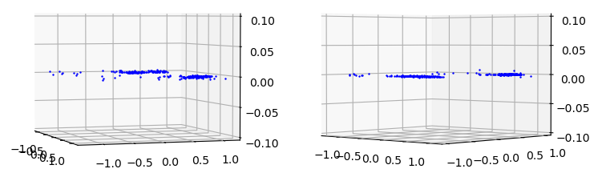
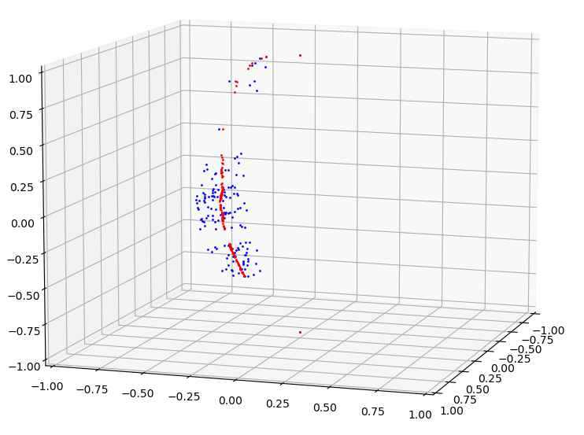
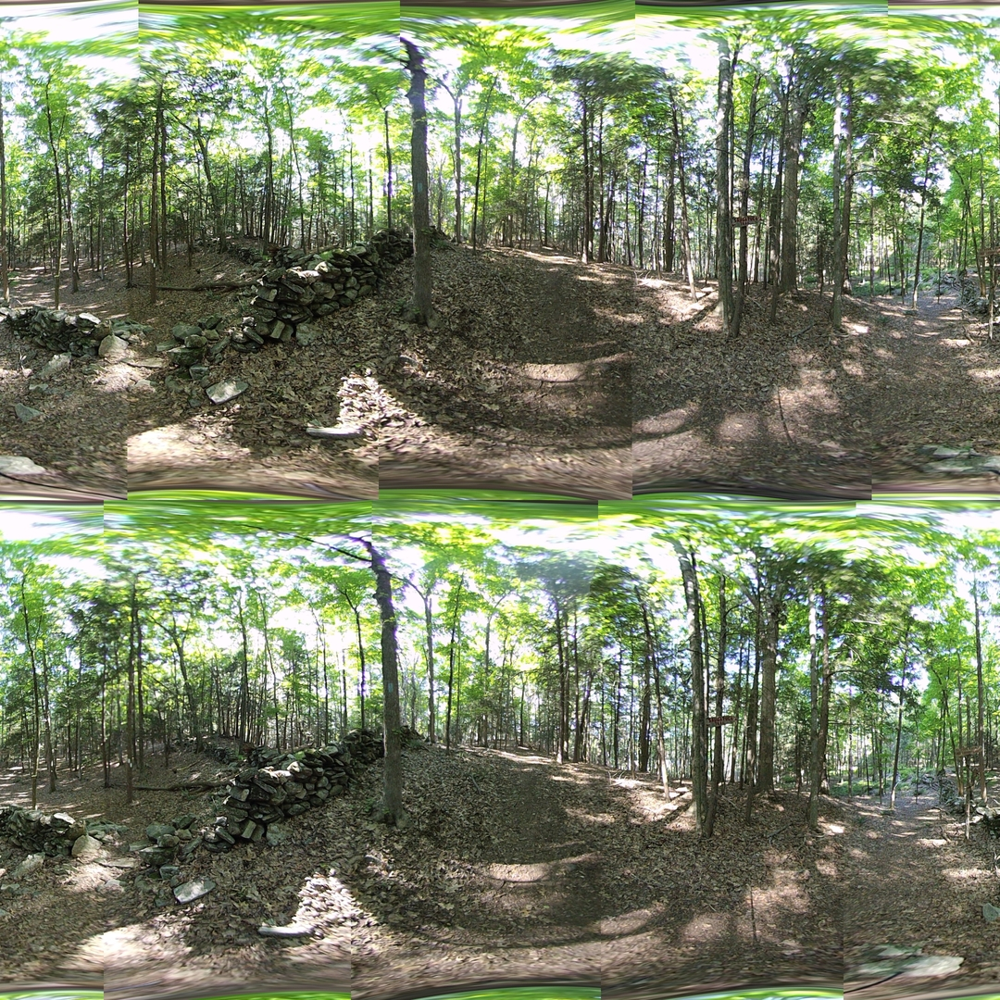

## All at Once Alignment

*Date: August 4, 2022*

Script: [vuze_merge.py](../src/vuze_merge.py)

Usage:
```
../src/vuze_merge.py -c config_features.dat
```

### Hypothesis

Having distinct sets of feature points for alignment of images and for computing the seam line leads to feature points with poor alignment being selected. Choosing feature points which had the least error between the desired position and the approximation should result in a better seam quality.

### Method

Using 60°x60° sections that make up each seam from each of the 4 images and performing feature selection and matching resulted in features points contained in all four images. The target coordiantes for each feature were computed, where $\theta_i$ and $\phi_i$ are the coordinates from the lens $i$.

$$\theta_{\mathit{left}} = 0.5(\theta_i + \theta_{i+2})$$

$$\theta_{\mathit{right}} = 0.5(\theta_{i+1} + \theta_{i+3})$$

$$\phi_f = 0.25 * (\phi_i + \phi_{i+1} + \phi_{i+2} + \phi_{i+3})$$

Due to the shift between eyes, the final value of $\theta$ for each point will be different between the left and right eyes. However, the $\phi_f$ should be the same for both eyes.

Using the sample image HET_0014 and the matching between eyes the following number of feature points were found for each seam.

| Seam | Points |
| :---: | :---: |
| 0 | 149 |
| 1 | 168 |
| 2 | 177 |
| 3 | 210 |

Before performing the regression, outliers were removed from the matching points. A point was considered an outlier if either of the following was true.

$$\left|\left(\theta_f - \theta_i\right) - \overline{\left(\theta_f-\theta_i\right)}\right| > 2 \sigma_{\theta_f - \theta_i}$$

$$\left|\left(\phi_f - \phi_i\right) - \overline{\left(\phi_f-\phi_i\right)}\right| > 2 \sigma_{\phi_f - \phi_i}$$

Regression was then performed for each lens, by combining the targets from the left seam and the right seam of the image. This allows for each image to have its own set of alignment constants for $\theta$ and $\phi$. For $\theta_a$ and $\phi_a$, the approximations of the final value, a 3rd order polynomial was used for each.

The implementation of determining the root of a polynomial was improved to support 2nd and 3rd order polynomials with multiple real roots. For 3rd order polynomials the trigonometric root finding solution was used. Given the context of finding the approximation of the initial value given a final value, with only a small change, the closest root to the initial value was selected.

| Initial Difference in $\theta$ (left) and $\phi$ (right) for Seam 0 with respect to $\theta$ and $\phi$ |
| :------: |
|  |

| Final Difference in $\theta$ (left) and $\phi$ (right) for Seam 0 with respect to $\theta$ and $\phi$ |
| :------: |
|  |

The regression for $\theta$ and $\phi$ for each image yielded a mean error of 0.0. The standard deviation of error for each regression is listed below.

| Lens | $\sigma_{\theta_f-\theta_a}$ | $\sigma_{\phi_f-\phi_a}$ |
| ---- | ---- | ---- |
| 1 | 0.0012 | 0.0008 |
| 2 | 0.0020 | 0.0012 |
| 3 | 0.0016 | 0.0007 |
| 4 | 0.0024 | 0.0007 |
| 5 | 0.0017 | 0.0005 |
| 6 | 0.0019 | 0.0007 |
| 7 | 0.0011 | 0.0006 |
| 8 | 0.0011 | 0.0006 |

Coordinates with error less than the specified threshold of 0.0075 for selected for computing the seam line, see the equation below.

$$\sqrt{(\theta_f-\theta_a)^2+(\phi_f-\phi_a)^2} < 0.0075$$

The selected points were sorted by $\phi_f$ and duplicate $\phi_f$ values were removed. The seam is based on the target values, $\theta_f$ and $\phi_f$ and there is one seam line defined per image. Seam 0 (zero-indexed) is the seam on the left side of lens 1 (one-indexed). The cumulative mean $\theta_f$ is used for each $\phi_f$ in the seam.

| Seam 0 in Red with Feature Points in Blue |
| :------: |
|  |

This seam computation works well in situations with a large number of feature points equally distributed amongst $\phi_f$ values.

### Split the $\phi$ Regression?

In attempt to further refine the seams, the left and right $\phi$ regressions for a single image were split into separate computations. The constant offset was removed from both to ensure the regressions would meet in the middle. This did not improve the seam line, and in fact led to a visible distortion in the center of the image where the two approximation functions met.

### Results

A significantly better fit was obtained using per lens alignment. The warping of the individual images appears less and the seam lines appear to align better overall. The new approach to seam lines appears to reduce the sharp cornors which used to be visible along the seam. The seam lines are still visible due to the color discrapancy between images, this configuration does not use exposure matching.


