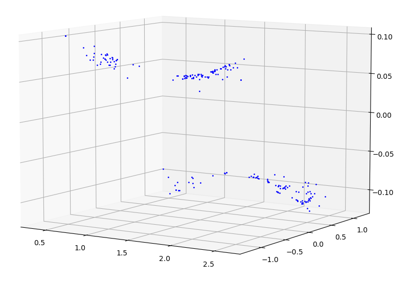
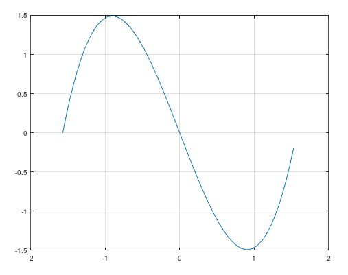
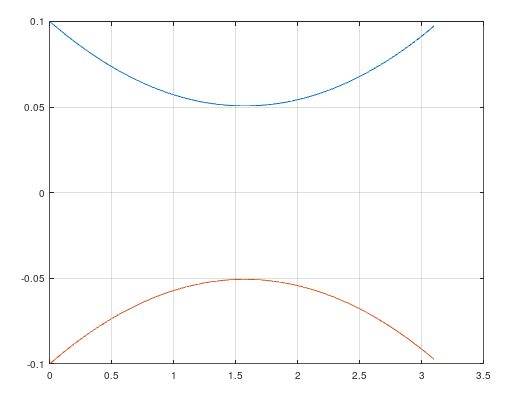
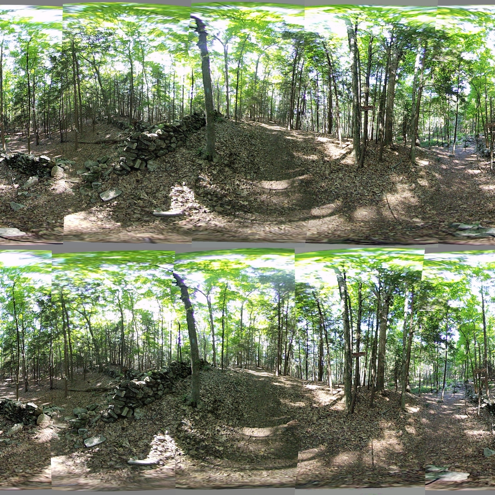

## Alignment with a Cubic

*Date: July 23, 2022*

Script: [features.py](../src/features.py)

Usage:
```
../notes/splice_360.sh -d -c config_bash_splice_360.dat
../src/features.py -c config_features.dat
```

To improve the standard deviation of $\theta$, a better approximation function needs to be determind. The difference between $\theta_f$ and $\theta_i$, or $\Delta\theta$ is shown with respect to $\theta_i$ and $\phi_i$. The plot appears to follow different curves with respect to each axis.

| $\theta_f - \theta_i$ with respect to $\theta_i$ and $\phi_i$ |
| :----: |
|  |

In each dimension it appears the desired correction could be approximated by a low-order polynomial. A low order polynomial would allow for both forward and inverse operations in efficient time.

| Shape of $\Delta\theta$ with respect to $\theta$ |
| :----: |
|  |

| Shape of $\Delta\theta$ with respect to $\phi$ |
| :----: |
|  |

To generate the sample plot of $\Delta\theta$ with respect to $\phi$ use the following Octave code.
```
phi = [0:0.05:pi];
y = (phi) .* (phi-pi) * 0.02 + 0.1
plot(phi, y, phi, -1 * y)
```

To generate the sample plot of $Delta\theta$ with respect to $\theta$ use the following Octave code.
```
theta = [-pi/2:0.05:pi/2];
y = (theta - pi/2) .* (theta + pi/2) .* theta
plot(theta, y)
```

This shape appears to follow a curve which is cubic with respect to $\theta$ and a quadratic with respect to $\phi$. The convexity of the quadratic changes about the $\theta$ axis.

$$\Delta\theta = c_1(\theta-c_2)(\theta-c_3)\theta + c_4(\phi-c_5)\phi\theta$$

$$\frac{\Delta\theta}{\theta} = a\theta^2 + b\theta + c\phi^2 + d\phi + e$$

With the givens of $\theta$, $\phi$, and $\Delta\theta$ treat this equation as a linear regression and compute the constants $a, b, c, d, e$. The approximation function for $\theta$ is then represented as the following. The result of which is called $\theta_a$.

$$\theta_a = \theta + \Delta\theta$$

$$\theta_a = a\theta^3 + b\theta^2 + \theta(c\phi^2 + d\phi + e + 1)$$

In order to compute $\theta_i$ given a $\theta_f$ and $\phi$ solve the following.

$$\theta_f = \theta + \Delta\theta$$

$$\theta_f = \theta + a\theta^3 + b\theta^2 + c\phi^2\theta + d\phi\theta + e\theta$$

$$0 = a\theta^3 + b\theta^2 + \theta(c\phi^2 + d\phi + e + 1) - \theta_f$$

A basic implementation assuming one root, was written using NumPy O(1) algebraic functions. The NumPy Polynomial module was not used, because the runtime complexity of it was not known.

Verticle alignment between eyes was attempted using two transforms. The first is an offset of $\phi$ for each lens calculated by using the average $\phi$ value of matching feature points between the left-eye and right-eye. This per lens offset was applied before other regression calculations including the analysis of $\theta$ mentioned above. Further analysis for $\phi$ will need to be performed in the future. At this point, the $\Delta\phi$ analysis was not performed and its approximation function was assumed to be a cubic with respect to $\theta$.

The results of using a cubic function for transforming the $\theta$ coordinate of the image in the spherical coordinate system are promissing. There is much better alignment on the seams and the $\sigma_{\Delta\theta}$ is much improved. In fact, the average difference between the approximation of $\theta_a$ and the expected $\theta_f$ was 0.0. The average difference between the approximation of $\phi_a$ and the expected $\phi_f$ was 0.0. The useful information is in how many coordinates lie within one standard deviation of the mean.



<table>
  <tr>
    <th>Lens</th>
    <th>$\sigma_{\theta_f - \theta_a}$</th>
    <th>$\sigma_{\phi_f - \phi_a}$</th>
  </tr>
  <tr>
    <td>1</td>
    <td>0.0240</td>
    <td>0.0141</td>
  </tr>
  <tr>
    <td>2</td>
    <td>0.0223</td>
    <td>0.0138</td>
  </tr>
  <tr>
    <td>3</td>
    <td>0.0293</td>
    <td>0.0130</td>
  </tr>
  <tr>
    <td>4</td>
    <td>0.0307</td>
    <td>0.0120</td>
  </tr>
  <tr>
    <td>5</td>
    <td>0.0198</td>
    <td>0.0161</td>
  </tr>
  <tr>
    <td>6</td>
    <td>0.0207</td>
    <td>0.0183</td>
  </tr>
  <tr>
    <td>7</td>
    <td>0.0212</td>
    <td>0.0183</td>
  </tr>
  <tr>
    <td>8</td>
    <td>0.0200</td>
    <td>0.0157</td>
  </tr>
</table>
