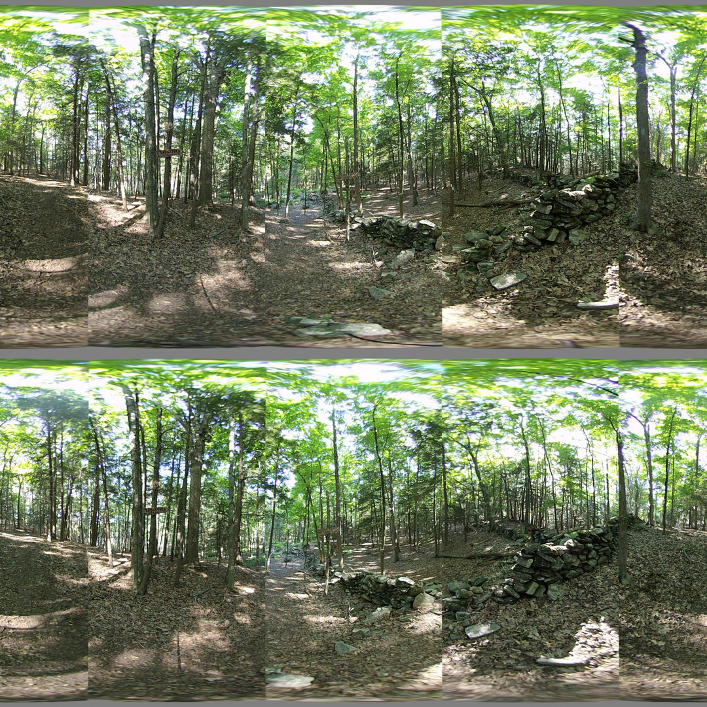

## Bash Splice

*Date: July 15, 2022*

Script: [splice_360.sh](./splice_360.sh)

Usage (from ./test): `../notes/splice_360.sh -c config_bash_splice_360.dat`

The goal is to join 4 left eye images into a single 360 panorama, and the 4 right eye images into a second 360 panorama. The first step was determining the center of the fisheye and the radius for each lens. The images were then cropped and padded such that the center of the fisheye was the center of the iamge. Ffmpeg was used to convert from fisheye to cubemap with faces ordered consistently such that the front of the camera was always the same side of the cubemap. The cubemap for each image was split apart and re-assembled such that a single cubemap including pieces of the original 4 was created. This was done for each eye and then the cubemaps were converted to equirectangular images.

The result was very poorly stitched 360 panorama for each eye. The seam locations being at the same angle from center in each image causes 8 seams to appear when viewing in stereo mode. Parts of the image were missing as horizontal scaling causes each image to occupy more than 90 degrees of the view. Ideally, there should be 4 seams and no missing parts of the image.

The example configuration file [config_bash_splice_360.dat](../test/config_bash_splice_360.dat) and output is provided in the [/test](../test/) directory.

### References

[FFMPEG v360 Filter](https://ffmpeg.org/ffmpeg-filters.html#v360)

[ImageMagick Convert](https://imagemagick.org/script/convert.php)
