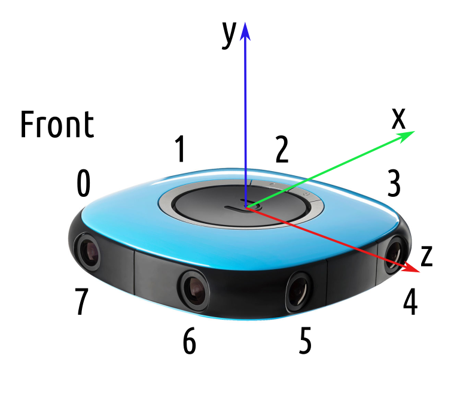
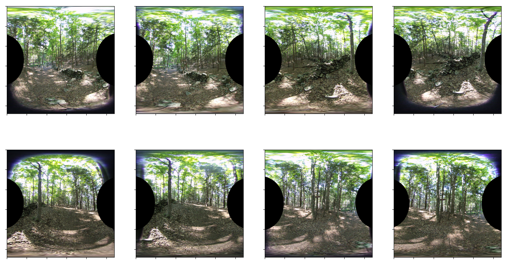
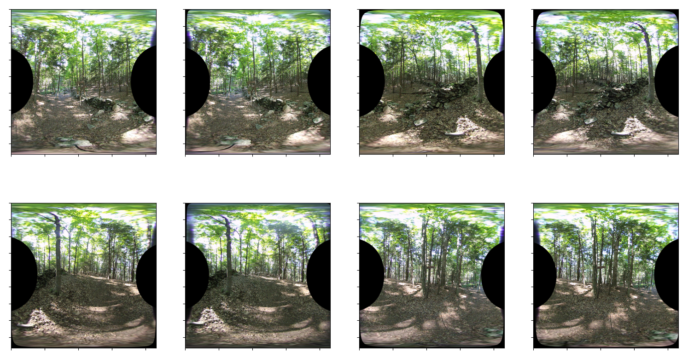
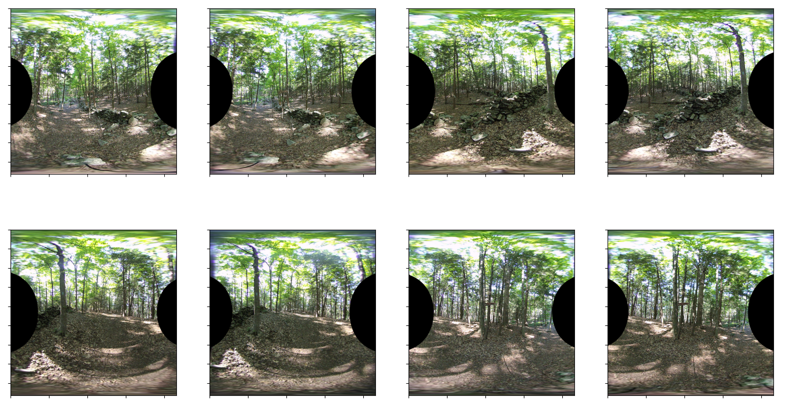

## Lens Alignment

*Date: December 23, 2022*

Script: [vuze_merge.py](../src/vuze_merge.py)

Usage:
```
./src/vuze_merge.py -w test/coeffs_v4.dat -y test/VUZ1178200318.yml -I test/HET_0014 -O test/HET_0014_yaml_calib -v -e -d fisheye -q 1080
```

### Objective

Use the yml configuration file generated by the Vuze camera to properly align and undistort the image from each lens.

### Configuration Constants

The YAML format file appears to be generated by OpenCV, as indicated by the types of matrices: `!!opencv-matrix`. Additionally each lens 0 through 7 has the same constants defined, see table below.

| Variable | Dimensions | Description |
| -------- | ---------- | ----------- |
| K | 3x3 | Intrinsic camera matrix. Units: pixels |
| R | 3x3 | Rotation matrix of the camera. Rotations are relative to lens 0. |
| CamCenter | 3x1 | Vector to the center of the camera, in the axes of the camera. Units: mm |
| t | 3x1 | Appears related to translation relative to camera center, but the axes and origin are unknown at this time. Units: mm |
| DistortionCoeffs $k$ | 11x1 | Coefficients K according to: [OpenCV Fisheye](https://docs.opencv.org/3.4/db/d58/group__calib3d__fisheye.html) |
| Fov_deg | 1x1 | Horizontal field of view in degrees. |
| StraightSrcImageSize | 1x2 | Size of the image. Units: pixels |
| ImageCircleCenter | 1x2 | Extracted from K. Units: pixels |
| ImageCircleRadius | 1x1 | Radius of the image. Units: pixels |

| Axes According to the Saved Constants |
| :----: |
|  |

The center of the camera is considered to the origin, and all rotations are related to lens 0.

$$\theta_d = \theta \left( k_0 + k_2 \theta^2 + k_4 \theta^4 + k_6 \theta^6 + k_8 \theta^8 \right)$$

### Undistort and Convert to Equirectangular

The OpenCV fisheye projectPoints function is used during the equirectangular conversion. Each pixel's coordinates in the equirectangular image are identified and arranged in a square image representing the center of the equirectangular view. The coordinates in terms of $c = (x, y, z)$ are initially represented in the y-axis forward orientation and need to be adjusted to y-axis up orientation.

$$c_c = c \begin{bmatrix} 1 & 0 & 0 \\\\ 0 & 0 & -1 \\\\ 0 & 1 & 0 \end{bmatrix}$$

These points are projected into the image space to obtain the coordinate pair $c_i = (u, v)$. The final adjustment is to account for the elliptical distortion as explained in [Lens Alignment](./lens_alignment.md). This is done by translating into the unit vector space as defined by the axis of the ellipse and then scaling the minor axis to create a circle.

### Adjusting Configuration Constants

Using the pre-defined constants from the configuration file the results show some distortion and misalignment.

| Camera Constants for Equirectangular Mapping |
| :----: |
|  |

Each image should not include any black pixels along the top or bottom. Several images show a mis-alignment including: lens 0, 3, 4, and 7.

This misalignment is caused by the camera intrinsic matrix being incorrect. Using the method from the previous [Lens Alignment](./lens_alignment.md), the center of the lens within the image sensor can be more accurately determined.

The rotation matrix $R$, is used to account for any rotation of the sensor about the forward/back and left/right axes. The rotation matrix for lenses 2-7 must be rotated first to align with the axis of lens 0.

In order to see the impact of the elliptical adjustment mentioend above, the step was skipped and the equirectangular images below were generated. These images appear slightly more compressed horizontally.

| Camera Constants for Equirectangular Mapping Without Elliptical Adjustment |
| :----: |
|  |

And when all adjustments and undistorition methods are combined the following is the result.

| Camera Constants for Equirectangular Mapping Updated |
| :----: |
|  |

The vuze_merge script was updated to support a parameter `-y` or `--yaml-config` which allows specification of the camera's yaml file. The data from the file along with the parameters of the ellipse are written to the coeffs file for future when processing other images. In order to get accurate ellipse and center parameters images with a large number of edges must be provided.
