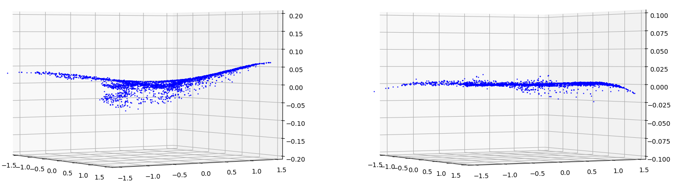

## Better Code Modularization

*Date: August 2, 2022*

Script: [vuze_merge.py](../src/vuze_merge.py)

Usage:
```
../src/vuze_merge.py -c config_features.dat
```

The previous features script was replaced by `vuze_merge.py`. The code was split across several files to aid in organization and future enhancements. The conversion from fisheye to equirectangular was included within the python code as well. This means it is no longer necessary to run a pre-processing bash script before the python feature recognition.


### Modules

coordinates - utility functions for converting between coordinate systems.

Equirec2Perspec - convert from equirectangular image to rectilinear image and back.

fisheye - convert from a fisheye image to an equirectangular image.

refine_seams - determine seam locations and transforms for each lens.

splice - generate the spliced image based on the seams and transforms.

transform - utility class for computing and applying coordinate transformations to an image.

vuze_merge - the "main" function which parses user options, loads images, and writes the output files.

### Exposure Fusion

The OpenCV library provides an implementation of the Mertens exposure funsion algorithm. That implementation was incorporated into the vuze_merge script. This makes the bash scripts completely obsolete. Exposure fusion is performed on the equirectangular images.

### Alignment

The 3 step alignment process is still used with some slight modifications. The adjustments are now done per lens instead of per lens (right/left) pair. This yields 8 sets of constants for vertical alignment, 8 sets for $\theta$ and 8 sets for $\phi$. The vertical alignment is 2nd order, $\theta$ is 3rd order and $\phi$ is 2nd order. The mean error after alignment for each regression was 0.0; the relevant metric is again the standard deviation.

| Difference in $\phi$ before (left) and after (right) Vertical Alignment |
| :------: |
|  |

| Difference in $\theta$ before (left) and after (right) Seam Alignment |
| :------: |
|  |

| Difference in $\phi$ before (left) and after (right) Seam Alignment |
| :------: |
|  |

| Lens | Vertical $\sigma_{\phi_f-\phi_a}$ | $\sigma_{\theta_f-\theta_a}$ | $\sigma_{\phi_f-\phi_a}$ |
| ---- | ---- | ---- | ---- |
| 1 | 0.0022 | 0.0019 | 0.0013 |
| 2 | 0.0019 | 0.0024 | 0.0026 |
| 3 | 0.0019 | 0.0026 | 0.0018 |
| 4 | 0.0021 | 0.0023 | 0.0012 |
| 5 | 0.0026 | 0.0024 | 0.0029 |
| 6 | 0.0029 | 0.0031 | 0.0033 |
| 7 | 0.0022 | 0.0026 | 0.0029 |
| 8 | 0.0021 | 0.0017 | 0.0023 |

Despite the significantly improved standard deviation of the error the overall seam lines appear similarly poor.


