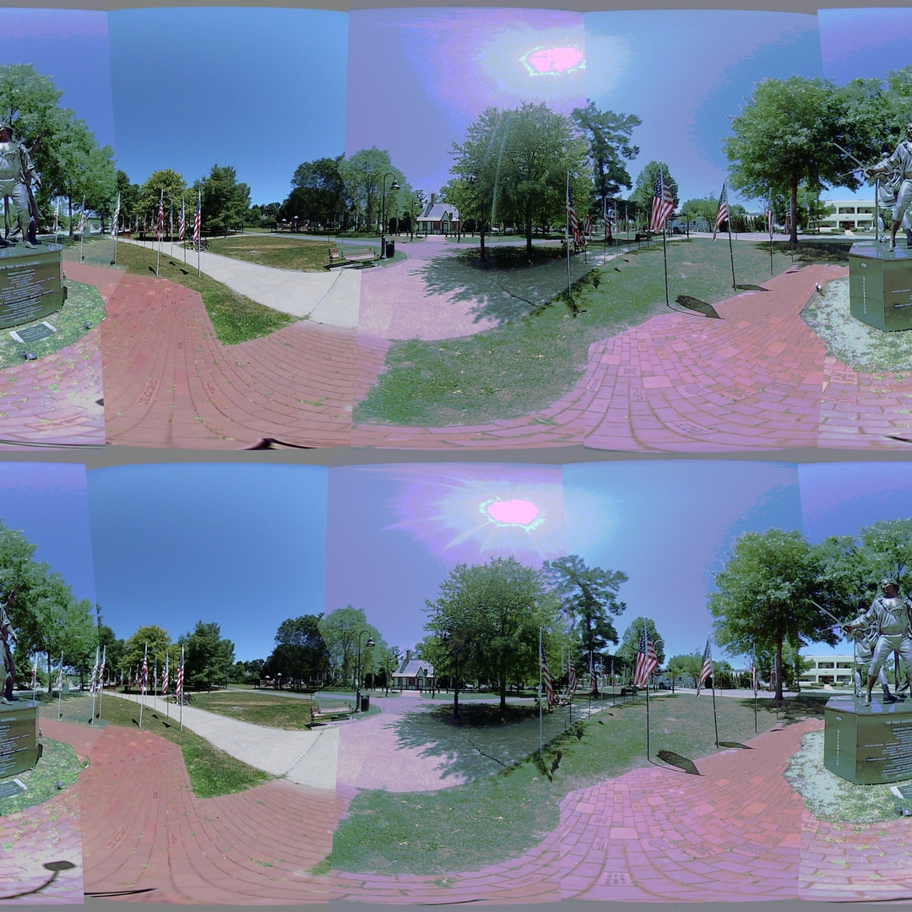

## Color Histogram Matching

With the improved image alignment and seams, the color differences between the lenses are becoming more obvious. A simple way to align color distributions between similar images is to use the histogram matching technique.

Histogram matching returns reasonable results for images with already similar color histograms.

A new image set was uploaded which included lens flare and distorted colors based on the changing brightness of the 360 scene. The histogram matching technique adjusts each color channel, RGB, separately. This results in distorted colors. Others using this technique have suggested only matching the brightness channel in the HSV color space.

This new set of images also exposes issues with feature identification and stitching. For large areas of blue sky, there are no feature points. This lack of data makes it difficult to correctly identify the image adjustment constants.

### References

[Histogram Matching - SciKit-Image](https://scikit-image.org/docs/stable/auto_examples/color_exposure/plot_histogram_matching.html)
