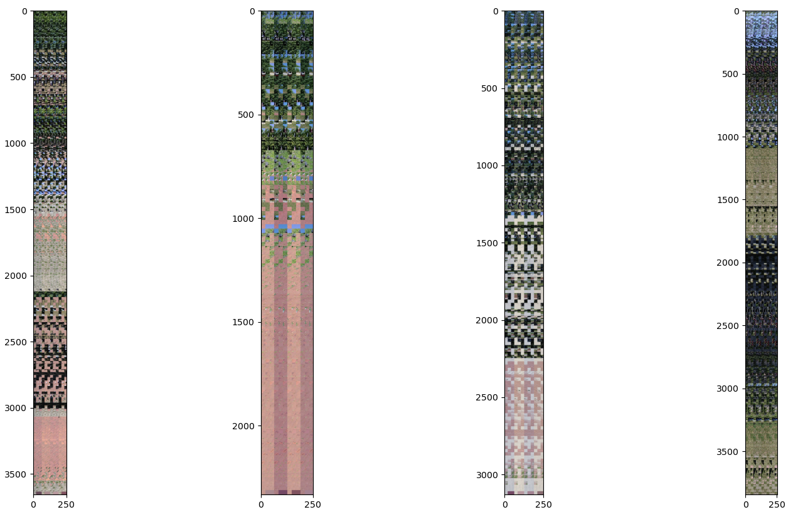
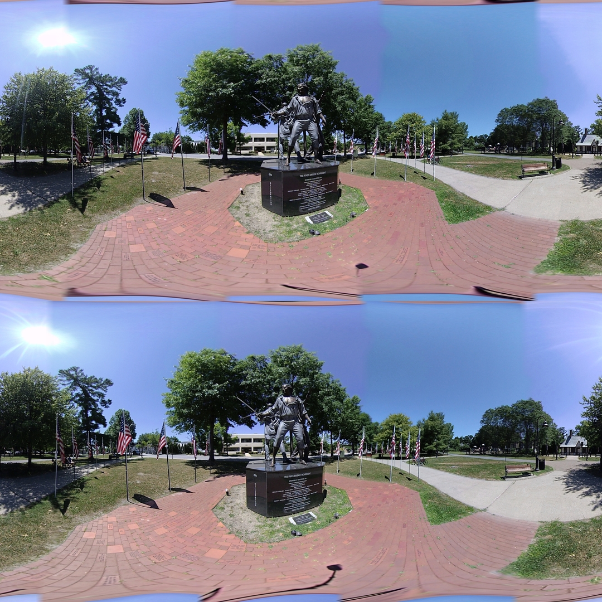
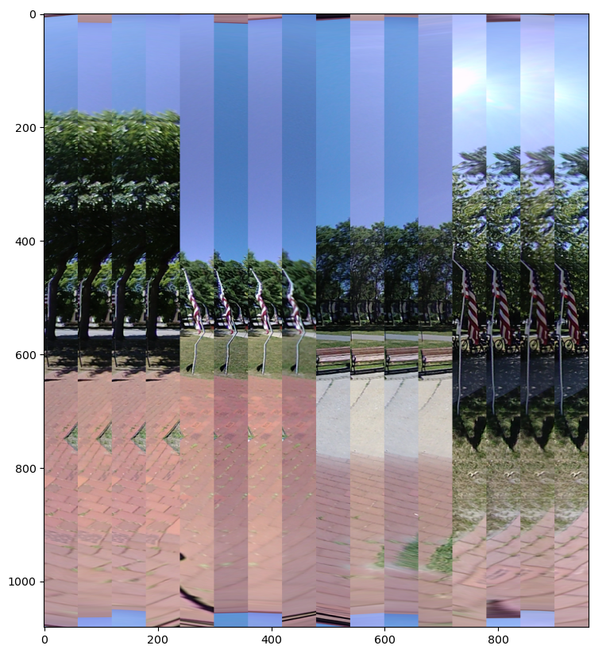
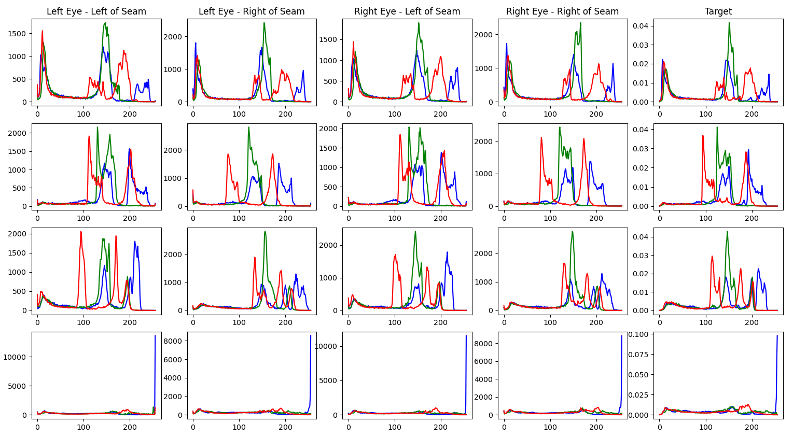
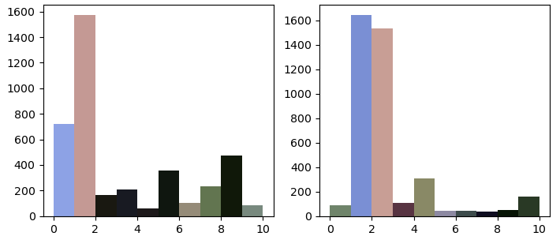
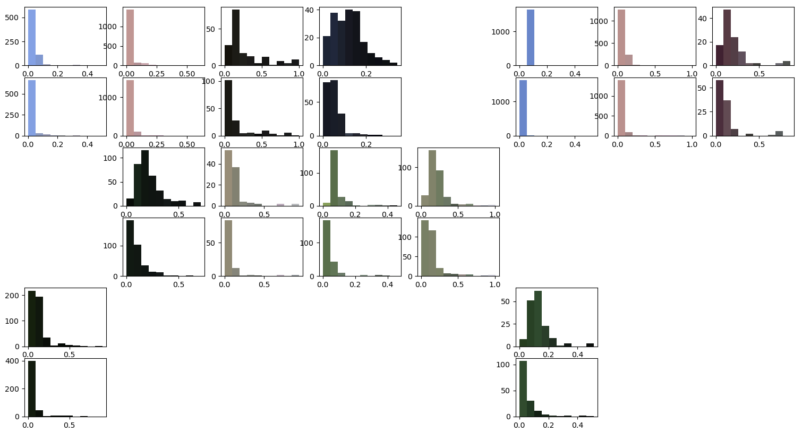
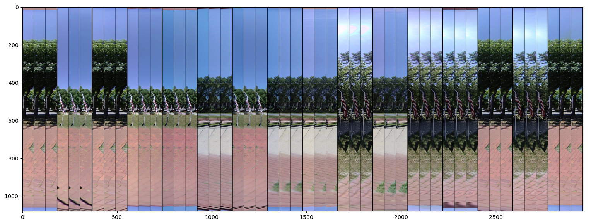
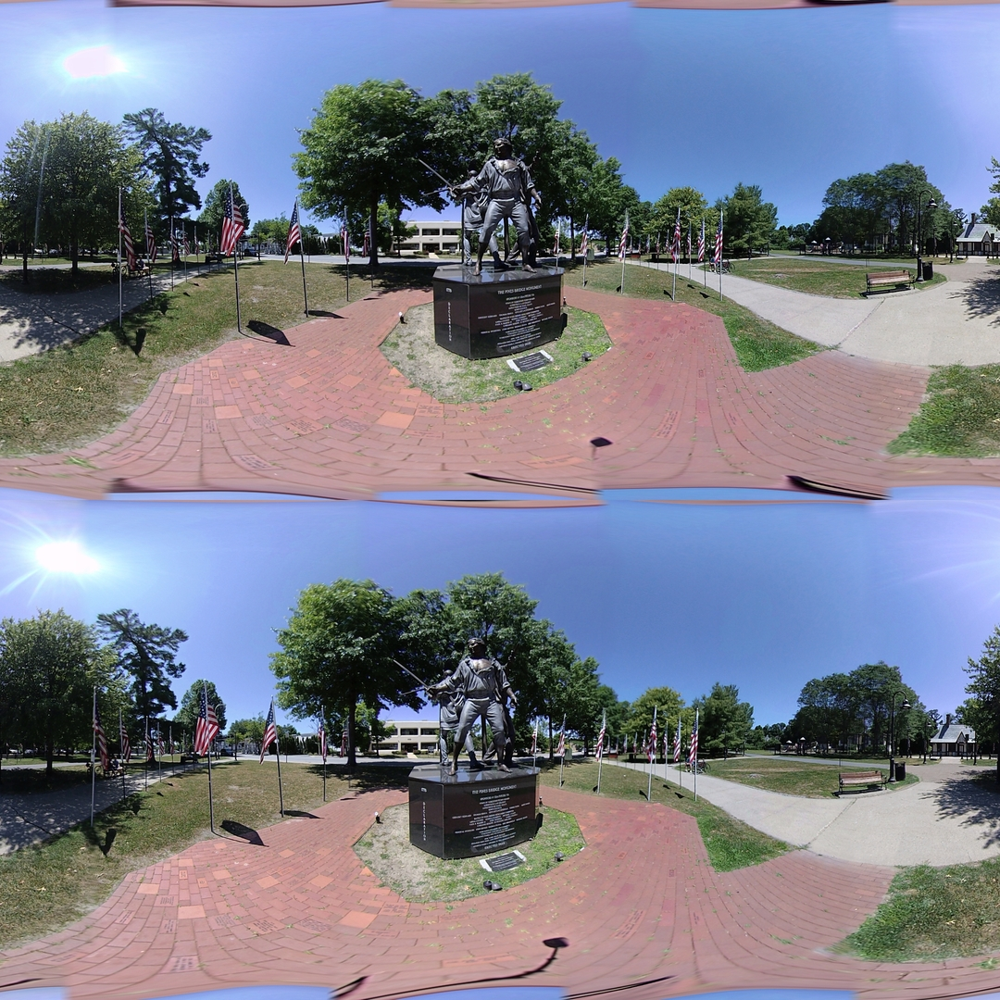

## Color Matching Techniques

*Date: October 14, 2022*

Script: [vuze_merge.py](../src/vuze_merge.py)

Usage:
```
../src/vuze_merge.py -v -r coeffs_v1_color.dat -c config_vuze_merge_color_points.dat
../src/vuze_merge.py -v -r coeffs_v1_color.dat -c config_vuze_merge_color_region.dat
```

### Feature Points Correction Calculation

The predetermined feature points from an image with good alignment were used along with features found in the current image. Only feature points which were found in all 4 images along a seam were used. The image, HET_0017, which showed poor color correction in the previous attempt was used as the main focus for this new approach.

| Image Areas used for Color Comparison (One Plot per Seam) |
| :------: |
|  |

The points per image are arranged in a Nx3 shape, and then 4 images are horizontally squished together per plot. The point alignment looks reasonable as each cropped piece cooresponding across the four images appears identical. The differences in color are more apparent between each image.



When the complete color correction process (described below) was applied to these points, the results were poor. The seam lines between images were readily apparent in the sky. Looking at the input, there are very few feature points in the sky. In order to obtain a better result the color correction inputs will need to include a greater portion of samples from portions of the image without feature points.

### Seams Correction Calculation

The seams between images were used to generate a sample more representative of the colors found within the overlapping area between images. The area $5^{\circ}$ to either side of the seam was used with a resolution matching that of the output image. The input seam information is corrected for the applied polar coordinate transform of each lens. In order to the same image sample from each image this transformation is reversed before the seam is extracted. These slices include many more data points of how the pixels that make up the sky should be color corrected between images.

| Image Areas used for Color Comparison (One Plot per Seam) |
| :------: |
|  |

Along any given seam there are 4 images which need to be color matched. The mean of the four images was computed and the color histogram for this mean was determined. The chart below shows the target histogram for each seam.

| Color Histograms per Image per Seam |
| :------: |
|  |

The target histogram was used as a reference and each slice's histogram was matched to the target. For each image, ie a left side slice and a right side slice, 8000 random pixels were selected to be used in the color matching regression. The 8000 samples were then split between the left side of the image and the right side of the image. The input data for each side was then distributed amongst 10 means, using Kmeans with k=10.

| Color Means for Lens 1, Left and Right Sides |
| :------: |
|  |

Each mean was considered separately to compute the linear regression coefficients for color correction. The initial and final colors were converted to the hsv color space and then the hue was converted into the $sin(h)$ and $cos(h)$. The matrix $x$ is the intial color per pixel and the matrix $y$ is the desired final color per pixel.

$$x = \begin{bmatrix} \sin(h_i) & \cos(h_i) & \frac{s_i}{255} & \frac{v_i}{255} & 1 \end{bmatrix}$$

$$y = \begin{bmatrix} \sin(h_f) & \cos(h_f) & \frac{s_f}{255} & \frac{v_f}{255} & 1 \end{bmatrix}$$

The coefficients matrix $c$ is determined by performing the linear regression.

$$y = x c$$

Given the 10 means per image side, 2 sides per image, and 8 images, the total number of coefficient sets is 160. To evaluate the fit, the distance between the initial and final color value is computed and compared with the distance between the estimated new color $y_a = x c$ and the final color.

| Lens | $d_i = \sqrt{\sum (y - x)^2}$ | $d_a = \sqrt{\sum (y_a - x)^2}$ |
| ----- | ------ | ------ |
| 1 | 0.1039 | 0.0562 |
| 2 | 0.0966 | 0.0515 |
| 3 | 0.1621 | 0.0737 |
| 4 | 0.1651 | 0.0650 |
| 5 | 0.1295 | 0.0717 |
| 6 | 0.1164 | 0.0637 |
| 7 | 0.0954 | 0.0655 |
| 8 | 0.0799 | 0.0578 |


An example of the shift in error is seen below. For a single image, the left side color distance errors are seen before (row 1) and after (row 2) the color correction is applied. The mean final color within each histogram bar is applied to the bar iteself in order to help visualize which colors are being adjusted.

| Distance between Color and Corrected Color Before and After Adjustment for Lens 1, Left and Right Sides |
| :------: |
|  |

The initial slice, the desired target and the corrected slice are shown below. The color correction is occuring across each slice and the blues appear to be more consistent between images.

| Slice, Target, and Corrected for each side of each image |
| :------: |
|  |

The corrected color within a single mean is computed using the coefficients $c$ from above and the hsv color space value of the other pixels within the image. All compuations are done using the trigonometric values of hue. The difference between the initial color and the corrected color is primarily used within the code. This difference we will call $\Delta_k$. The difference is scaled based on the maximum distance between $x$ and $y$ from above. It is also scaled based on the density of the color points used during the computation of the coefficients, $c$. As a point gets further from the cluster of intial colors $x$, the magnitude of the $\Delta_k$ will decrease. These two safety mechanisms work to ensure colors which were not present along the seam line are only minimally adjusted within the image.

The calculated left and right side corrections are applied to the image. The difference between the intial color and the corrected color is determined, $\Delta_r$ and $\Delta_l$ for the change in color based on the right and left seams respectively. The difference is scaled cubicly based on the distance from the seam for which the correction was originally computed. The scaling factor will be called $w_r$ and $w_l$. The coordinates $p$ in polar within the image are used to determine the weight.


$$r = \frac{\pi}{2}$$

$$a = \frac{6}{r^3}$$

$$d_p = p - \frac{3\pi}{2}$$

$$w_r = \frac{arp^2}{2} - \frac{ap^2}{3}$$

$$w_l = 1 - w_r$$

The final color adjustment for all pixels in the image will be $\Delta$.

$$\Delta = w_l \Delta_l + w_r \Delta_r$$

In order to smooth out any drastic color shifts a 2D filter is applied to $\Delta$. The filter is a 13 x 13 average. The final output is shown below.



The color correction is significantly improved over the version above. Yet it is still possible to see the seam lines based on the difference in color between the lenses.