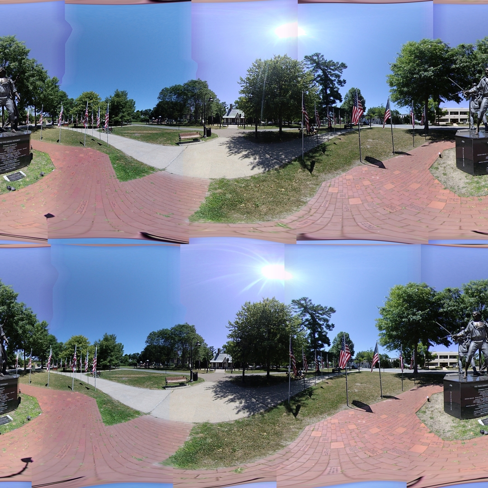

## Color Matching with Regression

*Date: August 11, 2022*

Script: [vuze_merge.py](../src/vuze_merge.py)

Usage:
```
../src/vuze_merge.py -d "color|color_regression" -v -w coeffs_v1_color_mean.dat -c config_vuze_merge_color_mean_good.dat
../src/vuze_merge.py -d "color|color_regression" -v -r coeffs_v1_color_mean.dat -c config_vuze_merge_color_mean_bad.dat
../src/vuze_merge.py -d "color|color_regression" -v -r coeffs_v1_color_mean.dat -c config_vuze_merge_color_seams.dat
```

### Determining Color Correction with Regression

The color differences between adjacent lenses make the seam lines clearly visible. To mitigate this the colors between lenses need to be adjusted to a common color. The known feature points from calculating each lens tranform will be used to identify how the Hue-Saturation-Value (HSV) colors should be adjusted between lenses. Each feature point references a location in 4 lenses which should have the same color. The average of these colors is used as the final color value, $c_f$. Due to the hue attribute of color being angular in nature, the circiular mean is used to calculate the final value, $h_f$. The hue, $h$, within OpenCV is in the range $[0, 180)$ while the saturation, $s$, and value, $v$, are in the range $[0, 256)$.

$$h_f = \arctan2 \left( \sum_{j=0}^{4}{\sin(h_j)}, \sum_{j=0}^{4}{\cos(h_j)} \right)$$

Below the color at each feature point is shown along with the average color at that feature point. Feature points are represented by rows. The final seam is zoomed to show the differences between colors across the lenses in better detail.

| Color at each feature point (rows) per lens (columns) per seam (plots). |
| :----: |
|  |

To determine the optimum adjust for colors per lens a linear regression was performed using the initial pixel colors within a lens, $c_i$ and the target color $c_f$. Since hue is angular, the $\sin(h)$ and $\cos(h)$ were used. A similar regression was performed to determine the adjustment for each channel of the HSV color, with the hue being computed separately as $\sin(h)$ and $\cos(h)$.

$$x = \begin{bmatrix} \sin(h) & \cos(h) & \frac{s}{255} & \frac{v}{255} & 1 \end{bmatrix}$$

$$\sin(h_f) = \sum_{j=0}^{5}{a_jx_j}$$

$$\cos(h_f) = \sum_{j=0}^{5}{b_jx_j}$$

$$s_f = \sum_{j=0}^{5}{d_jx_j}$$

$$v_f = \sum_{j=0}^{5}{e_jx_j}$$

Below is an example of the $\Delta\sin(h)$ before and after regression. The lack of obvious pattern means the regression may not be ideal solution to the issue of color adjustment.

| Lens 1 $\Delta\sin(h)$ with respect to $\sin(h)$ and $\cos(h)$ before (left) and after (right). |
| :----: |
  |  |

The standard deviation of the error between the target value and the approximation $\left\\{ h_a, s_a, v_a \right\\}$ for each component of the color is provided below. The mean for each was in most cases zero, or near zero.

| Lens | $\sigma_{\sin(h_f)-\sin(h_a)}$ | $\sigma_{\cos(h_f)-\cos(h_a)}$ | $\sigma_{s_f-s_a}$ | $\sigma_{v_f-v_a}$ |
| ----- | ----- | ----- | ----- | ----- |
| 1 | 0.0940017 | 0.12382536 | 0.02946372 | 0.01442023 |
| 2 | 0.09803206 | 0.12406455 | 0.02672973 | 0.0146082 |
| 3 | 0.08163212 | 0.10115528 | 0.03052008 | 0.02378787 |
| 4 | 0.08200335 | 0.10360652 | 0.03114667 | 0.02371506 |
| 5 | 0.07640092 | 0.10739497 | 0.02785152 | 0.01281353 |
| 6 | 0.07840988 | 0.10496436 | 0.02811039 | 0.01713419 |
| 7 | 0.09410913 | 0.09924857 | 0.02579107 | 0.02332994 |
| 8 | 0.08371832 | 0.10299901 | 0.02780345 | 0.02303007 |

### Exporting Coefficients

Some scenes have too few feature points in order to compute accurate transformation coefficients for the coordinate and color adjustments. Given that the same camera is used and leveled for each scene, it should be possible to apply the coefficients determined in one scene to another scene. The coefficients are saved to a file and this file can be read in during processing of a second scene. Reading the saved coefficients bypasses the feature dectection and regression steps for coordinate transforms. The color adjustment regression must still be performed using the matching feature points from the previous image.

### Entire Lens Color Correction

The color correction applied to the images from the woods removes the appearance of seam lines almost entirely. There is a slight color distortion introduced in the green leaves. Some of the leaves now appear more yellow in color.


Unfortunately, the same cannot be said for the scene with a large amount of blue sky.


Looking at the raw color data, it is possible to see that the number of blue data points is very few. This probably accounts for the incorrect adjustment of the blue sky.

| Color at each feature point (rows) per lens (columns) per seam (plots). |
| :----: |
|  |


### Color Matching on Seams Only

To address the yellow tinge seen in the first image the color adjustments were only applied around the seams. The magnitude of the application was decreased linearly with respect to the distance from the seam. The maximum distance from the seam at which the color adjustment is configurable and set to $15^\circ$ for the images below.


Due to the poor color regression for the scene with blue sky, the seam lines are still obvious.


