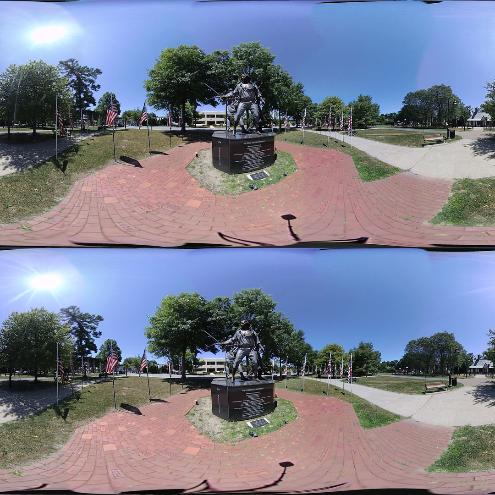

## Color Table

*Date: March 18th, 2023*

Script: [vuze_merge.py](../src/vuze_merge.py)

Usage:
```
src/vuze_merge.py -a coeffs_v6.json -I test/HET_0017_color_table -O HET_0017 -d color
```

### Objective

Improve the color matching between images in order to hide the seam lines in the sky and other "single" color areas. Thet HET_0017 image set is used for this testing as the sky clearly shows the stitch lines due to color differences.

### Method

Attempt to use a lookup table to translate from the color within a single lens to the color desired for the merged image. The early attempts at this relied upon the color histogram to determine the target color. It was found that using a color histogram was not effective at determining a seamless appearing color transition between images.

The alternative to the histogram was to use the median RGB valus for the pixels from all 4 images along a single seam. The median value is considered the target with the original pixels from each image used as the keys of the lookup table. The example below shows the 4 seams and 4 images from each seam for HET_0017, the seams are $6^\circ$ wide by default.

| Seam Regions by Seam and Image |
| :----: |
|  |
| |
| Target Region for Each Seam (in pairs, target on right) |
|  |

Only unique values were used for the original pixels. Any originally non-unique pixels which mapped to different target values required the target values to be meaned and used as the new target value. Further refinement of the lookup table was done by using only pixels which were different from their target by less than 0.75 standard deviations from the mean of all pixel differences. The resulting set of unique pixel values were loaded into a KDTree and the target colors were saved in a list aligned to the tree. The diagram below illustrates this process.

| Unique Color Mapping |
| :----: |
|  |

To use the lookup table, the closest 4 colors to the input color are determined. The ordered distance, $d = (d_0, d_1, d_2, d_3)$, and index, $i = (i_0, i_1, i_2, i_3)$, of each is provided by the KDTree. A weighted average of the differences, $a = (a_0, a_1, a_2, a_3)$, is used to compute the final adjustment, $A$, needed to the input color. If a color matches exactly, ie. $d_0 == 0$, the adjustment $a_0$ is used. If any of the distances exceeds $D$, then the input is considered out of range and no adjustment is performed. The minimum distance, $d_0$ is also used to scale the magnitude of the adjustment. As $d_0$ approaches $D$, the scaling factor for the adjustment approaches 0.

$$w_i = (d_0 + d_3 - d_i)^2$$

$$A = \frac{D-d_0}{D} \frac{ \sum a_i w_i }{ \sum w_i }$$

Once the adjustments for each pixel in the image is determined a box blur of 15x15 is applied to the adjustments before the adjustment is applied to the input yielding a result.

### Result

The results below show a clear improvement using the color table color matching approach. Overall runtime performance is unchanged, but the python code to correct colors is significantly more simple and straightforward.

| Before (note the different blues in the sky) |
| :----: |
|  |
| |
| After |
|  |
