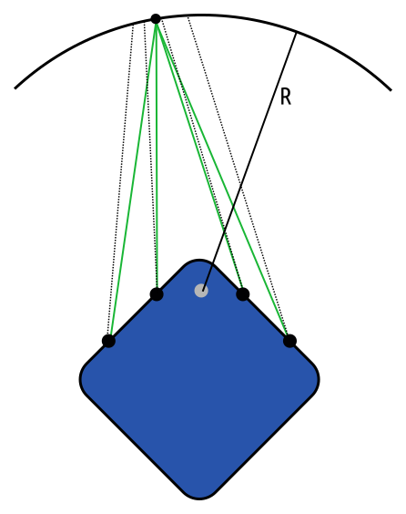

## Depth at Seam

*Date: March 25th, 2023*

Script: [vuze_merge.py](../src/vuze_merge.py)

Usage:
```
rm -f coeffs_v6.json
src/vuze_merge.py -a coeffs_v6.json --setup camera_setup.json
src/vuze_merge.py -a coeffs_v6.json -I test/HET_0014 -O HET_0014 \
  --write-coeffs --ignore-alignment-seams \
  -f stereo:90:0:0:1112:955 -f anaglyph:90:0:0:1112:955
src/vuze_merge.py -a coeffs_v6.json -I test/HET_0014 -O HET_0014 --depth
convert -delay 8 -loop 0 HET_0014_stereo*.JPG HET_0014_demo_stereo.gif
```

### Objective
Ensure the depth is computed accurately for features within the image and depth along the seams is consistent as possible. This should provide an easy viewing experience for people and provide the best sense of depth in the final image.

### Method

Starting with the method established in [Depth Calibration](../depth_calibration/depth_calibration.md), the goal will be to further improve the depth mapping output. A depth map for the features between the left and right lens can be generated using the `--depth` command line option. By using the seams for depth calibration, the hope is to reduce the depth discrepancy between the sides of a seam.

The images for each of the 4 seams were loaded using the previous method. The direction from the lens was determined for each color patch. To determine the desired placement between the lenses, an updated algorithm was used. First, the sphere a distance of $R$ is drawn around the center, $C$, of the front face of the camera. This is the point that all patch radii were measured from. Next, the intersection between a ray from the lens in the direction of the patch and the sphere is determined. This is repeated for the 2nd, 3rd, and 4th lenses in the data set. This approach is similarly applied for alignment between the left and right eyes of each side of the camera as well. Once the intersectoin points along the sphere are determined the center of these points is used as the actual location of the patch. From here the actual direction of this point from each lens is determined. The rotation of the camera for each image was required to compute the intersection and is represented in the `camera_setup.json` file.

| Computing the Expected Direction from Each Lens |
| :------: |
|  |

The process above was repeated for the 13 image sets of the camera in different positions. Given the actual and expected direction of each point from each lens a linear regression was performed using the components $(\phi, \theta, \phi\theta)$. The linear regression used 4th order polynomials for $\phi$ and $\theta$ and a 2nd order polynomail for $\phi\theta$.

After this process was completed the regression coefficients were saved and the following depth maps were created for HET_0014 and HET_0017. These maps are created using only the left and right image pairs.

| Depth Map for HET_0014 a Woods Scene (Lens 1) |
| :------: |
|  |

| Depth Map for HET_0017 a Flags (Lens 1) |
| :------: |
|  |

The depth maps show the basic characteristics of the image, but also lose some detail in the middle and lower parts of the image. The depths are also most likely inaccurate; only the change in depth should be used. While these results look promising using them for any image adjustments was deemed impracticle at this time.

Finally, a comparison of the Vuze software generated HET_0014 image and the python script was performed. The image looked at the $90^\circ$ around $(0^\circ, 0^\circ)$ with a resolution of (1112px, 955px). The left and right stereo pairs were converted to a wiggle 3d gif for viewing on a 2d screen. The gif generated by the Vuze software appears to shift the image forward providing a modest 3d effect. The gif generated by the vuze_merge script provides a more robust 3d effect visible on the sign and the rock wall.

| HET_0014 Wiggle 3d Gif (Vuze Software) |
| :------: |
|  |

| HET_0014 Wiggle 3d Gif |
| :------: |
|  |


### Numerical Results

The following tables provide the error in depth and direction of each patch before and after the linear regression. The first table looks at the aggregate error for all 13 image sets.

| Lens | Depth Squared Error | Samples |
| :----: | :----: | :----: |
| 1 | 7.72 | 248 |
| 2 | 7.70 | 248 |
| 3 | 6.97 | 253 |
| 4 | 6.79 | 253 |
| 5 | 7.99 | 259 |
| 6 | 8.12 | 259 |
| 7 | 7.59 | 258 |
| 8 | 7.67 | 258 |

The linear regression before and after yielded the following differences betwen the actual and expected polar coordinates for each patch.

| Lens | Corrected | $\overline{\Delta\phi}$ | $\overline{\Delta\theta_i}$ | $\sigma_{\Delta\phi}$ | $\sigma_{\Delta\theta}$
| :----: | :---: | :---: | :---: | :---: | :---: |
| 1 | No | 0.00207777 | -0.03774529 | 0.00461072 | 0.0170448 |
| 1 | Yes | -0.00001328 | -0.00004904 | 0.00344267 | 0.0109802 |
| 2 | No | -0.00184407 | 0.0366169 | 0.00442341 | 0.01293298 |
| 2 | Yes | -0.00000497 | 0.00001853 | 0.00360068 | 0.00906104 |
| 3 | No | -0.00399516 | -0.02574109 | 0.00820089 | 0.02352291 |
| 3 | Yes | -0.00004615 | -0.00005816 | 0.00603405 | 0.01177038 |
| 4 | No | 0.00028796 | 0.02668994 | 0.00798569 | 0.01856783 |
| 4 | Yes | -0.00000257 | -0.00002067 | 0.00647917 | 0.01199824 |
| 5 | No | 0.00519442 | -0.03871395 | 0.00744315 | 0.01741284 |
| 5 | Yes | 0.00002067 | 0.00000702 | 0.00485264 | 0.00880085 |
| 6 | No | -0.00523527 | 0.03863805 | 0.00716003 | 0.0162292 |
| 6 | Yes | 0.00001587 | 0.0000294 | 0.00505694 | 0.00912404 |
| 7 | No | 0.00128047 | -0.03562033 | 0.00462832 | 0.01401458 |
| 7 | Yes | 0.00004503 | 0.0000808 | 0.00329368 | 0.00816171 |
| 8 | No | -0.00009599 | 0.03493684  | 0.00528389 | 0.01267711 |
| 8 | Yes | -0.00000966 | -0.0000165 | 0.00332727 | 0.00726755 |

The following is the resulting depth squared error after the correction is applied using the linear regression determined above. Each image set is corrected and then the depth is recalculated for each patch. The distance between the closest points between the vectors from each lens is provided as $d$; ideally the vectors would intersect and $d == 0$ would be true.

| Lens | Depth Squared Error (initial) | $d_0^2$ | Depth Squared Error (final) | $d_1^2$ |
| :---: | :---: | :----: | :----: | :----: |
| **Image** | **colored** | | | |
| 1 | 6.31476355 | 0.00002783 | 4.61140299 | 0.00006935 |
| 2 | 6.3029809  | 0.00002783 | 4.57214165 | 0.00006935 |
| 3 | 4.91954899 | 0.0001206  | 2.3307302  | 0.00012857 |
| 4 | 4.89991474 | 0.0001206  | 2.31659651 | 0.00012857 |
| 5 | 6.63285208 | 0.00013373 | 9.30134106 | 0.00007164 |
| 6 | 6.61129761 | 0.00013373 | 9.2494278  | 0.00007164 |
| 7 | 6.14515305 | 0.00001793 | 3.75351024 | 0.00005093 |
| 8 | 6.11143398 | 0.00001793 | 3.72710013 | 0.00005093 |
| **Image** | **colored_left** | | | |
| 1 | 7.36730099 | 0.00017446 | 5.21014595 | 0.0000618  |
| 2 | 7.20281696 | 0.00017446 | 5.24405146 | 0.0000618  |
| 3 | 6.71809816 | 0.00034779 | 0.60707039 | 0.00011854 |
| 4 | 6.54379416 | 0.00034779 | 0.61469704 | 0.00011854 |
| 5 | 7.99837399 | 0.00029318 | 3.07730889 | 0.00010078 |
| 6 | 7.81222773 | 0.00029318 | 3.10453129 | 0.00010078 |
| 7 | 7.48647642 | 0.00017596 | 1.19330132 | 0.00008172 |
| 8 | 7.2951808  | 0.00017596 | 1.18260491 | 0.00008172 |
| **Image** | **colored_right** | | | |
| 1 | 6.95225763 | 0.00011551 | 7.74119663 | 0.000131   |
| 2 | 7.09105444 | 0.00011551 | 7.61150408 | 0.000131   |
| 3 | 5.04503155 | 0.00003019 | 4.44524193 | 0.00013769 |
| 4 | 5.1498723  | 0.00003019 | 4.37086916 | 0.00013769 |
| 5 | 6.9153018  | 0.00014253 | 2.65319991 | 0.00017032 |
| 6 | 7.0347681  | 0.00014253 | 2.58616304 | 0.00017032 |
| 7 | 6.20942879 | 0.00008053 | 2.60609555 | 0.00020014 |
| 8 | 6.31378365 | 0.00008053 | 2.55814552 | 0.00020014 |
| **Image** | **colored_far_left** | | | |
| 1 | 9.01506424 | 0.00057129 | 2.72439265 | 0.00013297 |
| 2 | 8.80515385 | 0.00057129 | 2.64484859 | 0.00013297 |
| 3 | 8.78988934 | 0.00066199 | 2.00712228 | 0.00010673 |
| 4 | 8.58173656 | 0.00066199 | 1.91828704 | 0.00010673 |
| 5 | 9.20523357 | 0.00059049 | 2.81131268 | 0.00011648 |
| 6 | 9.01873302 | 0.00059049 | 2.72474337 | 0.00011648 |
| 7 | 9.01639652 | 0.00054414 | 3.71037698 | 0.00011415 |
| 8 | 8.81665325 | 0.00054414 | 3.68544412 | 0.00011415 |
| **Image** | **colored_far_right** | | | |
| 1 | 8.52924156 | 0.00036081 | 17.5336437 | 0.00014901 |
| 2 | 8.77399635 | 0.00036081 | 17.5371475 | 0.00014901 |
| 3 | 6.95078707 | 0.00014157 | 18.8251094 | 0.00011257 |
| 4 | 7.17668915 | 0.00014157 | 18.6969738 | 0.00011257 |
| 5 | 8.37364006 | 0.00031158 | 7.91770649 | 0.00011367 |
| 6 | 8.58913231 | 0.00031158 | 7.83031702 | 0.00011367 |
| 7 | 8.20834637 | 0.00031049 | 5.21705675 | 0.00013546 |
| 8 | 8.42738628 | 0.00031049 | 5.15622377 | 0.00013546 |
| **Image** | colored_far_far_left | | | |
| 1 | 8.25983429 | 0.00050222 | 2.7154839  | 0.00023344 |
| 2 | 8.3919611  | 0.00050222 | 2.61159587 | 0.00023344 |
| 3 | 8.9918108  | 0.00045311 | 2.89258051 | 0.00032985 |
| 4 | 9.16219997 | 0.00045311 | 2.86249471 | 0.00032985 |
| 5 | 9.43908119 | 0.00043405 | 5.7913146  | 0.00024798 |
| 6 | 9.60245323 | 0.00043405 | 5.75414801 | 0.00024798 |
| 7 | 9.04988098 | 0.00048742 | 2.26578236 | 0.00023658 |
| 8 | 9.20508003 | 0.00048742 | 2.18573546 | 0.00023658 |
| **Image** | **colored_far_far_right** | | | |
| 1 | 10.6891632 | 0.00064408 | 6.43989038 | 0.00034023 |
| 2 | 10.6490879 | 0.00064408 | 6.44751501 | 0.00034023 |
| 3 | 9.45776463 | 0.000526   | 4.34626865 | 0.00040403 |
| 4 | 9.45886326 | 0.000526   | 4.4268446  | 0.00040403 |
| 5 | 10.0360755 | 0.00056681 | 2.52114344 | 0.00036433 |
| 6 | 9.98562145 | 0.00056681 | 2.59989929 | 0.00036433 |
| 7 | 10.2299842 | 0.0005857  | 2.88486075 | 0.00033814 |
| 8 | 10.2214899 | 0.0005857  | 2.97736192 | 0.00033814 |
| **Image** | **colored_up** | | | |
| 1 | 6.62727451 | 0.00020273 | 6.50787306 | 0.00100601 |
| 2 | 6.60065126 | 0.00020273 | 6.50724077 | 0.00100601 |
| 3 | 6.85044575 | 0.00066202 | 2.21092677 | 0.00116814 |
| 4 | 6.81842709 | 0.00066202 | 2.19777083 | 0.00116814 |
| 5 | 6.80090427 | 0.00026849 | 2.22579503 | 0.00113399 |
| 6 | 6.77280521 | 0.00026849 | 2.2149148  | 0.00113399 |
| 7 | 6.70707417 | 0.00016166 | 4.55373049 | 0.00107103 |
| 8 | 6.68110085 | 0.00016166 | 4.55397129 | 0.00107103 |
| **Image** | **colored_down** | | | |
| 1 | 6.61708403 | 0.00011061 | 1.25989366 | 0.00026611 |
| 2 | 6.59807158 | 0.00011061 | 1.25317132 | 0.00026611 |
| 3 | 4.90559912 | 0.00029952 | 4.74612617 | 0.00012108 |
| 4 | 4.87302971 | 0.00029952 | 4.74856615 | 0.00012108 |
| 5 | 7.44577265 | 0.00041192 | 1.53615093 | 0.00028538 |
| 6 | 7.40051126 | 0.00041192 | 1.53688359 | 0.00028538 |
| 7 | 6.18229055 | 0.00009496 | 1.71418679 | 0.00020835 |
| 8 | 6.15887737 | 0.00009496 | 1.71656382 | 0.00020835 |
| **Image** | **colored_seam_a** | | | |
| 1 | 7.47144985 | 0.00045833 | 2.92152023 | 0.00095748 |
| 2 | 8.86410427 | 0.00028834 | 5.5971899  | 0.00027611 |
| 3 | 8.71176338 | 0.00012177 | 4.12875366 | 0.00015414 |
| 4 | 4.44686508 | 0.00067914 | 1.56978953 | 0.00063774 |
| 5 | 0.         | 0.         | 0.         | 0.         |
| 6 | 0.         | 0.         | 0.         | 0.         |
| 7 | 0.         | 0.         | 0.         | 0.         |
| 8 | 0.         | 0.         | 0.         | 0.         |
| **Image** | **colored_seam_b** | | | |
| 1 | 0.         | 0.         | 0.         | 0.         |
| 2 | 0.         | 0.         | 0.         | 0.         |
| 3 | 7.91879272 | 0.00074983 | 4.50342274 | 0.0013554  |
| 4 | 9.24760246 | 0.00022726 | 6.34235477 | 0.00012878 |
| 5 | 9.9608717  | 0.00045577 | 6.12059879 | 0.00067103 |
| 6 | 8.86794758 | 0.0016238  | 4.81864643 | 0.00284807 |
| 7 | 0.         | 0.         | 0.         | 0.         |
| 8 | 0.         | 0.         | 0.         | 0.         |
| **Image** | **colored_seam_c** | | | |
| 1 | 0.         | 0.         | 0.         | 0.         |
| 2 | 0.         | 0.         | 0.         | 0.         |
| 3 | 0.         | 0.         | 0.         | 0.         |
| 4 | 0.         | 0.         | 0.         | 0.         |
| 5 | 6.44512749 | 0.00030618 | 2.50752091 | 0.00085418 |
| 6 | 9.58302593 | 0.00017507 | 5.53394747 | 0.00013295 |
| 7 | 9.14213467 | 0.00007677 | 5.19925356 | 0.00033803 |
| 8 | 7.70648479 | 0.00117687 | 2.53639841 | 0.00171534 |
| **Image** | **colored_seam_d** | | | |
| 1 | 8.44792271 | 0.00003309 | 4.83621836 | 0.00011453 |
| 2 | 6.60081863 | 0.00032116 | 1.83753228 | 0.00044161 |
| 3 | 0.         | 0.         | 0.         | 0.         |
| 4 | 0.         | 0.         | 0.         | 0.         |
| 5 | 0.         | 0.         | 0.         | 0.         |
| 6 | 0.         | 0.         | 0.         | 0.         |
| 7 | 6.47648382 | 0.000377   | 2.94730568 | 0.00061472 |
| 8 | 9.53708744 | 0.00001393 | 6.3390913  | 0.00018219 |
