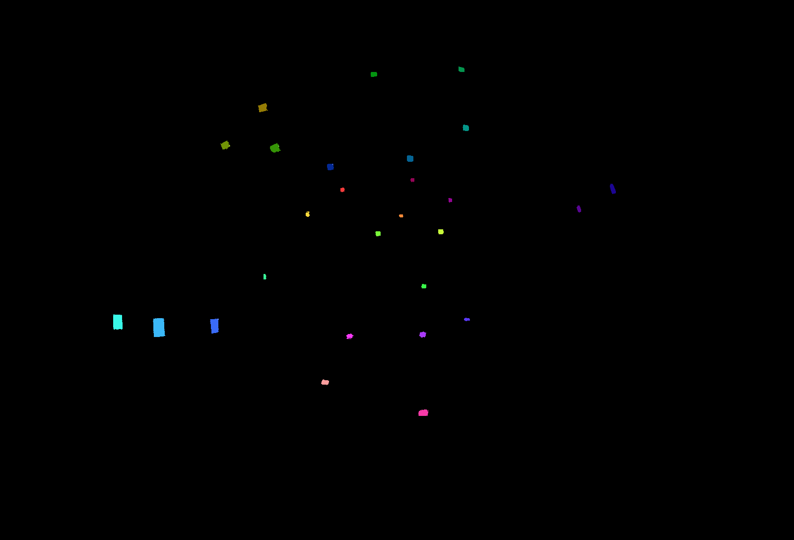

## Depth Calibration

*Date: January 8th, 2023*

Script: [vuze_merge.py](../src/vuze_merge.py)

Usage:
```
rm -f test/coeffs_v5.dat
./src/vuze_merge.py --alignment test/coeffs_v5.dat -i test/HET_0014 --ellipse-coeffs
./src/vuze_merge.py --alignment test/coeffs_v5.dat -i test/HET_0014 --yaml-config test/VUZ1178200318.yml
./src/vuze_merge.py --alignment test/coeffs_v5.dat -i calibration/colored --depth
./src/vuze_merge.py --alignment test/coeffs_v5.dat -i calibration/colored_left --depth
./src/vuze_merge.py --alignment test/coeffs_v5.dat -i calibration/colored_right --depth
./src/vuze_merge.py --alignment test/coeffs_v5.dat -I test/HET_0014 -O test/HET_0014_depth_calib --write-coeffs -d fisheye
./src/vuze_merge.py --alignment test/coeffs_v5.dat -I test/HET_0017 -O test/HET_0017_depth_calib
convert
```

### Objective
Obtain accurate depth measurements for features between the left and right eye. Determine a $f(\phi, \theta)$ that adjusts the original equirectangular image for each right eye lens that allows for more accurate depth measurements.


### Known Depth Measurements
A room was setup with the camera at one wall and blue post-it notes scattered around the remaining 4 walls of the room. The post-it notes ranged in distance from the camera between 1.15m and 5.066m. The camera was on a tripod with a notched rotation mechanism with 20 discrete points, about $18^\circ$ per notch. The camera was rotated to capture the angle of the room at 3 different rotations per side of the camera. With 4 sides to the camera and 3 rotations per side and 2 lenses per side a total of 24 images were captured.

<table>
  <tr><th colspan=3>Example Images: Camera Front - Left Eye - Rotations</th></tr>
  <tr><td>Left</td><td>Center</td><td>Right</td></tr>
  <tr>
    <td></td>
    <td></td>
    <td></td>
  </tr>
</table>

Each post-it note within each image was colored a unique color. The following colors were used along with the distance of the tagged post-it note. The same 3 images above are shown below with post-it notes colored and the remainder of the image removed. The depths were measured using a laser tape measure with millimeter accuracy, although holding the measure steady while taking a reading probably lead to centimeter accuracy instead.

<table>
  <tr><th colspan=3>Colored Images: Camera Front - Left Eye - Rotations</th></tr>
  <tr><td>Left</td><td>Center</td><td>Right</td></tr>
  <tr>
    <td></td>
    <td></td>
    <td></td>
  </tr>
</table>

| Post-It Note Colors and Depths from Camera |
| :----: |
|  |

A configuration file was created that saved the color and the distance the color was from the camera.

### Image Manipulation to Match Expected Depths
First, the image was scanned for all pixels matching the color of one of the post-it notes. The mean equirectangular coordinates of these matching pixels were converted to polar coordinates. These coordinates for a single post-it note are $(\phi_l,\theta_l)$ and $(\phi_r,\theta_r)$ for the left and right images. The process was repeated for each post-it note. If a post-it note was not found in either the left or right eye image, the color and distance was excluded. The YAML configuration parameters were used to know the position of each lens, $p_l$ and $p_r$ for the left and right positions. The cartesian coordinates are found, using the polar coordinates, but only after adjusting the coordinates to ensure the $\theta=0^\circ$ aligns with the postive x-axis.

$$\vec{m_l} = \begin{pmatrix} \sin(\phi_l)\cos(1.5\pi - \theta_l) \\\\ \sin(\phi_l)\sin(1.5\pi - \theta_l) \\\\ \cos(\phi_l) \end{pmatrix}$$

With all of the given information and the known expected distance from the camera to the point the following can be determind to be the expected direction of the point from the right eye.

$$\vec{m_r} = \left( \vec{p_l} + r\vec{m_l} \right) - \vec{p_r}$$

$$(\phi_r',\theta_r') = \left(\arctan\left( \frac{m_{ry}}{m_{rx}} \right), 1.5\pi - \arctan \left( \frac{\sqrt{m_{rx}^2+m_{ry}^2}}{m_{rz}} \right) \right)$$

With the actual values of $(\phi_r,\theta_r)$ and the expected values of $(\phi_r',\theta_r')$ it is possible to determine function $f(\phi_r',\theta_r') = (\phi_r,\theta_r)$. This function takes the desired coordinates for the right image and converts to the actual coordinates. Given the approach used for mapping images from predefined pixel coordinates translated to polar this is the ideal method.


TODO: check that the p_l and p_r of the other camera sides match with the expectations from the front?
