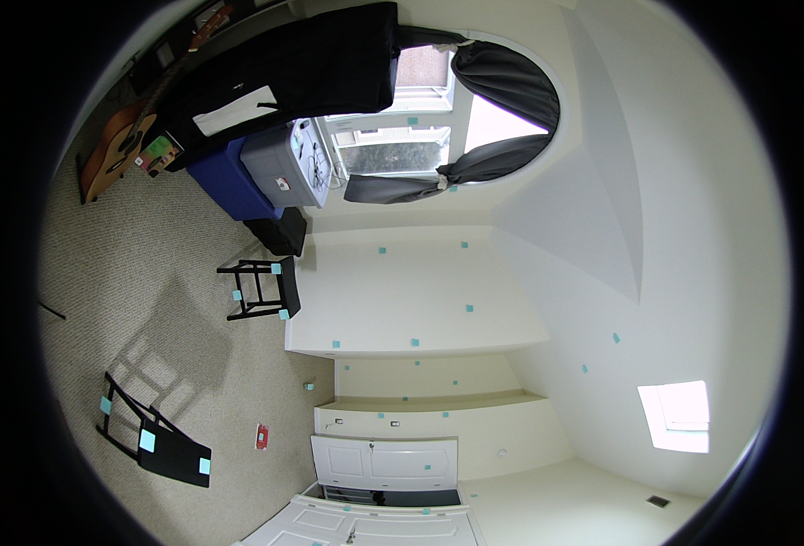
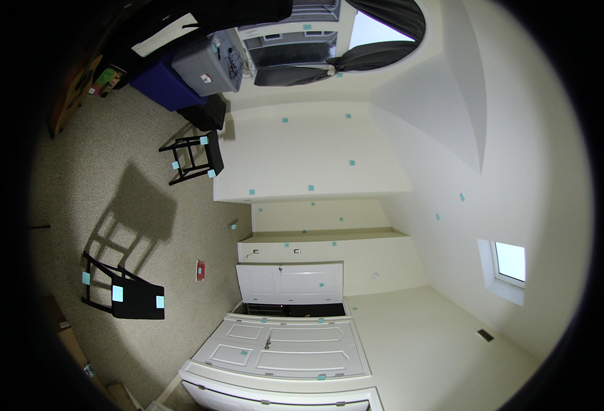
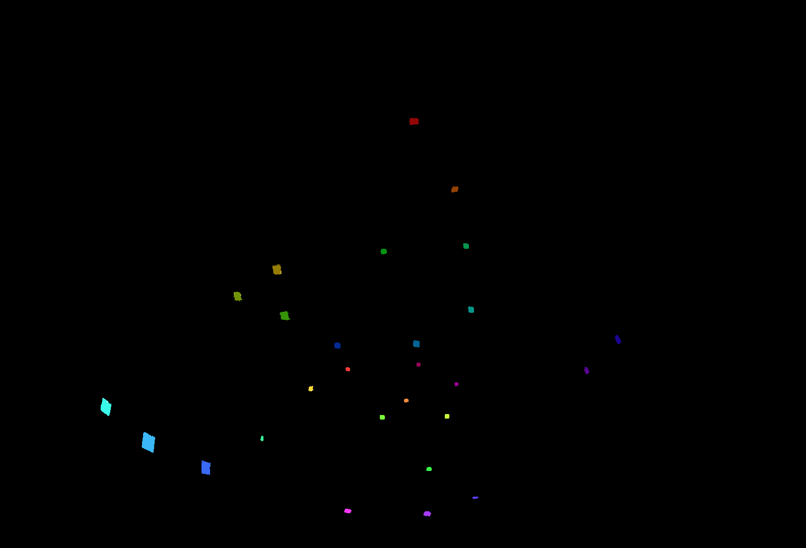

## Depth Calibration

*Date: January 8th, 2023*

Script: [vuze_merge.py](../src/vuze_merge.py)

Usage:
```
rm -f test/coeffs_v5.dat
src/vuze_merge.py -a test/coeffs_v5.dat -i test/HET_0014 --ellipse-coeffs
src/vuze_merge.py -a test/coeffs_v5.dat -i test/HET_0014 --yaml-config test/VUZ1178200318.yml
src/vuze_merge.py -a test/coeffs_v5.dat -i calibration/colored --depth add-only
src/vuze_merge.py -a test/coeffs_v5.dat -i calibration/colored_left --depth add-only
src/vuze_merge.py -a test/coeffs_v5.dat -i calibration/colored_right --depth add-only
src/vuze_merge.py -a test/coeffs_v5.dat -i calibration/colored_far_left --depth add-only
src/vuze_merge.py -a test/coeffs_v5.dat -i calibration/colored_far_right --depth add-only
src/vuze_merge.py -a test/coeffs_v5.dat -i calibration/colored_far_far_left --depth add-only
src/vuze_merge.py -a test/coeffs_v5.dat -i calibration/colored_far_far_right --depth add-only
src/vuze_merge.py -a test/coeffs_v5.dat -i calibration/colored_up --depth add-only
src/vuze_merge.py -a test/coeffs_v5.dat -i calibration/colored_down --depth add-only
src/vuze_merge.py -a test/coeffs_v5.dat -i calibration/colored --depth linreg
src/vuze_merge.py -a test/coeffs_v5.dat -I test/HET_0014 -O test/HET_0014_depth_calib \
  --write-coeffs --ignore-alignment-seams
src/vuze_merge.py -a test/coeffs_v5.dat -I test/HET_0017 -O test/HET_0017_depth_calib
convert
```

### Objective
Obtain accurate depth measurements for features between the left and right eye. Determine a $f(\phi, \theta)$ that adjusts the original equirectangular image for each right eye lens to allow for more accurate depth measurements.


### Known Depth Measurements
A room was setup with the camera at one wall and blue post-it notes scattered around the remaining 4 walls of the room. The post-it notes ranged in distance from the camera between 1.15m and 5.066m. The camera was on a tripod with a notched rotation mechanism with 20 discrete points, about $18^\circ$ per notch. The camera was rotated to capture the angle of the room at 9 different rotations per side of the camera. With 4 sides to the camera and 9 rotations per side and 2 lenses per side a total of 72 images were captured.

<table>
  <tr><th colspan=3>Example Images: Camera Front - Left Eye - Rotations</th></tr>
  <tr><td>Left</td><td>Center</td><td>Right</td></tr>
  <tr>
    <td></td>
    <td></td>
    <td></td>
  </tr>
</table>

Each post-it note within each image was colored a unique color. The following colors were used along with the distance of the tagged post-it note. The same 3 images above are shown below with post-it notes colored and the remainder of the image removed. The depths were measured using a laser tape measure with millimeter accuracy, although holding the measure steady while taking a reading probably lead to centimeter accuracy instead.

<table>
  <tr><th colspan=3>Colored Images: Camera Front - Left Eye - Rotations</th></tr>
  <tr><td>Left</td><td>Center</td><td>Right</td></tr>
  <tr>
    <td></td>
    <td></td>
    <td></td>
  </tr>
</table>

| Post-It Note Colors and Depths in Meters from Camera |
| :----: |
|  |

A configuration file was created that saved the color and the distance the color was from the camera.

### Initial Depth Calculation
The location in polar coordinates of each colored post-it note was determined by taking the mean of the pixel locations. These coordinates are $(\phi_l,\theta_l)$ and $(\phi_r,\theta_r)$ for the left and right images. The YAML configuration parameters were used to know the position of each lens, $p_l$ and $p_r$ for the left and right positions. The cartesian coordinates are found, using the polar coordinates, but only after adjusting the coordinates to ensure the $\theta=0^\circ$ aligns with the postive x-axis. Each vector is then represented as its 3 components, $a, b, c$.

$$\begin{pmatrix} a_l \\ b_l \\ c_l \end{pmatrix} = \vec{m_l} = \begin{pmatrix} \sin(\phi_l)\cos(1.5\pi - \theta_l) \\ \sin(\phi_l)\sin(1.5\pi - \theta_l) \\ \cos(\phi_l) \end{pmatrix}$$

$$\begin{pmatrix} a_r \\ b_r \\ c_r \end{pmatrix} = \vec{m_r} = \begin{pmatrix} \sin(\phi_r)\cos(1.5\pi - \theta_r) \\ \sin(\phi_r)\sin(1.5\pi - \theta_r) \\ \cos(\phi_r) \end{pmatrix}$$

The direction of the vector between $\vec{m_l}$ and $\vec{m_r}$ is the cross product of the two.

$$\begin{pmatrix} a_d \\ b_d \\ c_d \end{pmatrix} = \vec{m_d} = \frac{ \vec{m_r} \times \vec{m_l} }{ \left|\left| \vec{m_r} \times \vec{m_l} \right|\right| }$$

$$\begin{array}{cc}
\begin{pmatrix} a_{pl} \\ b_{pl} \\ c_{pl} \end{pmatrix} = \vec{p_l}
&
\begin{pmatrix} a_{pr} \\ b_{pr} \\ c_{pr} \end{pmatrix} = \vec{p_r}
\end{array}$$

This setup allows for the following equation which can be solved to determine the closest point between the two vectors: $\vec{v_l} = \vec{p_l} + r_l \vec{m_l}$ and $\vec{v_r} = \vec{p_r} + r_r \vec{m_r}$.

$$\vec{p_l} + r_l\vec{m_l} + r_d\vec{m_d} = \vec{p_r} + r_r\vec{m_r}$$

Breaking this equation into its 3 component equations and using GNU Octave's symbolic toolkit to solve yields the following. [Octave Script](./depth_solver.m)

$$r_d = \frac{a_l b_{pl} c_r - a_l b_{pr} c_r - a_l b_r c_{pl} + a_l b_r c_{pr} - a_{pl} b_l c_r + a_{pl} b_r c_l + a_{pr} b_l c_r - a_{pr} b_r c_l + a_r b_l c_{pl} - a_r b_l c_{pr} - a_r b_{pl} c_l + a_r b_{pr} c_l) }{ a_d b_l c_r - a_d b_r c_l - a_l b_d c_r + a_l b_r c_d + a_r b_d c_l - a_r b_l c_d }$$

$$r_r = \frac{ a_d b_l c_{pl} - a_d b_l c_{pr} - a_d b_{pl} c_l + a_d b_{pr} c_l - a_l b_d c_{pl} + a_l b_d c_{pr} + a_l b_{pl} c_d - a_l b_{pr} c_d + a_{pl} b_d c_l - a_{pl} b_l c_d - a_{pr} b_d c_l + a_{pr} b_l c_d }{ a_d b_l c_r - a_d b_r c_l - a_l b_d c_r + a_l b_r c_d + a_r b_d c_l - a_r b_l c_d }$$

$$r_l = \frac{-a_d b_{pl} c_r + a_d b_{pr} c_r + a_d b_r c_{pl} - a_d b_r c_{pr} + a_{pl} b_d c_r - a_{pl} b_r c_d - a_{pr} b_d c_r + a_{pr} b_r c_d - a_r b_d c_{pl} + a_r b_d c_{pr} + a_r b_{pl} c_d - a_r b_{pr} c_d }{ a_d b_l c_r - a_d b_r c_l - a_l b_d c_r + a_l b_r c_d + a_r b_d c_l - a_r b_l c_d }$$

Ideally, the value of $r_d$ should be less than 0.06m, the distance beteween the two lenses. Further, $r_l > 0$ and $r_r > 0$. In cases where $\vec{m_r} \times \vec{m_l} = 0$, a maximum value was used for the depth. The depth for the point is determined as follows.

$$r = \left|\left| \frac{ r_l \vec{m_l} + r_r \vec{m_r}}{2} \right|\right|$$

The following are the initial depths in meters determined using this method with unaltered images for `calibration/colored`.

| Post-It Note (Hex Color) | Expected Depth | Front Depth | Right Depth | Back Depth | Left Depth |
| :----: | :----: | :----: | :----: | :----: | :----: |
| 940505 | 2.267 | 0.45097197 | 0.98275605 | 0.55284289 | 0.52286742 |
| 944105 | 2.815 | 0.6069831  | 1.14466199 | 0.67947752 | 0.66548503 |
| 947c05 | 2.012 | 0.69346577 | 0.96966772 | 0.73812295 | 0.70606477 |
| 709405 | 2.233 | 0.75700391 | 0.96316226 | 0.80102859 | 0.76021549 |
| 359405 | 2.100 | 0.73690134 | 0.93960104 | 0.75129223 | 0.75558557 |
| 059411 | 2.256 | 0.72805261 | 1.20883157 | 0.75529189 | 0.76052526 |
| 05944d | 3.290 | 0.71548423 | 1.30825993 | 0.71969149 | 0.76716138 |
| 059488 | 3.023 | 0.76821063 | 1.24102897 | 0.71744852 | 0.80703792 |
| 056494 | 2.911 | 0.78528585 | 1.17412612 | 0.74939883 | 0.814646   |
| 052994 | 3.039 | 0.76416127 | 1.10949965 | 0.79279922 | 0.82715214 |
| 1d0594 | 2.296 | 0.78247354 | 1.15189583 | 0.63918357 | 0.81505571 |
| 580594 | 2.914 | 0.82147315 | 1.22654324 | 0.6609496  | 0.87381163 |
| 940594 | 4.917 | 0.87602264 | 1.37902673 | 0.77815649 | 0.93785136 |
| 940558 | 4.884 | 0.87253559 | 1.35830596 | 0.81524607 | 0.94573991 |
| f83a3a | 5.066 | 0.90602422 | 1.31346273 | 0.8535872  | 0.94186738 |
| f88a3a | 4.917 | 0.89033771 | 1.37589484 | 0.79932283 | 0.94407229 |
| f8d83a | 3.722 | 0.8637965  | 1.11771476 | 0.82234464 | 0.89054237 |
| c8f83a | 3.902 | 0.8332578  | 1.24187127 | 0.74360052 | 0.91665807 |
| 7af83a | 3.920 | 0.84913036 | 1.14636218 | 0.76498478 | 0.9011868  |
| 3af84a | 3.933 | 0.80562917 | 1.08700047 | 0.68370272 | 0.85857807 |
| 3af89a | 2.889 | 0.79507991 | 0.89904809 | 0.74566978 | 0.79572023 |
| 3af8e8 | 1.565 | 0.70161737 | 0.60039509 | 0.63900136 | 0.69136852 |
| 3ab8f8 | 1.150 | 0.58692029 | 0.569627   | 0.54389616 | 0.57204856 |
| 3a6af8 | 1.385 | 0.60318137 | 0.63158312 | 0.55674623 | 0.59600066 |
| 5a3af8 | 3.734 | 0.76607453 | 0.99950647 | 0.60545003 | 0.8129076  |
| a83af8 | 3.310 | 0.72157116 | 0.90309603 | 0.59747212 | 0.75552431 |
| f83af8 | 3.400 | 0.73136979 | 0.87937111 | 0.63130542 | 0.75497465 |
| f83aa8 | 2.290 | 0.52629901 | 0.58736177 | 0.40795447 | 0.52962269 |
| fb9d9d | 2.754 | 0.63014968 | 0.68023241 | 0.5197056  | 0.62733274 |

The camera was rotated in 8 different directions as listed below along with a name describing each. Since the camera position remained fixed within the room, the post-it notes remained at approximately the same distance. The position within the lens of the camera changed.

| Name | Horiztonal $\theta^\circ$ | Vertical $\phi^\circ$ |
| :----: | :----: | :----: |
| left | -18 | 0 |
| right | 18 | 0 |
| far left | -36 | 0 |
| far right | 36 | 0 |
| far far left | -54 | 0 |
| far far right | 54 | 0 |
| up | 0 | 45 |
| down | 0 | -45 |

Combining the post-it note locations within the lens for all of te different rotations yields the following distribution of sample points.

| Post-It Combined Positions (Camera at Origin) |
| :----: |
|  |


### Determined Depth to Actual Depth
Early attempts at determining the correct depth used a technique which took the calculated depth and the location of the point on the x-z-axis plane. This yielded good results, but could only be used to calculate the depth not any type of image correction. This computation was only performed for the data from the single image set `calibration/colored`.

The squared errors listed below are between the expected depth and the actual depth.

| Camera Side | Initial Squared Error | Final Squared Error |
| :-----: | :-----: | :-----: |
| Front | 176.67 | 3.69 |
| Right | 135.41 | 5.96 |
| Back | 184.85 | 5.86 |
| Left | 171.18 | 4.30 |

### Expected Coordinates in the Right Eye

Using the coordinates $(\phi_l, \theta_l)$ and the expected depth the correct coordinates for $(\phi_r', \theta_r')$ can be computed using the following.

$$\vec{m_l} = \begin{pmatrix} \sin(\phi_l)\cos(1.5\pi - \theta_l) \\ \sin(\phi_l)\sin(1.5\pi - \theta_l) \\ \cos(\phi_l) \end{pmatrix}$$

With all of the given information and the known expected distance from the camera to the point the following can be determind to be the expected direction of the point from the right eye.

$$\vec{m_r} = \left( \vec{p_l} + r\vec{m_l} \right) - \vec{p_r}$$

$$(\phi_r',\theta_r') = \left(\arctan\left( \frac{m_{ry}}{m_{rx}} \right), 1.5\pi - \arctan \left( \frac{\sqrt{m_{rx}^2+m_{ry}^2}}{m_{rz}} \right) \right)$$

With the actual values of $(\phi_r,\theta_r)$ and the expected values of $(\phi_r',\theta_r')$ it is possible to determine function $f(\phi_r',\theta_r') = (\phi_r,\theta_r)$. This function takes the desired coordinates for the right image and converts to the actual coordinates. Given the approach used for mapping images from predefined pixel coordinates translated to polar this is the ideal method.

Using the data from the 9 image sets above the numbers of samples per camera side are listed below.
| Camera Side | Number of Samples |
| :---: | :---: |
| Front | 218 |
| Right | 222 |
| Back | 227 |
| Left | 227 |

### Kabsch Rotation of the Right Eye

If the computed depth is incorrect, this means the alignment of the images is also incorrect. Ideally, the depth calibration could also be used to adjust the appearance of the images used for stitching. One possible manipulation is to rotate the coordinates of each pixel. The rotation matrix is determined based on the initial and expected locations of each post-it note.

The SciPy module was used for the Kabsch algorithm calculation. [SciPy](https://docs.scipy.org/doc/scipy/reference/generated/scipy.spatial.transform.Rotation.align_vectors.html)

Below is the example rotation matrix generated from the front of the camera using points from the 9 image sets.

$$R = \begin{bmatrix}
0.99817681 & 0.06026117 & -0.00341253 \\
-0.0602696 & 0.99817919 & -0.00242472 \\
0.0032602  & 0.00262597 & 0.99999124
\end{bmatrix}$$

The matrix is used to rotate the final coordinates into the original right eye image usign the above rotation matrix $R$.

$$\left( \phi_r,\theta_r \right) = R \left( \phi_r', \theta_r' \right)$$

The right eye image was rotated according to the above matrix and then the post-it note locations were re-determined. Using the new right eye coordinates in combination with the left eye coordinates the distance to each post-it note was calculated. These distances were compared to the expected distances below.

| Camera Side | RSSD | Initial Coord Error | Final Coord Error | Initial Depth Error | Final Depth Error |
| :----: | :----: | :----: | :----: | :----: | :----: |
| Front | 0.1495 | 0.628 | 0.022 | 183.41 | 220.80 |
| Right | 0.2606 | 0.328 | 0.068 | 141.42 | 136.73 |
| Back  | 0.3037 | 0.814 | 0.092 | 191.83 | 352.06 |
| Left  | 0.1580 | 0.588 | 0.025 | 177.91 | 371.21 |

While the rotation is able to reduce the error between the actual and expected coordinates it does not appear to translate to the location of the post-it notes given the larger scale of the image.

### Linear Regression to Adjust the Right Eye

With the actual values of $(\phi_r,\theta_r)$ and the expected values of $(\phi_r',\theta_r')$ it is possible to determine function $f(\phi_r',\theta_r') = (\phi_r,\theta_r)$. This function takes the desired coordinates for the right image and converts to the actual coordinates. Given the approach used for mapping images from predefined pixel coordinates translated to polar this is the ideal method. Through experimentation a 4th order polynomial in terms of $\phi_r'$ and $\theta_r'$ was used for each the $\phi_r$ and $\theta_r$ computation.

$$\phi_r = \sum_{i=0}^4 \sum_{j=0}^4 a_{ij} \phi_r'^i \theta_r'^j$$

$$\theta_r = \sum_{i=0}^4 \sum_{j=0}^4 b_{ij} \phi_r'^i \theta_r'^j$$

With each equation above there are 25 coefficients which need to be determined. A basic linear regression is performend using the samples above to determine the coefficients $a$ and $b$. The resulting error of each regression for each camera side is below. Using the equations, the right eye image was adjusted and the depth was recomputed for each known point in the provided image, ~29 points. The depth squared error is also shown below.

| Camera Side | Error $\phi_r$ | Error $\theta_r$ | Initial Depth Squared Error | Final Depth Squared Error |
| :----: | :----: | :----: | :----: | :----: |
| Front | 0.00029222 | 0.00324201 | 183.41 | 16.40 |
| Right | 0.00053273 | 0.00193436 | 141.42 | 15.74 |
| Back | 0.00035843 | 0.00132452  | 191.83 | 10.64 |
| Left | 0.00037627 | 0.00156418  | 177.91 | 10.02 |

### Comparing the Results

The minimized final squared error of depth is obtained usnig the linear regression. Below compares the unadjusted, rotated, and linear regression adjusted images for the right eye from the front of the camera. The source images are HET_0014. Additionally, using the final stitched image an anaglyph is extracted. The anaglyph can be used to compare the left eye and right eye images, in blue and red respectively. The greater the difference between the eyes the more red and blue will be present in the image.

<table>
  <tr><th>Unadjusted</th><th>Kabsch Rotation</th><th>Linear Regression</th></tr>
  <tr>
    <td></td>
    <td></td>
    <td></td>
  </tr>
  <tr>
    <td></td>
    <td></td>
    <td></td>
  </tr>
</table>

Using a rendered image from the Vuze VR Studio the same portion of the over-under render is extracted as an anaglyph.

| Vuze VR Studio |
| :----: |
|  |

The render from the Vuze VR Studio and the Linear Regression appear similar. The depth of objects appear the same and the same amount of red and blue overlap is visible in both images. The render from the Vuze VR Studio does appear slightly fuzzy in some areas, but otherwise the images are nearly identical.
