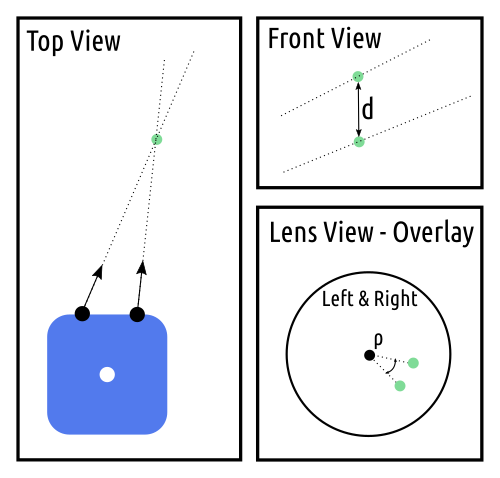

## Lens Rotation and Feature Depth

*Date: December 27, 2022*

Script: [vuze_merge.py](../src/vuze_merge.py)

Usage:
```
./src/vuze_merge.py -r test/coeffs_v3.dat -I test/HET_0014 -O test/HET_0014_depth_mesh -d depth_points
```

### Objective
Align the rotation of the lens on each side of the camera. Using the aligned images from each lens on each side of the camera generate a set of points with known depth. This is an automatic method for alignment which will not require any additional calibration inputs.


### Feature Points
To accurately determine the rotation of each lens relative to the other lens on that side of the camera feature points within the image are used. Feature points are determined by converting the equirectangular image of each lens into 9 sections which are converted to rectilinear format. Feature points are identified within each rectilinear image. The feature points between lens' are compared to find matching features. The rectilinear coordinates are converted back to polar coordinates within each image. These polar coordinates provide a vector indicating the direction of each feature from the lens of the camera.

### Roughly Estimating Depth
Using the direction of each feature point from the left and right lens on a given side of the camera, two vectors in 3 dimensions can be created. These vectors are not guarenteed to intersect. In an ideal scenario these vectors would intersect at the feature point in the real world and using the distance from the lens to the intersection of the vectors would provide the depth. Instead of a point of intersection the point at which the vectors are nearest to each other is computed.

| Feature Point between Different Views |
| :----: |
|  |

The rotation of each lens on a side of the camera may be inconsistent. This inconsistency causes the depth of feature points to be miscalculated. It also causes the vectors from each image to only pass close to each other and not actually intersect. The angle of rotation between the image from each lens will be represented as $\rho$. The following calculations will compute $\rho$ such that the distances $d$ between vectors is minimized. The vector to the feature point from each lens is defined as $\vec{v}$, where $\vec{p}$ is the center of the lens, $r$ is the distance between the lens and the feature, and $\vec{m}$ is the slope.

$$\vec{v} = \vec{p} + r \vec{m}$$

For a given feature point located in polar coordinates at $( \phi, \theta )$ the slope is defined as follows.

$$\vec{m} = \begin{pmatrix} \sin(\phi) \cos \left( \frac{\pi}{2} - \theta \right) \\ \sin(\phi) \sin \left( \frac{\pi}{2} - \theta \right) \\ \cos(\phi) \end{pmatrix}$$

The slope for the feature point from the left and right lenses is represented as $m_l$ and $m_r$ respectively. The closest point between $v_l$ and $v_r$ will be $r_l$ distance from the left lens and $r_r$ distance from the right lens. The distance between the lines at the closest point is $d$ and the slope of the vector between them is $m_d$.

The slope $m_d$ is calculated using $m_r \times m_l$.  The objective is to solve for the components of $m_l$ and m_r$.

$$\vec{p_l} + r_l\vec{m_l} + d\vec{m_d} = \vec{p_r} + r_r\vec{m_r}$$

$$\begin{array}{cc} \vec{p_l} = \begin{pmatrix} -0.03 \\ 0 \\ 1.8 \end{pmatrix} & \vec{p_r} = \begin{pmatrix} 0.03 \\ 0 \\ 1.8 \end{pmatrix} \end{array}$$

The values of $m_d$ and $d$ can be computed for each feature point. The computation is as follows for the components. The offset of each lens in the x-axis from the center of the camera is $X = 0.03$.

$$\begin{array}{cc}
m_l = \begin{pmatrix} a_l \\ b_l \\ c_l \end{pmatrix}
& m_r = \begin{pmatrix} a_r \\ b_r \\ c_r \end{pmatrix}
& m_d = \begin{pmatrix} a_d \\ b_d \\ c_d \end{pmatrix}
\end{array}$$

$$A = \frac{b_l c_r - c_l b_r}{c_d b_r - b_d c_r}$$

$$r_l = \frac{2 * X}{a_l + A a_d - c_l \frac{a_r}{c_r} - A c_d \frac{a_r}{c_r}}$$

$$r_r = r_l \frac{c_l}{c_r} + r_l A \frac{c_d}{c_r}$$

$$d = A * r_l$$

Determining the distance to the best 3 feature points within each of the sections of the woods scene, HET_0014, yields results of 0.32m to 1.82m. The range of $d$ is from 0.00023m to 0.0405m, which is less than the 0.06m between the lenses. The camera within the image can be assumed to be about 1.8m off the ground. It is not likely that any of the trees or rocks are 0.32m away from the camera. Clearly there is some type of systematic distortion between the lenses that yields incorrect results.

### Lens Rotation

During the lens and sensor alignment the one adjustment which was neglected was the rotation of the sensor parallel to the lens. This leds to a difference in rotation of the image between the two lenses. To account for the rotation between the lenses, $\rho$, the left slope, $m_l$ can be adjusted. To reduce the length of the formulas $\rho_1 = \cos\rho$ and $\rho_2 = \sin\rho$.

$$\vec{m_l} = \begin{bmatrix} \rho_1 & 0 \rho_2 \\ 0 1 0 \\ -\rho_2 & 0 & \rho_1 \end{bmatrix} \vec{m_l}$$

To solve for $\rho$ multiple feature points will need to be used. The objective is to solve for $\rho_1$ and $\rho_2$ such that $\rho_1 + \rho_2 = 1$.

Using GNU Octave and the symbolic package the following equations were determined from the `depth_rotation.m` script.

The distance $d$ is in terms of $A$ and $r_l$. Since $r_l$ is not zero, this means to minimize $d$, the value of $A$ must be zero. The representation of $A$ including $\rho_1$ and $rho_2$ is below.


        # v = p + r * m
        # find the point on v_l and v_r such that the points are closest
        # r_l and r_r are the radius along each line that results in the closest point
        # if the point is r_l = r_r = 0, ignore the point,
        m_d = np.cross(m_r, m_l)
        a_d = m_d[:,0:1]
        b_d = m_d[:,1:2]
        c_d = m_d[:,2:3]

        A = (b_l*c_r - c_l*b_r) / (c_d*b_r - b_d*c_r)
        r_l = (2 * self._X / (a_l + A*a_d - c_l*a_r/c_r - A*c_d*a_r/c_r)).reshape((n,1))
        r_r = r_l*c_l/c_r + r_l*A*c_d/c_r
        r_d = A * r_l

        v_l = p_l + r_l * m_l
        v_r = p_r + r_r * m_r

        d = v_l - v_r
        d = np.sqrt(np.sum(d*d, axis=1))
        print('r_d', np.mean(r_d), np.min(d), np.max(d))
        print('d', np.mean(d), np.min(d), np.max(d))


## References

Geometry Stack Overflow: https://math.stackexchange.com/a/1993990
