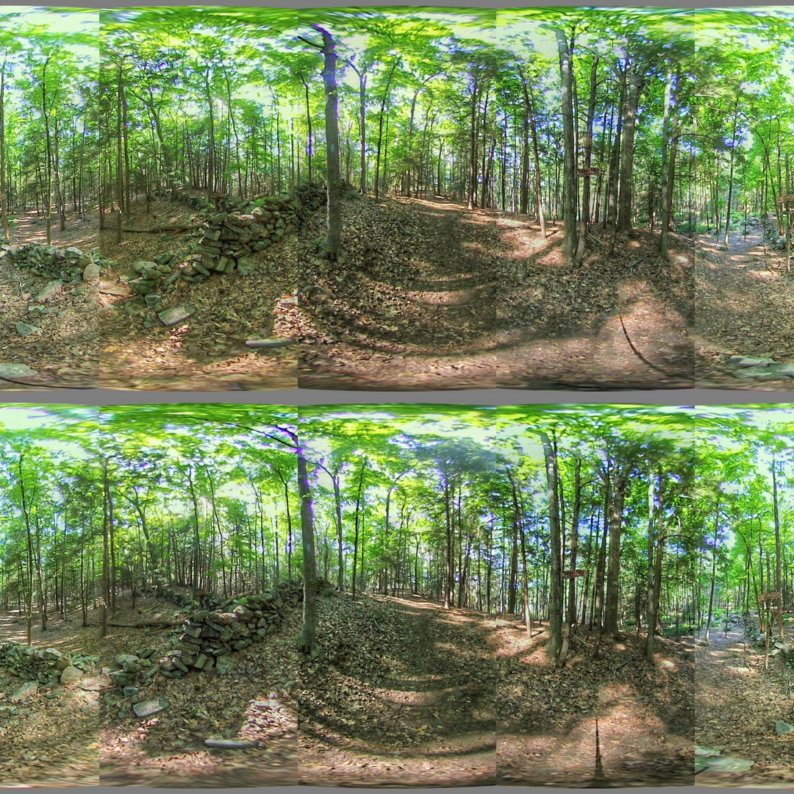
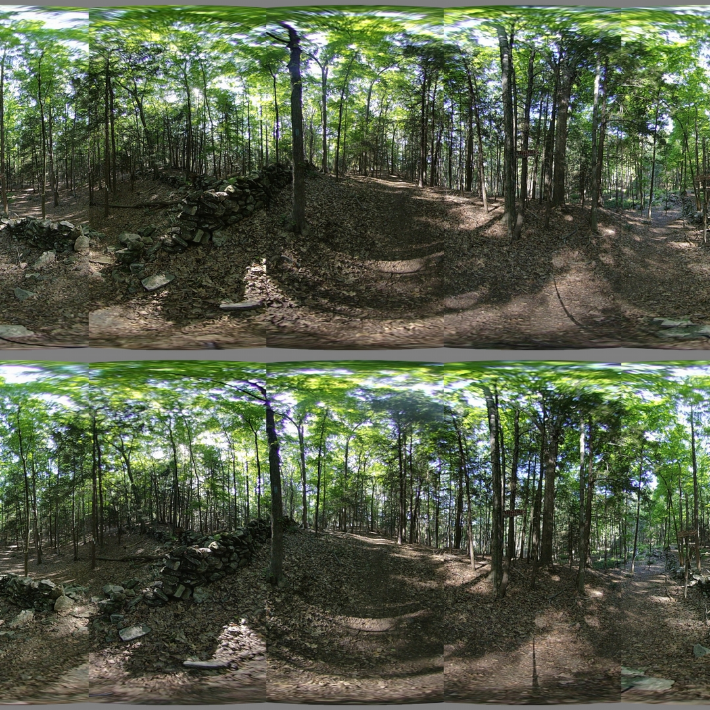

## Exposure Fusion

*Date: July 19, 2022*

Script: [merge_exposure.sh](./merge_exposure.sh)

Usage (Luminance): `../notes/merge_exposure.sh -c config_exposure_merge_luminance.dat`

Usage (Enfuse): `../notes/merge_exposure.sh -c config_exposure_merge_enfuse.dat`

Expanding the feature set of the Vuze VR Studio to include exposure bracketing and HDR image creation would be helpful. The exposure fusion script attempts to take multiple images from a single lens and fuse the exposures into a new single image for that lens. This new image can be used in Vuze VR Studio or provided to a yet to be created splice script.

The first attempt at exposure fusion relied on Luminance HDR. The application has a batch interface which allows for creating HDR images and saving them as HDR images. The application also allows for creating a LDR image from the HDR image. There are over-exposed areas within the test images causing Luminance HDR and the LDR conversion alogirthms to create images with grey blotches in those areas. To mitigate this, the bash script for exposure fusion added support for negating the image and then fusing exposures. A clampping feature was also added. Finally a reasonable result was obtained. This result was given to the python splice script to produce the output below. While reasonable the result did show color distoritions.

Given the complexity of Luminance HDR stitching and its inability to provide a reasonable image given real world input a simpler solution is needed. The `enfuse` application was incorporated into the script as an option. Enfuse does not require the HDR configuration or LDR conversion. It does not require the exposure value for each image either. The result from enfuse was much closer to the original source images.

Cleary the winner here is Enfuse. The simple configuration and color accurate result speak for themselves.

### References

[Luminance HDR](https://luminancehdr.readthedocs.io/en/latest/)

[pfsclamp](https://resources.mpi-inf.mpg.de/pfstools/man1/pfsclamp.1.html)

[Enfuse](http://enblend.sourceforge.net/index.htm)

[Mertens-Kautz-Van Reeth](https://web.stanford.edu/class/cs231m/project-1/exposure-fusion.pdf)
