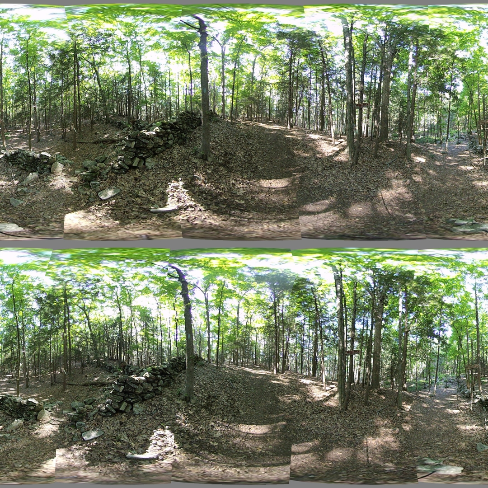

## Using Feature Detection

*Date: July 23, 2022*

Script: [features.py](../src/features.py)

Usage:
```
../notes/splice_360.sh -d -c config_bash_splice_360.dat
../src/features.py -c config_features.dat
```

Image feature identification works best with rectilinear images. The Equirec2Perspec code was used to convert to rectilinear for feature identification. The code was enhanced to provide the reverse mapping "Perspec2Equirec" and allow for determining the original equirectangular point for each feature.

The features script uses image features as determined by the SIFT algoritm and brute force macthing between images to determine the constants used for image transformations. All image transforms are within the spherical coordinate system. The most beneficial is the scaling of $\theta$. A second transform was added to linearly shift phi with respect to $\theta$.

$\theta_f = k \theta_i$

$\phi_f = \phi_i + k \theta_i$

These transforms were used because the operations are easy to perform both forward and reverse. The reverse transform is needed to determine the pixel location within the lens when given a pixel location in the final image. The table below shows the resulting constants and the error between the expected value and the calculated value using the constant.

<table>
  <tr>
    <th>Lens</th>
    <th>Theta Scale</th>
    <th>$\overline{\theta_f - \theta_i}$</th>
    <th>$\sigma_{\theta_f-\theta_i}$</th>
    <th>Phi Rate</th>
    <th>$\overline{\phi_f - \phi_i}$</th>
    <th>$\sigma_{\phi_f-\phi_i}$</th>
  </tr>
  <tr>
    <td>1</td>
    <td>0.8974</td>
    <td>0.0099</td>
    <td>0.0193</td>
    <td>0.0015</td>
    <td>-0.2655</td>
    <td>0.5106</td>
  </tr>
  <tr>
    <td>2</td>
    <td>0.9007</td>
    <td>-0.0242</td>
    <td>0.0237</td>
    <td>0.0027</td>
    <td>-0.1943</td>
    <td>0.5920</td>
  </tr>
  <tr>
    <td>3</td>
    <td>0.8760</td>
    <td>-0.0223</td>
    <td>0.0268</td>
    <td>-0.0100</td>
    <td>-0.3039</td>
    <td>0.4947</td>
  </tr>
  <tr>
    <td>4</td>
    <td>0.8970</td>
    <td>-0.0098</td>
    <td>0.0218</td>
    <td>0.0015</td>
    <td>-0.2582</td>
    <td>0.5568</td>
  </tr>
  <tr>
    <td>5</td>
    <td>0.8897</td>
    <td>0.0308</td>
    <td>0.0248</td>
    <td>0.0079</td>
    <td>-0.2470</td>
    <td>0.5288</td>
  </tr>
  <tr>
    <td>6</td>
    <td>0.9084</td>
    <td>-0.0193</td>
    <td>0.0235</td>
    <td>0.0033</td>
    <td>-0.3314</td>
    <td>0.5195</td>
  </tr>
  <tr>
    <td>7</td>
    <td>0.9048</td>
    <td>-0.0123</td>
    <td>0.0173</td>
    <td>0.0053</td>
    <td>-0.2227</td>
    <td>0.5425</td>
  </tr>
  <tr>
    <td>8</td>
    <td>0.9054</td>
    <td>-0.0044</td>
    <td>0.0192</td>
    <td>0.0109</td>
    <td>-0.2575</td>
    <td>0.5707</td>
  </tr>
</table>

Once the images were adjusted to get the feature points as close as possible, the stitch seams were computed. Instead of choosing a single constant $\theta$ for the seam a line of points starting from phi = 0, to phi = math.pi was used. All points within one standard deviation of the median $\theta$ were used for the seam. The seam is sorted by $\phi$ with duplicate values of phi removed. Points within the seam are assumed to be connected by a straight line. As you can see the stitch lines have issues when $\theta$ changes greatly with very little change in $\phi$. The significant changes causes a zig-zag pattern in the final image. There are still 8 stitch lines in the image.



### References

[OpenCV Feature Matching](https://docs.opencv.org/4.x/dc/dc3/tutorial_py_matcher.html)

[Equirec2Perspec](https://github.com/fuenwang/Equirec2Perspec) - A script for converting an equirectangular image to rectilinear.