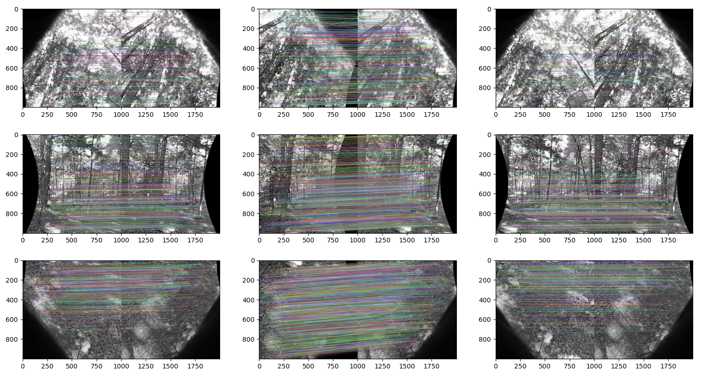
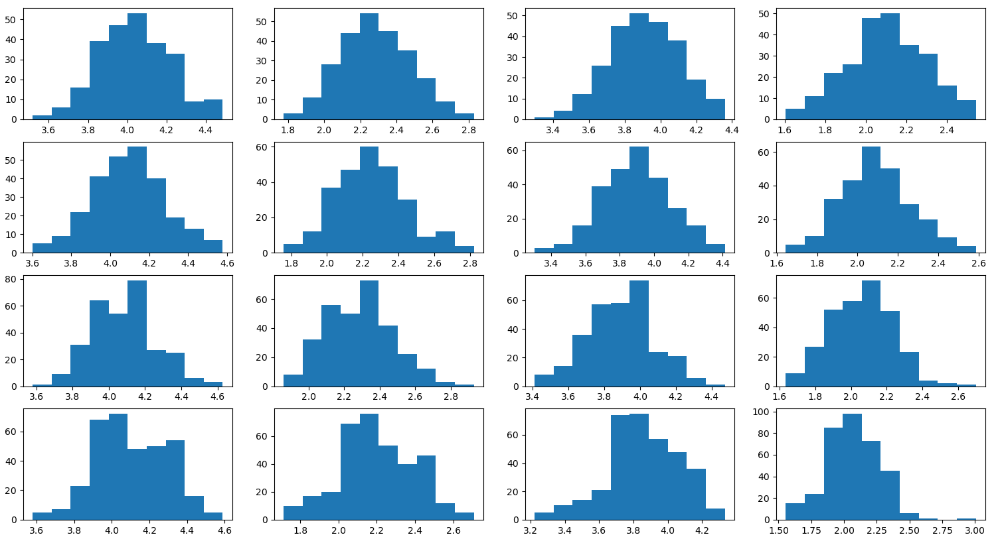
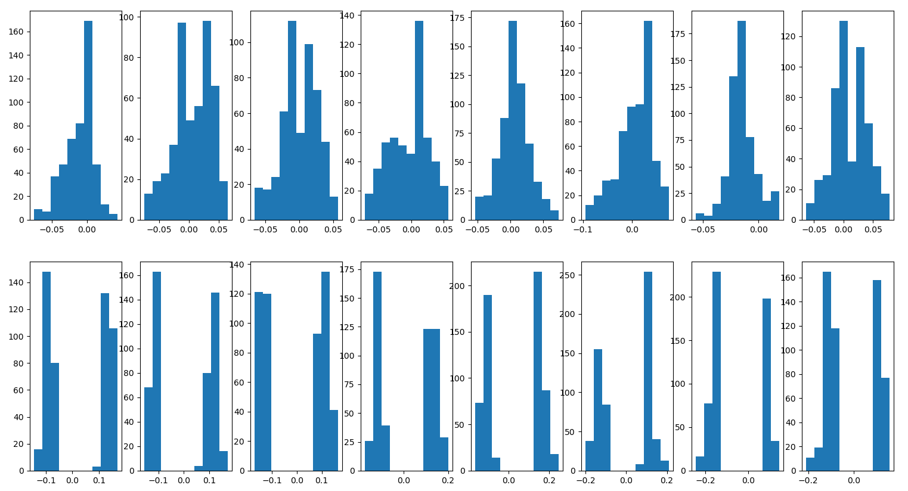
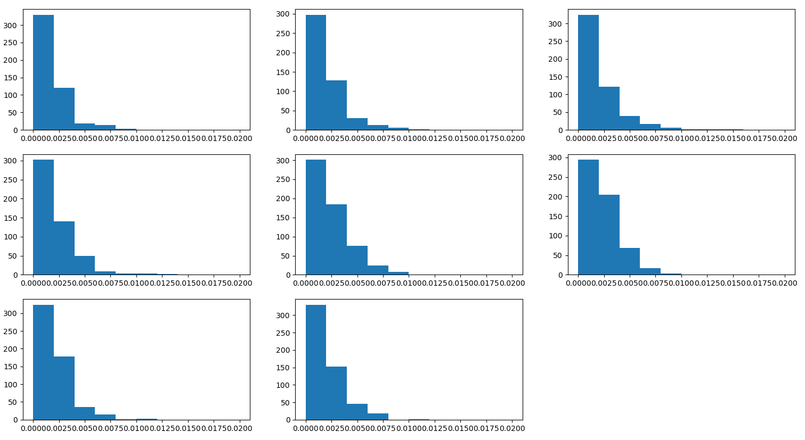
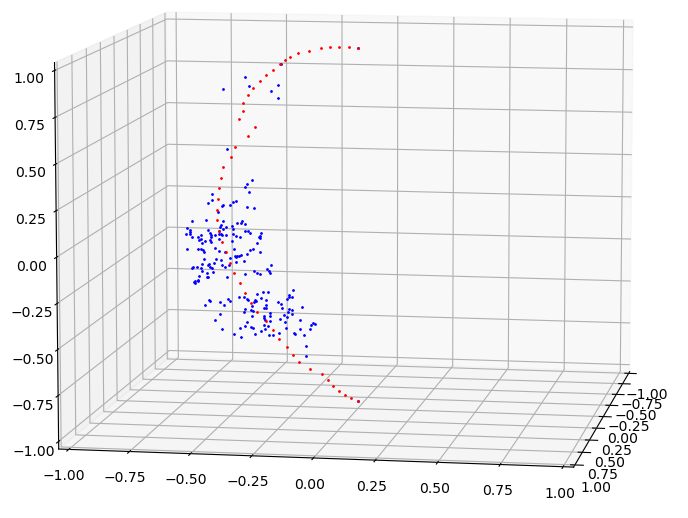
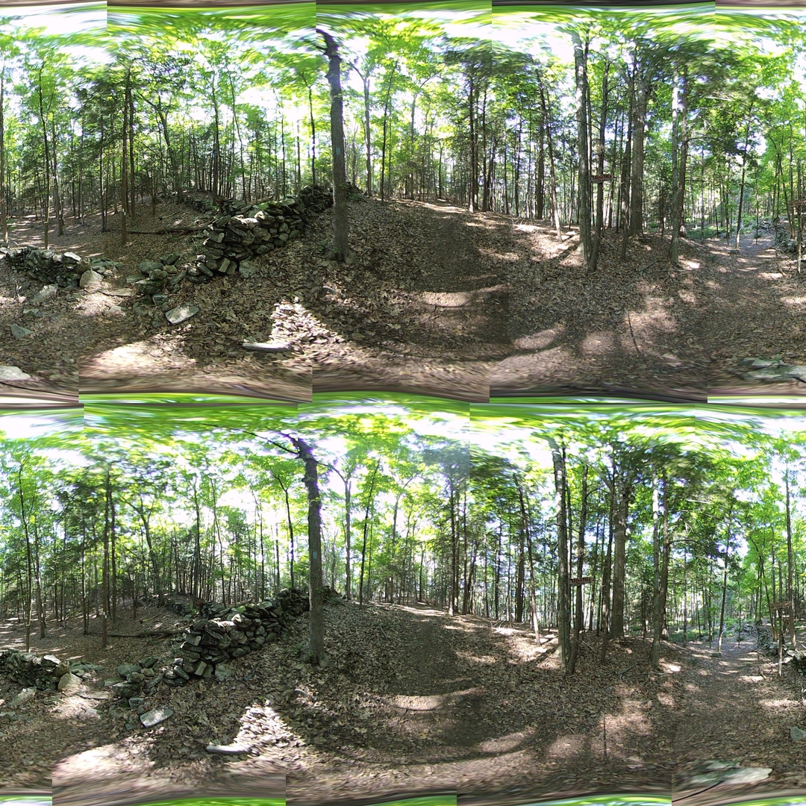

## Handling Outliers & Better Seams

*Date: August 7, 2022*

Script: [vuze_merge.py](../src/vuze_merge.py)

Usage:
```
../src/vuze_merge.py -d "regression_hist|seams|sanitize|matches" -v -c config_vuze_merge.dat
```

### Invalid Feature Point Matches

During feature matching sometimes the algorithm incorrectly identifies matches. The diagonal lines in the images below represent these invalid matches. The images represent rectilinear images taken at $\phi = \left\\{60^{\circ}, 0^{\circ}, -60^{\circ}\right\\}$. The right hand side of each match pair is the image from lens 7.

| Matching Features for Seam 0: Lenses 7, 8, 1, 2 |
| :------: |
|  |

To mitigate this effect on the result several sanity checks are performed. The first is to remove points beyond 5 standard deviations from the mean along the $\theta$ axis. The previous version of the code removed points beyond 1 standard deviation. Relaxing this requirement allows for more matching feature points.

| Seam | Points |
| :---: | :---: |
| 0 | 253 |
| 1 | 265 |
| 2 | 299 |
| 3 | 348 |

The distribution of $\theta$ is visualized below.

| Distribution of $\theta$ per Seam (rows) with columns (left-eye-right-of-seam), (left-eye-left-of-seam), (right-eye-right-of-seam), (right-eye-left-of-seam). The coordinates are in reference to the center of each lens located at $\theta=\pi$.  |
| :------: |
|  |

When removing outliers for the transform for a single image, the points on the left seam are now treated separately from the points on the right seam. The sets of points are then combined and the regression is performed. The formulas below will be applied twice for each image.

$$\left|\left(\theta_f - \theta_i\right) - \overline{\left(\theta_f-\theta_i\right)}\right| > 2 \sigma_{\theta_f - \theta_i}$$

$$\left|\left(\phi_f - \phi_i\right) - \overline{\left(\phi_f-\phi_i\right)}\right| > 2 \sigma_{\phi_f - \phi_i}$$

After removing outliers the combined feature point set for each image is visualized below. The distinct means for each side of the seam indicate that this method will probably yeild better results.

| Distribution of $\theta_f-\theta_i$ (top) and $\phi_f-\phi_i$ (bottom) for each lens. |
| :------: |
|  |

Performing the regression with the sanitized feature points leads to the following distribution of errors. The error is computed as follows and the feature points used for the seam must have an error less than 0.0075.

$$\mathit{err} = \sqrt{(\theta_f-\theta_a)^2+(\phi_f-\phi_a)^2}$$

| Error between final and approximated coordiantes for each feature point in the Lenses. |
| :------: |
|  |

### Better Seams

The existing seam line computation can leave large gaps between points. These gaps appear as straight lines in the final image. For a more detailed seam line, the range of $\phi$ from $\left[0, \pi\right]$ was divided into 50 points. About each point, the features within a predefined range were considered. The $\overline{\theta}$ for all coordinates in the range was used as the seam location. Several other techniques were attempted to allow seams to gradually, but responsively adjust as the location of feature points changes. In the following equations $s$ is the index of the point within the seam, 50 is the predefined number of seam points, and 10 is the twice the number of windows in the rane of $\phi$.

$$\frac{s\pi}{50} - \frac{\pi}{10} < \phi < \frac{s\pi}{50} + \frac{\pi}{10}$$

The computed seam using the sliding window approach appears as follows.

| Seam 0 computed using a sliding window. |
| :------: |
|  |

As the number of seam points increased, the computation time to determine which final image points lie between which seam $\phi$ values also increases. The proper balance between smoothness of the seam and runtime must be obtained.

### Results

The mean regression error for both $\phi$ and $\theta$ is 0.0. The standard deviation is provided in the table below.

| Lens | $\sigma_{\theta_f-\theta_a}$ | $\sigma_{\phi_f-\phi_a}$ |
| ---- | ---- | ---- |
| 1 | 0.002101 | 0.001197
| 2 | 0.002794 | 0.00144
| 3 | 0.002601 | 0.001162
| 4 | 0.003233 | 0.001159
| 5 | 0.003276 | 0.001499
| 6 | 0.002804 | 0.004069
| 7 | 0.002436 | 0.000944
| 8 | 0.002398 | 0.001457

The overall output image appears to have better seam lines. Some of the seam lines can only be distinguished by the slight color difference between the lenses.


