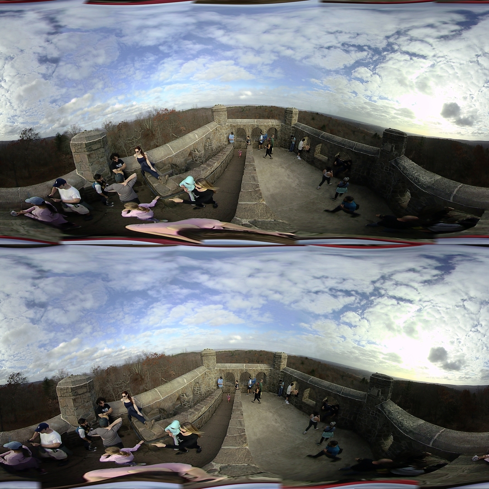
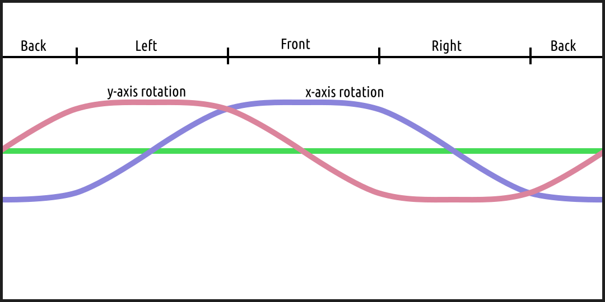
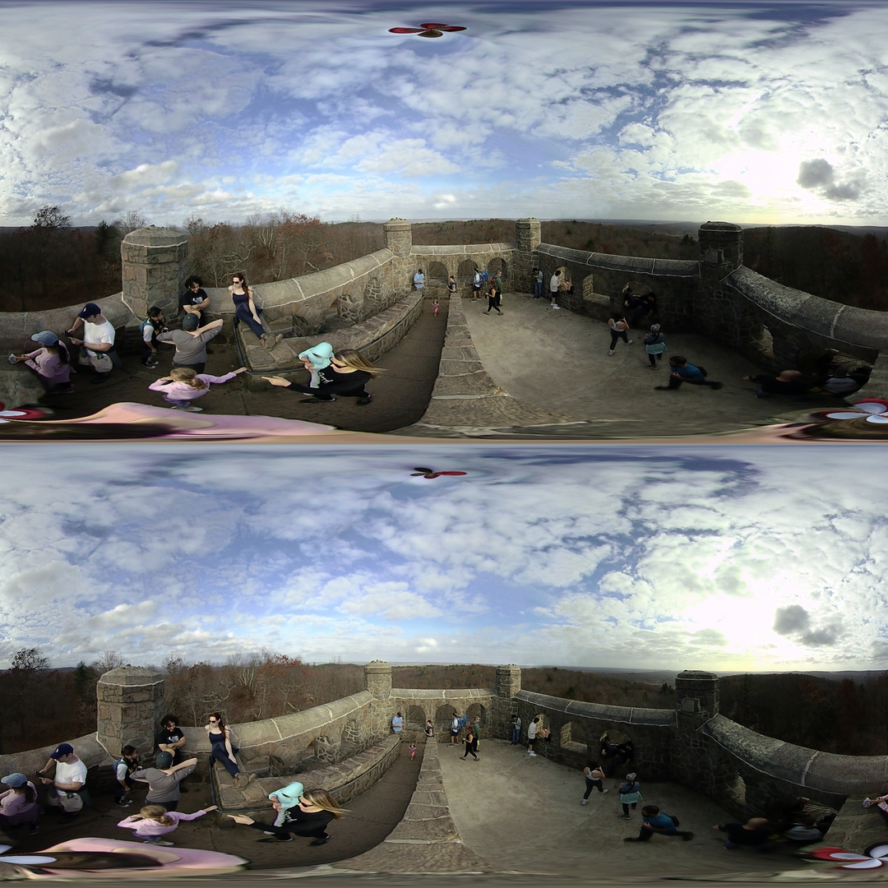

## Super Resolution

*Date: October 21, 2022*

Script: [vuze_merge.py](../src/vuze_merge.py)

Usage:
```
# adjust the vuze_merge script to default to NOT use accelerometer alignment.
../src/vuze_merge.py -v -r ../test/coeffs_v2.dat -I ../test/HET_0025 -O ../test/HET_0025_horizon_bend -q 1080
# adjust the vuze_merge script to default to use accelerometer alignment.
../src/vuze_merge.py -v -r ../test/coeffs_v2.dat -I ../test/HET_0025 -O ../test/HET_0025_horizon_level -q 1080
```

### Concept
The Vuze camera includes a 3-axis accelerometer which can be used to determine the orientation of the camera relative to the horizon. Additionally, instead of using fixed seams only based on a single known good image, feature points specific to the current image can be used as well for better seams and alignment.

### Better Seams
The coefficients file was updated to include feature points in coordinates within the original image and the target coordinate for the desired polar coordinate transforms. During the processing of a new image, feature points specific to that image are determine along with their desired target polar location in the merged image. The feature points from the coefficients file and the current image are then combined into a single list and the standard outlier and linear regression operations are used to determine the set of coefficients for the coordinate transforms. The combined feature point list is also used to determine the optimal seam.

### Horizon Leveling
Inorder to maintain a sense of immersion without causing discomfort to viewers of the picture, a level horizon is desired. When the camera is not level the horizon can be seen to bend as illustrated below.



The above image shows what happens when the camera is rotated along the x-axis. The camera could also be rotate along the y-axis. The diagram below shows an example of each distortion and how it impacts each side of the final $360^\circ$ image.

| Possible Horizon Distortions |
| :----: |
|  |

If a rotation occurs along each axis the distortions will sum throughout the image. The accelerometer measures along all 3 axes, $a_x$, $a_y$, and $a_z$. When perfectly level the accelerometer ideally would read exactly zero in the $a_x$ and $a_y$ direcitons and 1 along $a_z$. The magnitude of the acceleration of the camera when stationary is equal to the force of gravity and should always be perpendicular to level ground. This means the $a_x$ and $a_z$ readings of the accelerometer form two sides of a right triangle, similarly for $a_y$ and $a_z$. The angle of camera rotation in each axis is determined as follows.

$$r_x = \tan^{-1}(a_x / a_z)$$

$$r_x = \tan^{-1}(a_y / a_z)$$

The adjustments are applied to the final stitched image by converting from equirectangular to polar and finally to cartesian coordinates. Using the cartesian coordinates and the rotation angles, $r_x$ and $r_y$ along each accelerometer axis, the image is remapped. The following equations represent the cartesian remapping of coordinates, $c$.

$$X = \begin{bmatrix} \cos(r_x) & 0 & \sin(r_x) \\\\ 0 & 1 & 0 \\\\ -\sin(r_x) & 0 & \cos(r_x) \end{bmatrix}$$

$$Y = \begin{bmatrix} 1 & 0 & 0 \\\\ 0 & \cos(r_y) & \sin(r_y) \\\\ 0 & -\sin(r_y) & \cos(r_y) \end{bmatrix}$$

$$c = (YXc^\intercal)^\intercal$$

The $X$ transform matrix rotates points about the cartensian coordinate y-axis, while the $Y$ transform matrix rotates points about the cartesian coordinate x-axis. Note the axis swap between cartensian and accelerometer. The points to transform are represented by $c$, a $n$x$3$ matrix of cartesian points.



The corrected image above now appears to have a more level horizon. The zenith and nadir points are now also visible within the equirectangular image and a location other than the top and bottom. This is a good way to tell how much horizon leveling was required.