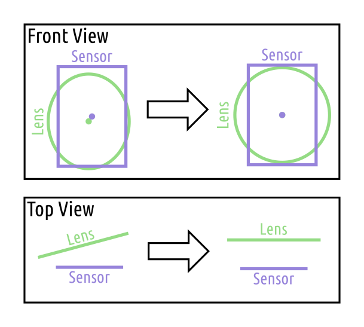
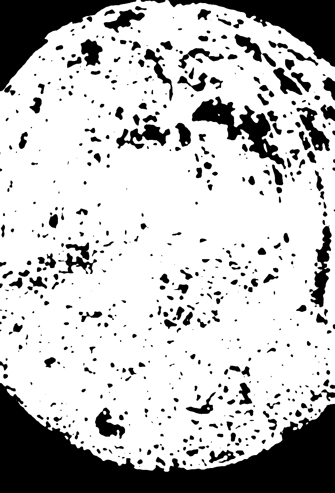
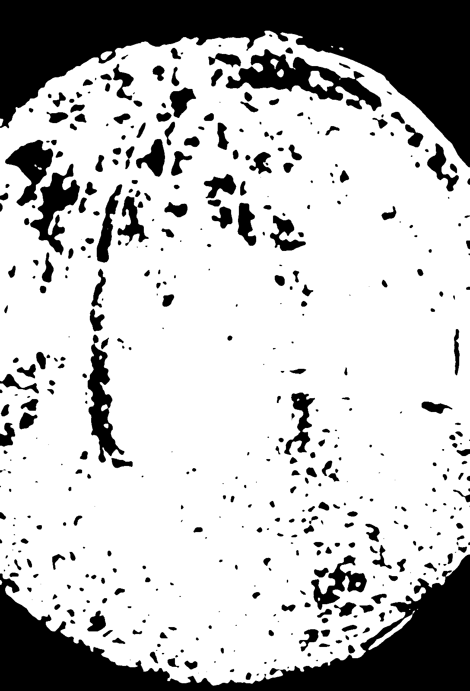
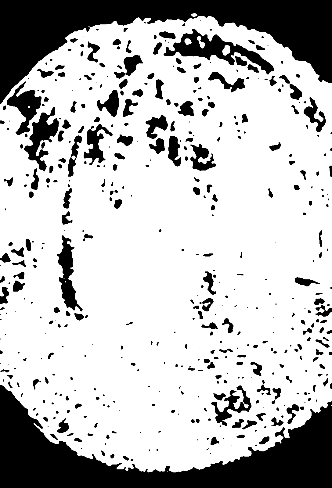
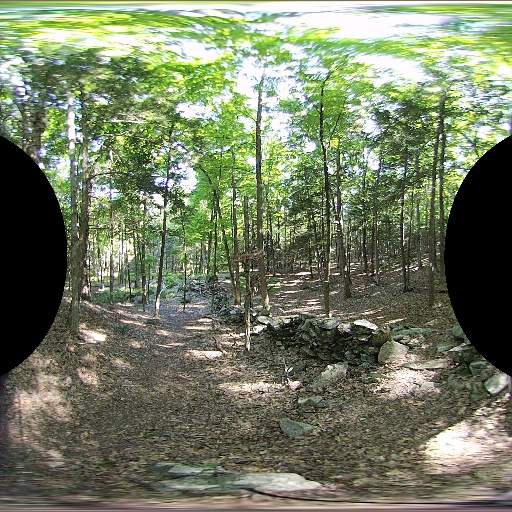
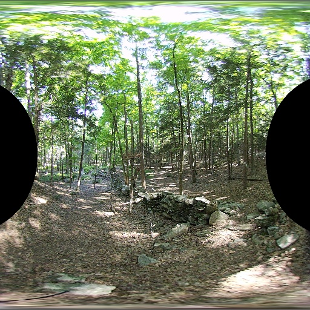
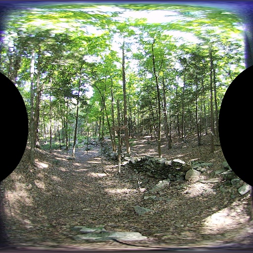
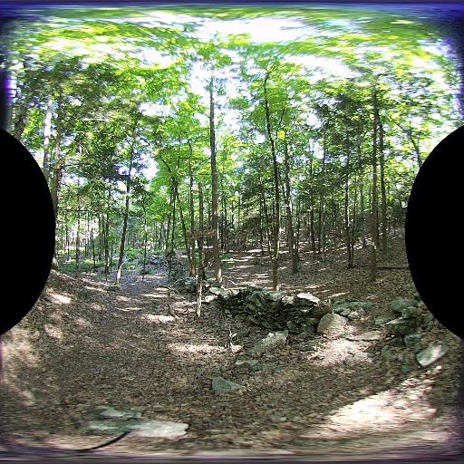

## Lens Alignment

*Date: November 17, 2022*

Script: [vuze_merge.py](../src/vuze_merge.py)

Usage:
```
../src/vuze_merge.py -d "calib" -v -w coeffs_v3.dat
```

### Objective

Ensure the images captured by each image sensor are properly centered, rotated, and de-skewed. The lens and the image sensor may not be in the same plane or perfectly aligned causing issues during more complex calculations.

### Skew and Offset

When attempting to determine the depth of objects within left and right eye images, the results were wrong. The reason behind the incorrect calculations was determined to be poor alignment of the images from each lens. The biggest source of error was using the incorrect lens center when adjusting for the offset between the center of the lens and the center of the image sensor.

| Correcting Lens and Sensor Position, Alignment, and Skew |
| :----: |
|  |

The lens is assumed to be a perfect circle. When the circle is viewed from the sensor it may appear shifted and skewed. The lens may appear elliptical to the sensor.

First the boundary between the lens and the surrounding area is established. An outdoor image of woods was used to provided a large number of edges. Assuming the scene captured by the lens is all edges the surrounding area outside the lens should have no edges.

To determine whether a given pixel in the image was viewing the lens or not the following steps were used.

1. Convert the image to gray scale.
1. Median Blur with 5 pixels.
1. Adaptive gaussian threshold.
1. Gaussian blur over an area of 31x31 pixels.
1. threshold of 180/255.

The result is an image similar to the images below.

| Pixels within each Lens |
| :----: |
|    |

Within each column the top-most and bottom most white pixels were determined. These values are the edge of the lens. The lens is assumed to be elliptical when viewed from the sensor and using the points along the ellipse the constants for the ellipse can be determined. The python code from [SciPython - Christian](https://scipython.com/blog/direct-linear-least-squares-fitting-of-an-ellipse/) was used to determine the least squares fit of the ellipse and the parameters $x_0, y_0, a_p, b_p, e, \rho$. This method uses the distance from the conic as represented by $F$.

$$F(x,y) = ax^2 + bxy + cy^2 + dx + ey + f$$

The coefficients $a, b, c, d, e, f$ are then converted to ellipse parameters $x_0, y_0, r_a, r_b, \rho$. In this notation, $r_a$ is the radius along the semi-major axis and $r_b$ is the radius along the semi-minor axis. The rotation of the semi-major axis about the center is $\rho$. Using HET_0014 as the image with a lot of edges, the following ellipse parameters are computed. All coordinate values are in pixels from the top left corner.

| Lens | $x_0$ | $y_0$ | $r_a$ | $r_b$ | $\rho$ |
| ----- | ----- | ----- | ----- | ----- | ----- |
| 1 | 561.22 | 767.73 | 763.56 | 722.83 | 1.44 |
| 2 | 548.72 | 774.08 | 765.16 | 721.28 | 1.62 |
| 3 | 519.57 | 788.80 | 769.75 | 732.10 | 1.49 |
| 4 | 564.18 | 761.50 | 762.00 | 719.72 | 1.53 |
| 5 | 512.77 | 826.81 | 751.35 | 715.23 | 1.51 |
| 6 | 558.95 | 797.77 | 748.51 | 713.54 | 1.64 |
| 7 | 533.61 | 762.12 | 766.54 | 722.93 | 1.56 |
| 8 | 564.70 | 801.24 | 763.24 | 718.09 | 1.64 |

These coefficients are inline with the observations made from the images above. The semi-major axis of the ellipse appears along the verticle axis. This means the rotation $\rho$ should be approximately $\pi/2$. The center of each lens appears to be near the center of the sensor and the radius of the lens appears to be approximately half the height of the sensor, 800px.

Reversing the misalignment of the sensor and the lens can be performed using the following manipulations. For every pixel within the desired equirectangular output image, the coordinate location is converted to polar, then to cartesian (radius=1). Assuming a perfect fisheye lens the location within the lens, $f$, is determined.

$$r = \frac{2}{aperture} * \tan^{-1}\left( \sqrt{ \frac{x^2 + z^2}{y} } \right)$$

$$\alpha = \tan^{-1}\left( \frac{z}{x} \right)$$

$$\vec{f} = \begin{pmatrix} r \cos \alpha \\\\ r \sin \alpha \end{pmatrix}$$

Since the true lens and sensor are not perfectly aligned, the points $f$ must be converted to a basis which is aligned to the semi-major and semi-minor axes of the calibration ellipse.

$$\mathbf{E} = \begin{bmatrix} \cos\rho & -\sin\rho \\\\ \sin\rho & \cos\rho \end{bmatrix}

Given the point $\vec{f}$ in the perfect fisheye lens the following is used to map to the actual pixel value within the sensor, $p$. The skew of the lens and the sensor is accounted for using similar triangles and scaling the semi-minor component of the point in the ellipse basis space.

$$\vec{p} = \max(r_a, r_b) \mathbf{E}^{\intercal} \begin{bmatrix} 1 & 0 \\\\ 0 & \frac{r_a}{r_b} \end{bmatrix} \mathbf{E} \vec{f} + \begin{pmatrix} x_0 \\\\ y_0 \end{pmatrix}$$

The adjustment produces a slightly different image by horizontally expanding the pixels in the equirectangular image. An example before and after image is provided below.

| Pixels within each Lens | Left Eye | Right Eye |
| :----: | :----: | :----: |
| Before |  |  |
| After |  |  |

### Rotation

It is not possible to know if the sensor and the lens are off by a given angle of rotation, becuase the lens is assumed to be a circle. Both the left and right eye images from a given side of the camera will need to be used to correct for different sensor rotations. If the left and right eye images are aligned this should aid in depth determination of feature points.
