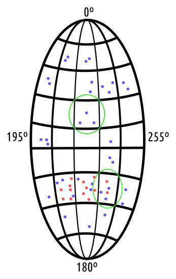
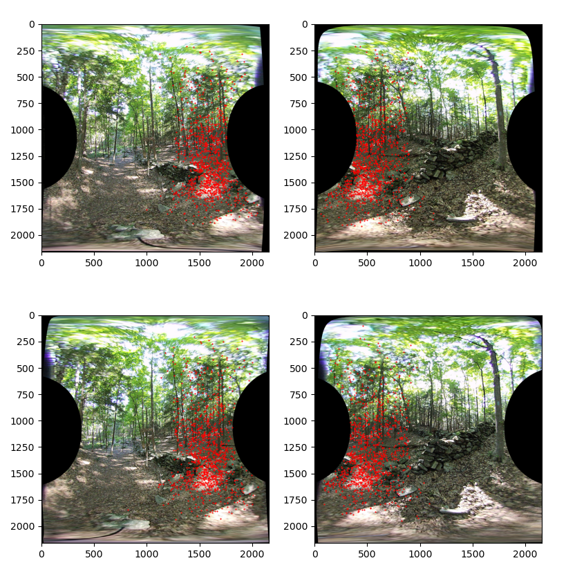
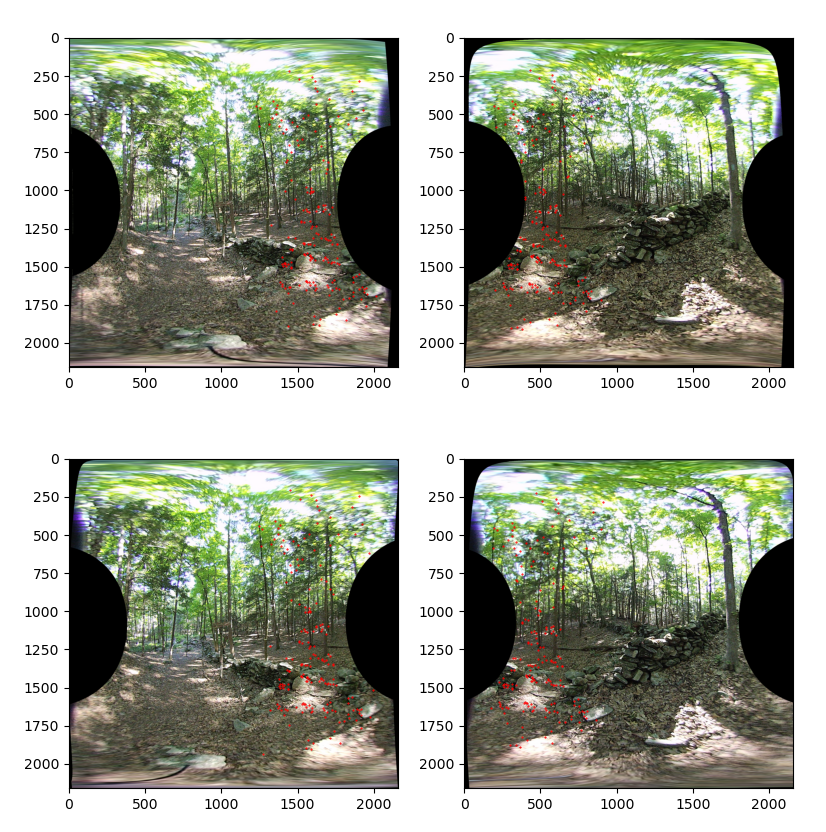
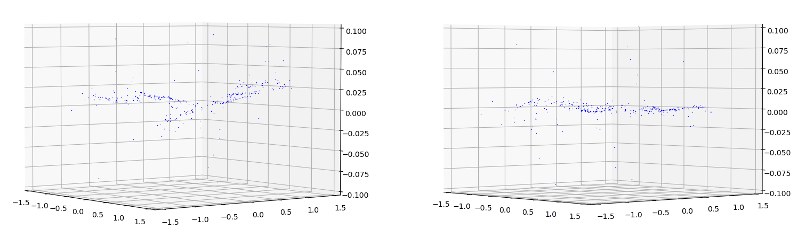
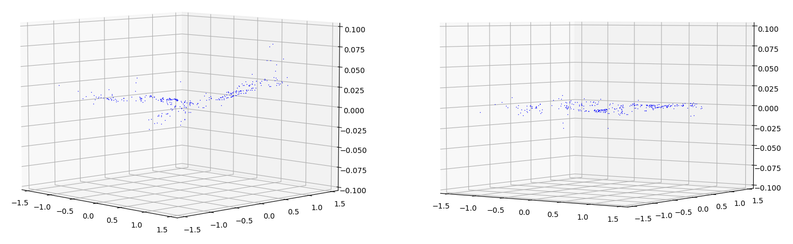

## Matches and Seams

*Date: March 17th, 2023*

Script: [vuze_merge.py](../src/vuze_merge.py)

Usage:
```
src/vuze_merge.py -a coeffs_v6.json -I test/HET_0014 -O HET_0014 \
  --ignore-alignment-seams -d feature-matches
src/vuze_merge.py -a coeffs_v6.json -I test/HET_0014 -O HET_0014 \
  --ignore-alignment-seams -d align-regression
```

### Objective

Further improve the appearance of seams and distortions within the final image. Improve runtime to make processing a large number of images faster.

### Match Density Reduction

The result of the `FeatureMatcher4` yields many points, but they tend to be tightly clustered in certain areas of the image. These tight clusters of points will influence the transform linear regression computation to prefer the adjustments required for the high density area only.

To ensure a transform which is applicable to all areas of the image, the area around the seam is divided into $N$ sections of approximately equal number of degrees vertically and horizontally. The radius of this circle is computed as is the center of each subdivision. The number of points within each circular subdivision in polar coordinates is counted and the median number of points for all non-zero subdivisions is used as $D$ the optimal number of points. Limits are applied such that $D$ must be between 10 and 20, inclusive.

| Subdivisions Around the Seam |
| :----: |
|  |

Points within subdivisions with a count greater than $D$ are reduced by taking the standard deviation of the difference between the points across each combination of the 4 images around the seam. Points with the lowest standard deviations are kept. The discard points are shown in red in the diagram above. The images below show the before and after match distribution of the HET_0014 test image.

| Before Density Reduction |
| :----: |
|  |

| After Density Reduction |
| :----: |
|  |

| Seam | Matches Before | Matches After |
| :----: | :-----: | :----: |
| 0 | 1095 | 187 |
| 1 | 991 | 185 |
| 2 | 1170 | 185 |
| 3 | 1214 | 161 |

Reducing the number of points and optimizing for the good matches additionally reduces the runtime of the linear regression and seam path cost analysis.

### Linear Regression Outliers

While the method of determining feature matches is adequate it is not perfect. There are matches which are significantly different from the majority of other matches but a naive difference between the actual and expected yields a reasonable result ignoring the coordinates position in the image. After the linear regression is performed once these outliers are easier to detect as the error between the esimate and the actual value.

Points with an regression error greater than 1.5 standard deviations will be removed and the linear regression coefficients will be recalculated. The result of the linear regression will then be the error and an array of points kept during the computation. The images below show the difference between the actual point and the estimate for $\theta$ with respect to the polar coordinate pair $(\phi, \theta)$. The left side shows initial vs. actual and the right shows estimate vs. actual. The following example is generated using the HET_0014 test image using the density reduction technique above.

| Before Outlier Removal (Theta) |
| :----: |
|  |

| After Outlier Removal (Theta) |
| :----: |
|  |

A linear regression is performed for each of the 8 images. The results in terms of error standard deviation in each situation are below. The $\sigma'$ designates after outliers have been removed. The mean error for each is within 0.0000001 of 0.0, so providing it serves no purpose.

| Image | $\sigma_\phi$ | $\sigma_\theta$ | Removed (%) | $\sigma'_\phi$ | $\sigma'_\theta$ |
| :---: | :----: | :----: | :----: | :----: | :----: |
| 0 | 0.01539324 | 0.01621977 | 8.05%  | 0.00193439 | 0.00338912 |
| 1 | 0.0208748  | 0.02007094 | 10.06% | 0.00412902 | 0.0051663  |
| 2 | 0.01455247 | 0.01326805 | 6.72%  | 0.00271629 | 0.00330544 |
| 3 | 0.01484651 | 0.01676022 | 9.68%  | 0.00310058 | 0.00397465 |
| 4 | 0.01175954 | 0.00957593 | 6.22%  | 0.00191869 | 0.00273457 |
| 5 | 0.01419184 | 0.01442296 | 9.19%  | 0.00219989 | 0.0042106  |
| 6 | 0.01142462 | 0.0129409  | 6.94%  | 0.00246963 | 0.00312914 |
| 7 | 0.02042788 | 0.01808686 | 9.25%  | 0.00279149 | 0.00507755 |
