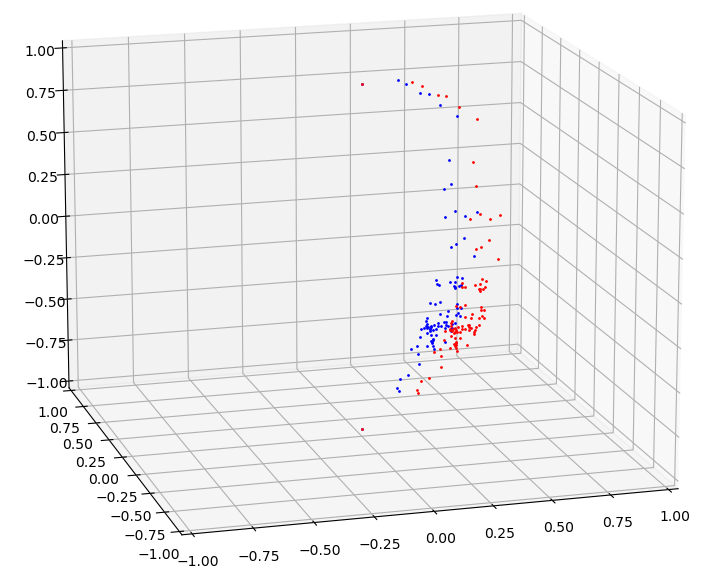
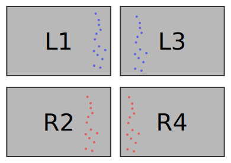
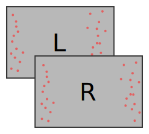
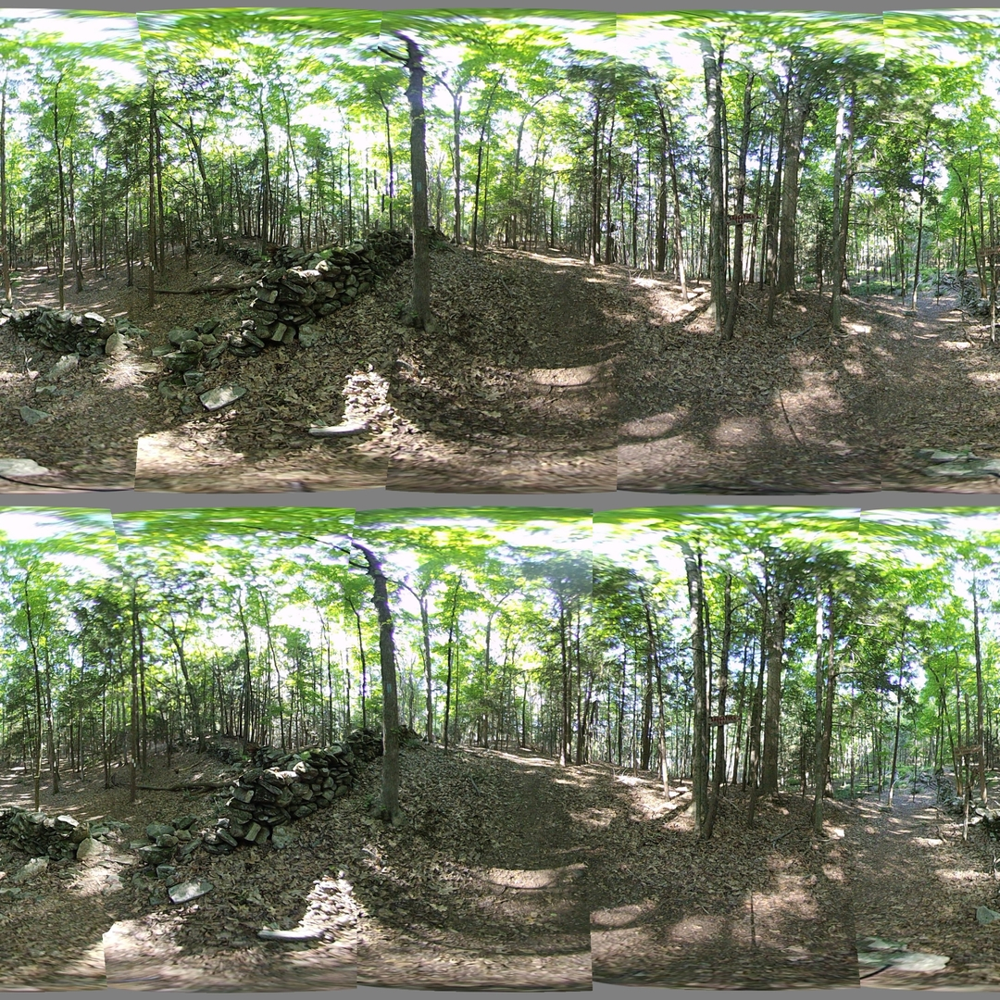

## Seam Alignment

*Date: July 24, 2022*

Script: [features.py](../src/features.py)

Usage:
```
../notes/splice_360.sh -d -c config_bash_splice_360.dat
../src/features.py -c config_features.dat
```

The 8 seams lines within the stereo images are disorienting. Using matching feature points from the left and right eye for each seam should reduce the number of seams appearing to a person to 4. This requires matching feature points between 4 images instead of 2. Those images are the left-eye-left-of-seam, left-eye-right-of-seam, right-eye-left-of-seam, and right-eye-right-of-seam.

The best points for each seam were obtained by choosing points within 1 standard deviation of the median of all seam points. The average between the left-of-seam and right-of-seam points for each eye was sorted and combined into the seam line. The plot below shows the left-eye and right-eye seam points for the first seam, between lenses 1, 2, 3, and 4. Such a diagram is produced by the script for each set of four lenses: (1,2,3,4), (3,4,5,6), (5,6,7,8), and (7,8,1,2).

| Left and Right seam points (lenses: 1, 2, 3, 4) |
| :----: |
|  |

| Hypothetical Seam Points per Lens |
| :----: |
|  |

In addition to better seam analysis, the scrpit was enhanced to attempt a verticle alignment of images between eyes, before calculating theta/phi constants for aligning lenses within an eye. The verticle alignment was implemented as a constant offset which attempted to align each image to the average between the eyes.

Finally, the theta scaling and phi rate constants were computed using points which were found in all 4 images surrounding a seam. The average coordinate of matching features per side of the seam was used. This resulted in a single set of constants for each side of the camera: forward, back, left, right. Constants were computed using points from both eyes, the points to the right of the left seam, and the points to the left of the right seam.

| Alignment Points per Stereo Pair |
| :----: |
|  |


The improved seam analysis had an overall positive effect while the alignment per pair worsened the computed error of the theta/phi constants.



<table>
  <tr>
    <th>Lens</th>
    <th>Theta Scale</th>
    <th>$\overline{\theta_f - \theta_i}$</th>
    <th>$\sigma_{\theta_f-\theta_i}$</th>
    <th>Phi Rate</th>
    <th>$\overline{\phi_f - \phi_i}$</th>
    <th>$\sigma_{\phi_f-\phi_i}$</th>
  </tr>
  <tr>
    <td>1, 2</td>
    <td>0.9044</td>
    <td>-0.0057</td>
    <td>0.0862</td>
    <td>0.0022</td>
    <td>-0.0281</td>
    <td>0.6596</td>
  </tr>
  <tr>
    <td>3, 4</td>
    <td>0.8904</td>
    <td>-0.0184</td>
    <td>0.0686</td>
    <td>-0.0088</td>
    <td>-0.0921</td>
    <td>0.6250</td>
  </tr>
  <tr>
    <td>5, 6</td>
    <td>0.8946</td>
    <td>-0.0063</td>
    <td>0.0777</td>
    <td>0.0059</td>
    <td>-0.1139</td>
    <td>0.6221</td>
  </tr>
  <tr>
    <td>7, 8</td>
    <td>0.8938</td>
    <td>-0.0002</td>
    <td>0.0863</td>
    <td>0.0034</td>
    <td>-0.0617</td>
    <td>0.6517</td>
  </tr>
</table>
