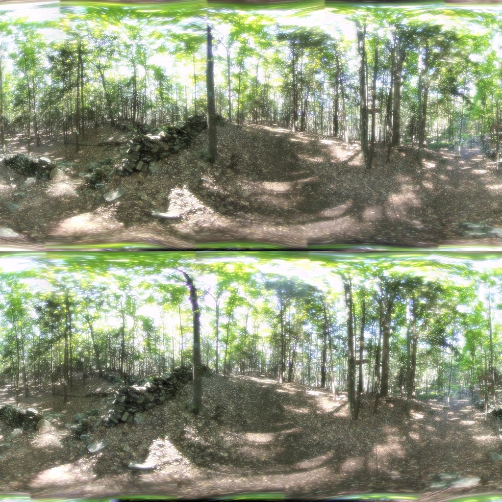
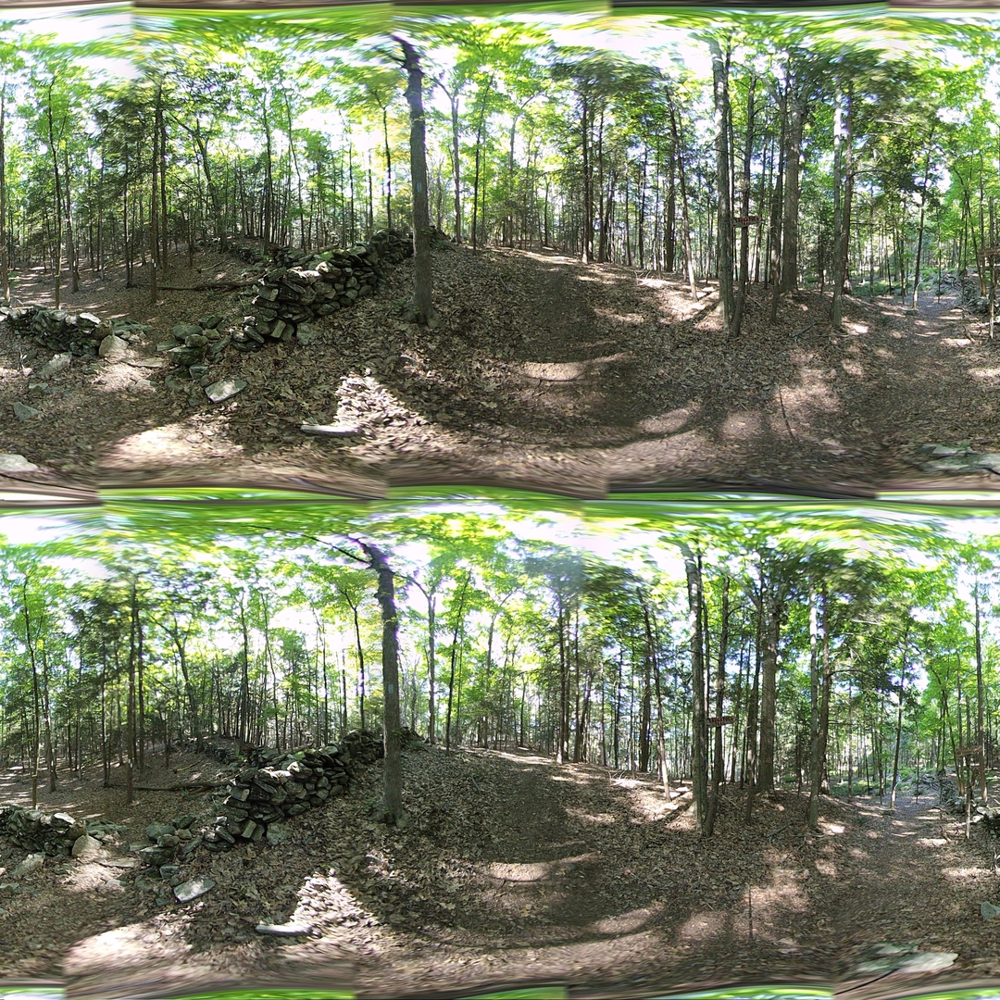

## Seam Blending

*Date: August 12, 2022*

Script: [vuze_merge.py](../src/vuze_merge.py)

Usage:
```
../src/vuze_merge.py -v -c config_vuze_merge_pyramid.dat
../src/vuze_merge.py -v -c config_vuze_merge.dat
```

### Laplacian Pyramid Blending

The pyramid blending technique was implemented into the script with a configurable depth. The implementation uses the equirectangular images for each lens to compute the guassian and laplacian pyramids. The individual levels are then stitched together using the provided seam line and transformations. The color correction is only applied at the lowest level of the pyramid when operating on the low-resolution version of the image. The countour images are not color corrected. The result is not satisfactory.



### Fade Blending

A second option for blending was added, which allowed for each pixel of the image to the left of the seam to be a weighted average with the pixel to the right of the seam. The weight is linear based on the difference between the pixel's $\theta$ location and the seam's $\theta$ location. This blending technique resulted in a decent seam line even when the images were not perfectly aligned. In places the images are pefectly aligned the seam line quality is unaffected.


