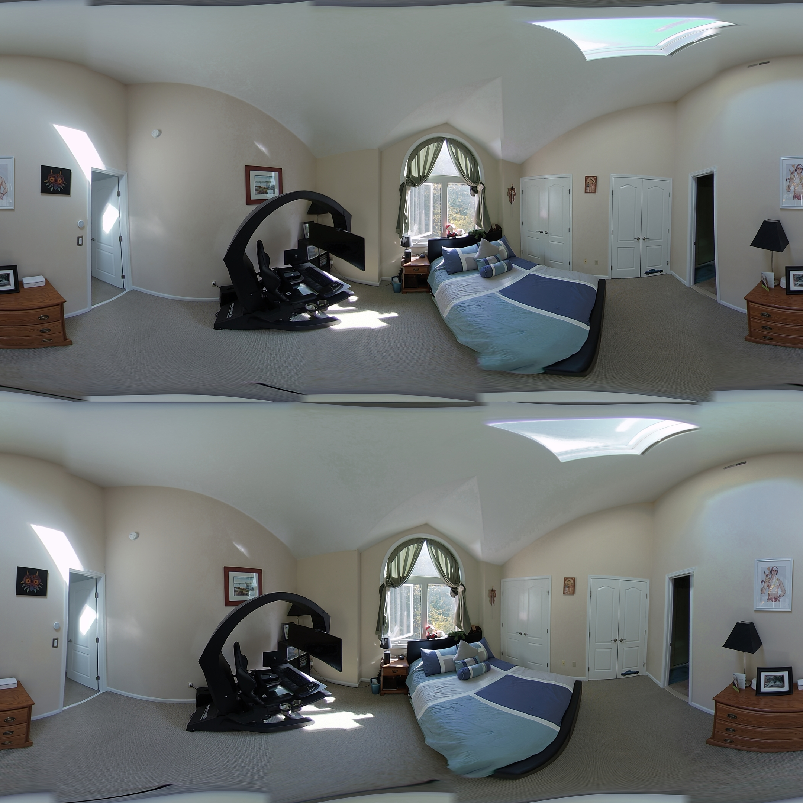
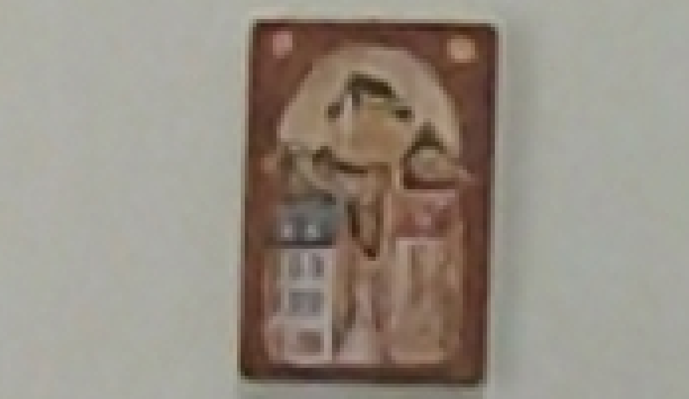
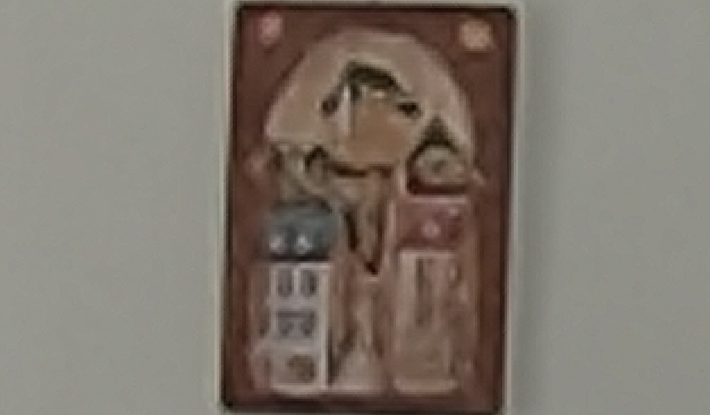
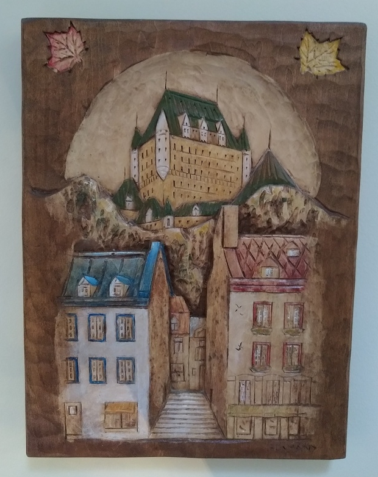

## Super Resolution

*Date: October 21, 2022*

Script: [vuze_merge.py](../src/vuze_merge.py)

Usage: Requires too many images to include in github.

### Concept

It is possible to create a high resolution image from a series of slightly shifted lower resolution images. The combination of the lower resolution images will reduce the noise within the image.

### Method

The lower resolution images are loaded into memory and each image is converted to equirectangular format in the desired higher resolution. The equarectangular images for each lens are aligned using OpenCV alignMTB and the mean is taken. The result is sharpened using the following filter2D kernal.

$$\begin{bmatrix} 0 & -1 & 0 \\ -1 & 5 & -1 \\ 0 & -1 & 0 \end{bmatrix}$$

Each of these higher resolution images is used for the remaining alignment and stitching as normal.

Additional features were added to enable/disable the sharpen filter and to remove outliers from given images before taking the mean. A bucketing system was also added to allow for creating super resolutions of different exposures and then using Mertens merge on the result of each bucket.

Using the Mertens merge was investigated instead of using the mathematical mean, but this lead to images with a great deal of noise.

### Memory Concerns

Due to the increased size of each image and number of images the 16GB of memory was no longer enough to execute the python script. Several modifications were made to use proper data types throughout the script and reduce to 32bit floating point numbers throughout. To speed up the process each series of lens images was loaded in parallel with 4 threads.

### Results

The images HET105_0031 - HET106_31 were captured of my bedroom. Approximately 12 images for each of 4 different exposure levels. These images were merged without using the Mertens merge for exposure correction. Instead pixels were average between the lighter and darker images without regard to quality of exposure. The merged 8320x8320px scaled down super to 25% resolution image is below.

Examining the wood carving hanging on the wall between the two doors on the right hand side of the image yields the following.

| Single Image HET105_0031 Crop |
| :------: |
|  |

| Super Resolution 8K Crop |
| :------: |
|  |

| Actual Wood Carving |
| :------: |
|  |

While the highres image is slightly darker, there is still definite improvements in image quality. The windows on the buildings in the wood carving are more defined. The wall around the carving also shows a more consistent color and less noise in the super resolution image crop.