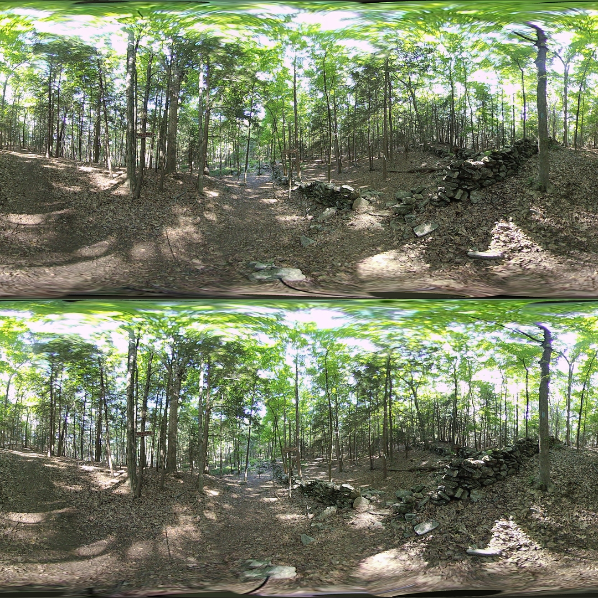

## World Seams

*Date: March 5th, 2023*

Script: [vuze_merge.py](../src/vuze_merge.py)

Usage:
```
rm -f coeffs_v6.json
src/vuze_merge.py -a coeffs_v6.json --setup camera_setup.json
src/vuze_merge.py -a coeffs_v6.json -I test/HET_0014 -O test/HET_0014_world_seams \
  --write-coeffs --ignore-alignment-seams
src/vuze_merge.py -a coeffs_v6.json -I test/HET_0017 -O test/HET_0017_world_seams
convert test/HET_0014_world_seams.JPG -resize 25% test/HET_0014_world_seams.JPG
convert test/HET_0017_world_seams.JPG -resize 25% test/HET_0017_world_seams.JPG
```

### Objective

Refine the fisheye to 3D 360 panorama stitching process to account for depth and to intelligently choose seams based on depth, seam quality, and position. The current process for converting the fisheye images to a single 3D 360 panorama relies on averaging the location of feature points between the left and right side for a single eye. The idea will be to determine the depth of various feature points and use the detph along with known characteristics of the human head to convert to a 3D 360 image which when viewed by a person accurately represents the world from the individual lens images. First, a coordinates system for each space needs to be defined.

### Lens Coordinates

Each lens takes a single fisheye image centered around its position on the camera. Each pixel in the images is represented as $(\phi, \theta)$ pair centered at the lens origin, cartesian point $P_0$. The polar coordinates can be convereted to a cartesian coordinates using the estimated radius for that location, $r$.  The cartesian point will be $P$.

| Top View | Side View |
| :------: | :-------: |
|  |  |

### Eye Coordinates

The eye coordinate system will be used to identify locations within the final $360^{\circ}$ polar image. These polar coordinates can easily be converted to equirectangular coordinates in order to generate the final image. The coordinate system must be able to adjust to each eye and be consistent across all sides of the camera and all vertical view rotations.

| Top View | Side View |
| :------: | :-------: |
|  |  |

### Determining the Radius

For simplicity the radius was chosen to be 5m in all case. The radius can be computed using the depth calculations from [Depth Calibration](../depth_calibration/depth_calibration.md). Using this process with determined feature points many issues arose regarding the quality of the alignment of the images. The radius along the seam turned out to be inaccurate and thus a fixed 5m was used.

The investigation into determining the radius used feature points from all 4 overlapping lens images to create a depth map. The depth map was based on the cloud of determined feature points and their radius calculated using the respective position of each lens. The depth map used the N nearest points to a provided point and took a weighted average by distance to determine an estimate for the radius.

### Lens to Eye Transform

The forward transformation will be applied in 2 steps. First calculate $\theta_H$, then calculate $\phi_H$. The input and output coordinates of the transform will be polar with the left side of the image at $\frac{\pi}{2}$ radians and the right side of the image at $\frac{3\pi}{2}$ radians. This is oposite and offset from the lens coordinates system defined above. For simplicity the plane of the camera is assumed to be the x-y-axis plane, ie. $z=0$. The objective is to find $(\phi_H, \theta_H)$. A required input is the interocular distance, $E$, in meters.

$$P_H = \vec{P_0} + \begin{pmatrix}
r \sin \left( \phi \right) \cos \left( \frac{3\pi}{2} - \theta \right) \\\\
r \sin \left( \phi \right) \sin \left( \frac{3\pi}{2} - \theta \right) \\\\
0
\end{pmatrix}$$

$$\begin{array}
& R = \norm{\vec{p_0}} & \alpha = \sin^{-1} \left( \frac{E}{2R} \right) & y = x \tan(\alpha) & d = \norm{P_H - C}
\end{array}$$

$$\begin{align}
d^2 &= ( R + x )^2 + y^2 \\\\
d^2 &= ( R + x )^2 + x^2 \tan^2(\alpha) \\\\
d^2 &= x^2 + 2Rx + R^2 + x^2 \tan^2(\alpha) \\\\
0 &= \left( 1 + \tan^2(\alpha) \right) x^2 + 2Rx + (R^2 - d^2)
\end{align}$$

This yields an equation with two solutions for $x$. The quadratic formula is used and the solution which will yield a positive $x$ in all cases is selected.

$$\begin{align}
x &= \frac{-2R + \sqrt{4R^2 - 4 \left( 1 + \tan^2(\alpha) \right) (R^2 - d^2)}}{2 \left( 1 + \tan^2(\alpha) \right)}\\\\
x &= \frac{-R + \sqrt{R^2 - \left( 1 + \tan^2(\alpha) \right) (R^2 - d^2)}}{\left( 1 + \tan^2(\alpha) \right)}
\end{align}$$

Using $x$ the angle $\beta$ can be determined.

$$\beta = \cos^{-1} \left( \frac{x + R}{d} \right)$$

The final angle $\theta_H$ will be zeroed relative to $\rho$.

$$\theta_H = \rho - (\beta + \psi)$$

The location of $P_1$ and $C_1$ are computed in order to calculate $\phi_H$. The distance $R_E$ is the distance from the eye to the tilt axis of the head behind the eye.

$$\begin{array}
& P_1 = C + \begin{pmatrix}
R \cos \left( \beta + \psi \right) \\\\
R \sin \left( \beta + \psi \right) \\\\
0
\end{pmatrix}
& \vec{H_\theta} = \frac{P_H - P_1}{\norm{P_H - P_1}}
& C_1 = P_1 - R_E \vec{H_\theta}
\end{array}$$

$$\phi_H = \cos^{_1} \left( \frac{R_E + \norm{P_H - P_1}}{\norm{P - C_1}} \right)$$

The following diagrams labels the distances in a specific example using a location of $P_1$ to the right of $P_0$. The polar coordinate $(\phi_H, \theta_H)$ will need to be converted into the proper orientation with $\phi_H = 0$ being the top of the image and $\theta_H = \pi$ being at the center of the image with $\theta_H = \frac{\pi}{2}$ on the left side.

| Top View | Side View |
| :------: | :-------: |
|  |  |

### Eye to Lens Transform

### Results

| HET_0014 with new Transforms |
| :------: |
|  |

| HET_0017 with new Transforms |
| :------: |
|  |


## Saved Calibration Configuration

The calibration process specification was simplified and directly presented in a single configuration file, [example](./camera_setup.json). This reduces the knowledge required to run multiple commands in the proper sequence. The new configuration file is specified in a single command and the script is responsible for executing the calibration steps in the correct order. The provided alignment file will be created or updated.

Source File: [camera_setup.py](../../src/camera_setup.py)

Usage:
```
src/vuze_merge.py --alignment coeffs_v6.json --setup camera_setup.json
```

## Questioning Assumptions

### Is $\phi$ the same for a given point between 2 lenses?

Short answer: No

The setup uses 2 cameras at $c_1$ and $c_2$ in the same y-plane and z-plane, and 1 point at $P$. Represented in cartesian coordinates as follows.

$$\begin{array}{cc}
c_1 = \begin{pmatrix} c_{x1} \\\\ c_y \\\\ c_z \end{pmatrix}
&
c_2 = \begin{pmatrix} c_{x2} \\\\ c_y \\\\ c_z \end{pmatrix}
&
P = \begin{pmatrix} P_x \\\\ P_y \\\\ P_z \end{pmatrix}
\end{array}$$

From each camera the point $P$ appears at the following locations.

$$\begin{array}{cc}
P_1 = \begin{pmatrix} P_x - c_{x1} \\\\ P_y - c_y \\\\ P_z - c_z \end{pmatrix}
&
P_2 = \begin{pmatrix} P_x - c_{x2} \\\\ P_y - c_y \\\\ P_z - c_z \end{pmatrix}
\end{array}$$

Next Convert to polar coordinates and specifically calculating $\phi$.

$$\phi_1 = \cos^{-1} \left( \frac{P_z}{ \sqrt{ \left( P_x - c_{x1} \right) ^2 + P_y^2 + P_z^2 } } \right)$$

$$\phi_2 = \cos^{-1} \left( \frac{P_z}{ \sqrt{ \left( P_x - c_{x2} \right) ^2 + P_y^2 + P_z^2 } } \right)$$

Given the slight difference in the formulas arising from the difference in the $x$ location of the cameras the asumption that the value of $\phi$ between the two cameras should be the same is an incorrect assumption.
