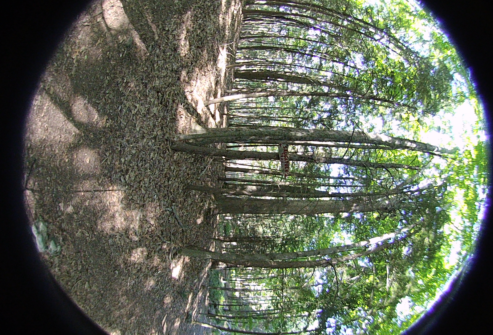

## Example Output Files

Note: all examples are reduced to 1080x1080 and default jpg quality. This was to keep this page fast to load and not use an excessive amount of space in the git repo.
`convert HET_1014.JPG -resize 25% HET_1014.JPG`

### Bash Splice
The bash splice script uses cubemaps to combine the images from each lens of the camera. The splice lines are obvious. Some form of scaling needs to be applied in order to properly fit the images within the 360deg area of the image.

### Python Splice
This script allows for arbitrary seam locations and individual lens manipulation. It is a manual process which requires all inputs to be provided. Using a 0.9 scaling on theta results in an improved stitch of the images for each eye. While better than the Bash script, it is not as good as the Vuze VR Studio software.

### Exposure Fusion Luminance
The pre-process script is run on each lens individually with a new set of 8 images being created. This configuration uses the Luminance HDR application. The 8 images were then merged using the Python Splice script. The pre-process of exposure fusion with different exposure settings greatly improves the image quality. Unfortunately, the color differences between the lenses become more apparent.

### Exposure Fusion Enfuse
The pre-process script is run on each lens individually with a new set of 8 images being created. The 8 images where then merged using the Python Splice script. The pre-process of exposure fusion with different exposure settings greatly improves the image quality. The colors remain more true when using the enfuse program to fuse exposures. The script also requires fewer inputs and processing steps to get a good output.

## Test Image Files from the Vuze 4k 3D 360 Camera

### HET_0011
Hiking trail intersection in Redding, CT. Exposure -2. Large number of feature points and lighting conditions. Same location as HET_0012 and HET_0014

<table>
  <tr>
    <td></td>
    <td></td>
    <td></td>
    <td></td>
  </tr>
  <tr>
    <td></td>
    <td></td>
    <td></td>
    <td></td>
  </tr>
</table>

### HET_0012
Hiking trail intersection in Redding, CT. Exposure -1. Large number of feature points and lighting conditions. Same location as HET_0011 and HET_0014

<table>
  <tr>
    <td></td>
    <td></td>
    <td></td>
    <td></td>
  </tr>
  <tr>
    <td></td>
    <td></td>
    <td></td>
    <td></td>
  </tr>
</table>

### HET_0014
Hiking trail intersection in Redding, CT. Exposure 0. Large number of feature points and lighting conditions. Same location as HET_0011 and HET_0012

<table>
  <tr>
    <td></td>
    <td></td>
    <td></td>
    <td></td>
  </tr>
  <tr>
    <td></td>
    <td></td>
    <td></td>
    <td></td>
  </tr>
</table>
