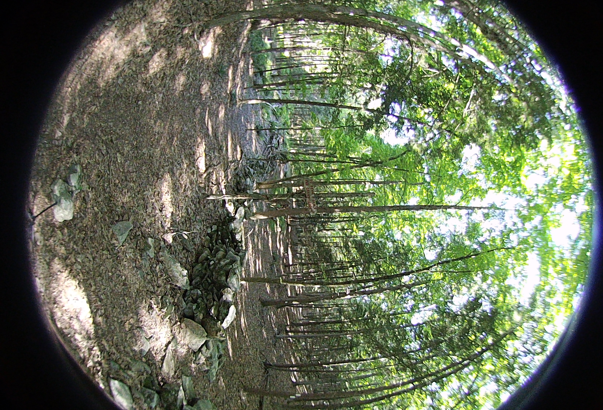
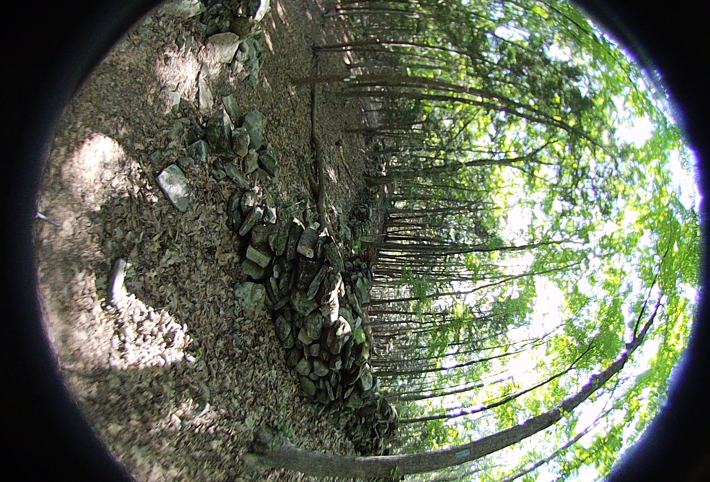
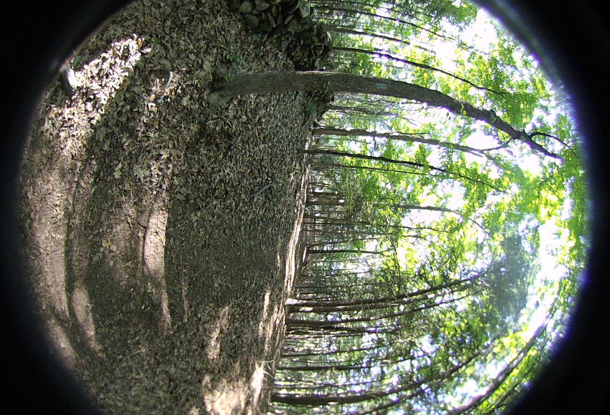
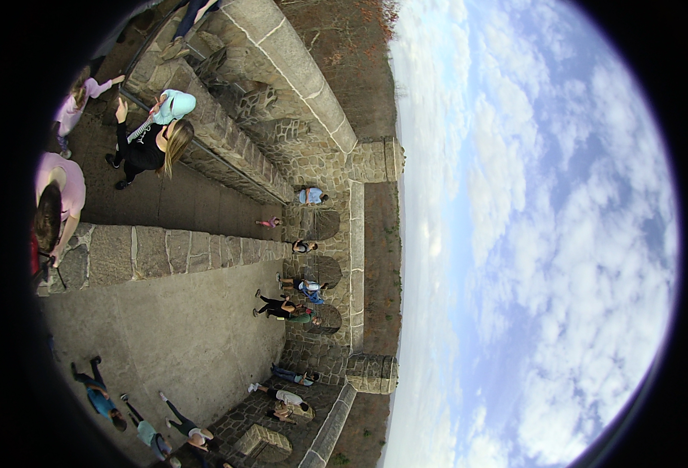
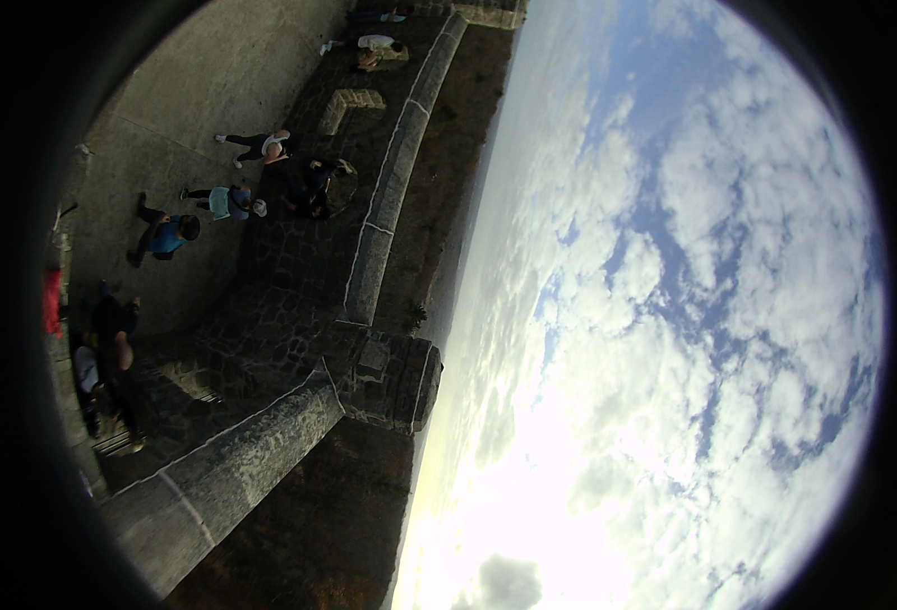

## Example Output Files

Note: all examples are reduced to 1080x1080 and default jpg quality. This was to keep this page fast to load and not use an excessive amount of space in the git repo.
`convert HET_1014.JPG -resize 25% HET_1014.JPG`

## Test Image Files from the Vuze 4k 3D 360 Camera

### Saved Camera Constants
The following file was copied from an SD card setup by the Vuze Camera. The file appears to be generated by OpenCV and contains constants for each lens and camera. More on this file can be found in the development log: [Camera Constants](../notes/camera_constants.md) (December 23, 2022)

[VUZ1178200318.yml](./VUZ1178200318.yml)

### HET_0011
Hiking trail intersection in Redding, CT. Exposure -2. Large number of feature points and lighting conditions. Same location as HET_0012 and HET_0014

<table>
  <tr>
    <td></td>
    <td></td>
    <td></td>
    <td></td>
  </tr>
  <tr>
    <td></td>
    <td></td>
    <td></td>
    <td></td>
  </tr>
</table>

### HET_0012
Hiking trail intersection in Redding, CT. Exposure -1. Large number of feature points and lighting conditions. Same location as HET_0011 and HET_0014

<table>
  <tr>
    <td></td>
    <td></td>
    <td></td>
    <td></td>
  </tr>
  <tr>
    <td></td>
    <td></td>
    <td></td>
    <td></td>
  </tr>
</table>

### HET_0014
Hiking trail intersection in Redding, CT. Exposure 0. Large number of feature points and lighting conditions. Same location as HET_0011 and HET_0012

<table>
  <tr>
    <td></td>
    <td></td>
    <td></td>
    <td></td>
  </tr>
  <tr>
    <td></td>
    <td></td>
    <td></td>
    <td></td>
  </tr>
</table>

### HET_0017
A bright day at the Putnam Railroad Station in Yorktown Heights, NY. The solid blue sky provides few feature points and the bright sun on one set of lenses causes color and brightness differences.

<table>
  <tr>
    <td></td>
    <td></td>
    <td></td>
    <td></td>
  </tr>
  <tr>
    <td></td>
    <td></td>
    <td></td>
    <td></td>
  </tr>
</table>

### HET_0025
A cloudy day on top of Sleeping Giant in Hamden, CT. The camera was rotated to allow obvious utilization of post-processing horizon leveling functionality.

<table>
  <tr>
    <td></td>
    <td></td>
    <td></td>
    <td></td>
  </tr>
  <tr>
    <td></td>
    <td></td>
    <td></td>
    <td></td>
  </tr>
</table>
