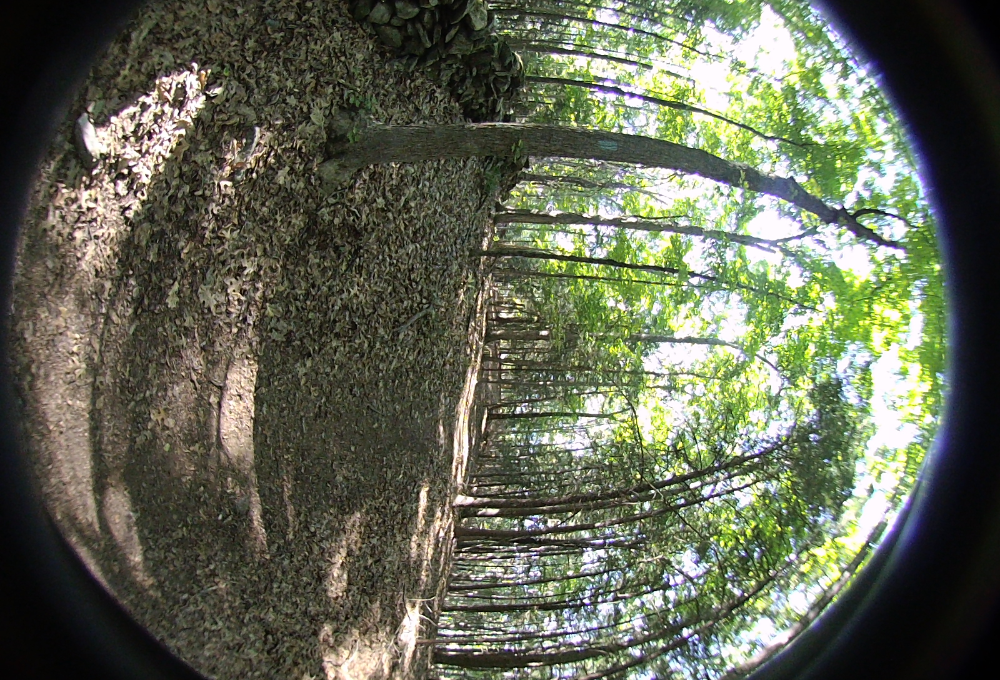
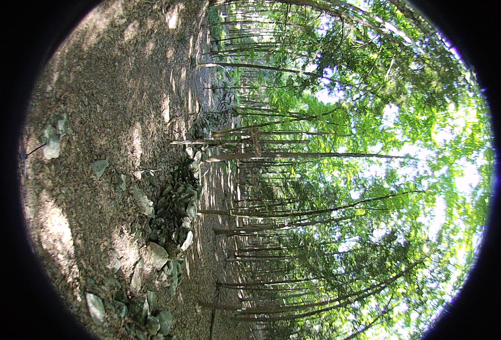

## Test Image Files from the Vuze 4k 3D 360 Camera

### HET_0011
Hiking trail intersection in Redding, CT. Exposure -2. Large number of feature points and lighting conditions. Same location as HET_0014

<table>
  <tr>
    <td></td>
    <td></td>
    <td></td>
    <td></td>
  </tr>
  <tr>
    <td></td>
    <td></td>
    <td></td>
    <td></td>
  </tr>
</table>

### HET_0014
Hiking trail intersection in Redding, CT. Exposure 0. Large number of feature points and lighting conditions. Same location as HET_0011

<table>
  <tr>
    <td></td>
    <td></td>
    <td></td>
    <td></td>
  </tr>
  <tr>
    <td></td>
    <td></td>
    <td></td>
    <td></td>
  </tr>
</table>
